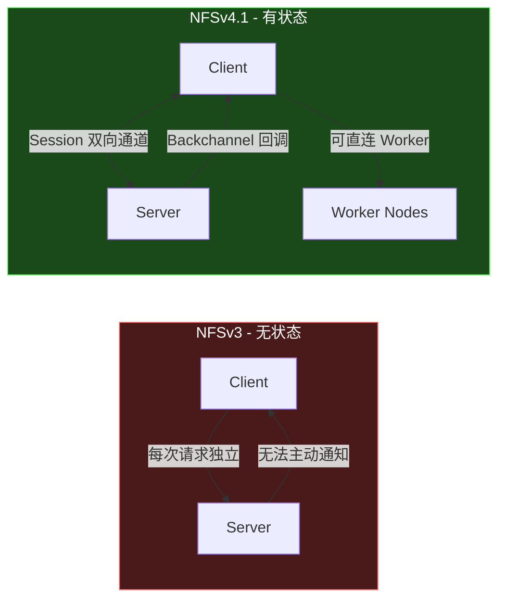
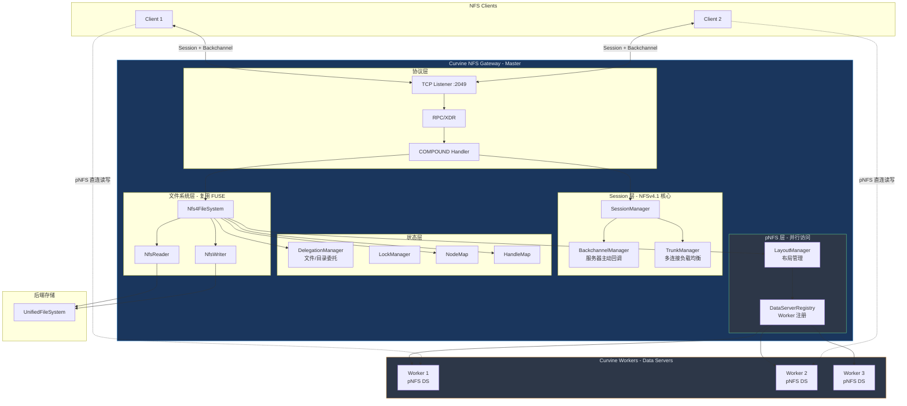
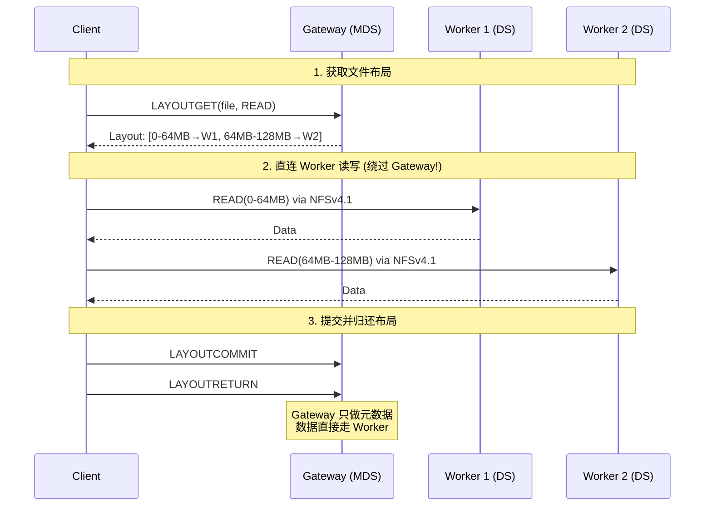
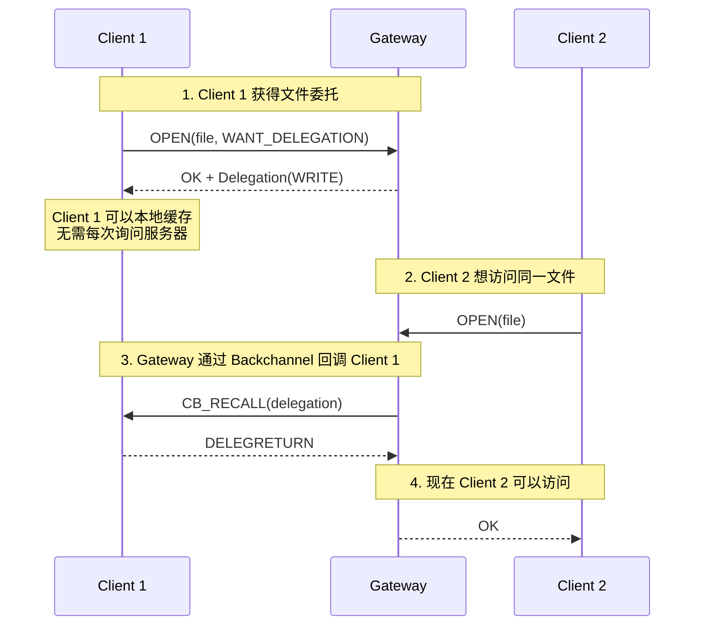
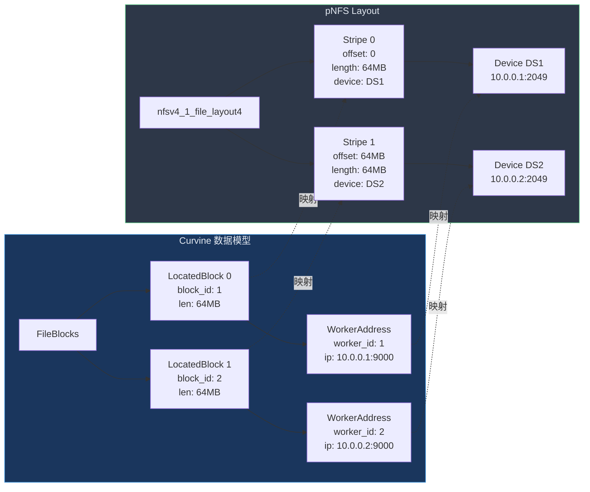

# Curvine NFS Gateway NFSv4.1 完整设计文档 v3.0

## 1. 设计目标

- **完全切换到 NFSv4.1**，不再支持 NFSv3
- **复用 FUSE 模块的设计模式**，95% 的读写逻辑可以复用
- **支持 NFSv4.1 全部核心特性**：
  - ✅ Session + Slot 并发
  - ✅ Session Trunking (多连接负载均衡)
  - ✅ Backchannel (服务器主动回调)
  - ✅ File Delegation (文件委托缓存)
  - ✅ Directory Delegation (目录委托)
  - ✅ pNFS (并行 NFS，直连 Worker)
  - ✅ State Recovery (状态恢复)

## 2. NFSv4.1 vs NFSv3 核心差异



| 特性 | NFSv3 | NFSv4.1 |
|------|-------|---------|
| 状态 | 无状态 | 有状态 (Session) |
| 通信 | 单向 | 双向 (Backchannel) |
| 并发 | 无保证 | Slot 机制保证 |
| 缓存 | 客户端猜测 | Delegation 精确控制 |
| 分布式 | 单点 | pNFS 直连存储 |

## 3. 整体架构

### 3.1 完整架构图



### 3.2 pNFS 数据流 - 绕过 Gateway 直连 Worker

这是 NFSv4.1 最强大的特性，让客户端绕过 Gateway 直接访问存储节点：



### 3.3 Backchannel 回调机制

服务器可以主动通知客户端，这是实现 Delegation 的基础：



## 4. 核心组件设计

### 4.1 Session 层 (NFSv4.1 核心)

#### 4.1.1 SessionManager - 会话管理

```rust
/// NFSv4.1 Session Manager
/// Manages client sessions, slots, and trunking
pub struct SessionManager {
    /// Client ID -> ClientState
    clients: RwLock<HashMap<clientid4, Arc<ClientState>>>,
    /// Session ID -> Session
    sessions: RwLock<HashMap<sessionid4, Arc<Session>>>,
    /// Lease timeout
    lease_time: Duration,
    /// Backchannel manager
    backchannel: Arc<BackchannelManager>,
    /// Trunk manager for multi-connection
    trunks: Arc<TrunkManager>,
}

/// Client state with multiple sessions support
pub struct ClientState {
    pub clientid: clientid4,
    pub verifier: verifier4,
    pub confirmed: bool,
    /// Multiple sessions per client (trunking)
    pub sessions: Vec<sessionid4>,
    pub last_renew: Instant,
    /// Client's callback program for backchannel
    pub cb_program: u32,
}

/// NFSv4.1 Session with bidirectional channels
pub struct Session {
    pub sessionid: sessionid4,
    pub clientid: clientid4,
    /// Fore channel: client -> server requests
    pub fore_channel: Channel,
    /// Back channel: server -> client callbacks
    pub back_channel: Option<Channel>,
    /// Session flags
    pub flags: u32,
    /// Associated TCP connections (trunking)
    pub connections: RwLock<Vec<ConnectionId>>,
}

/// Channel with slot-based concurrency
pub struct Channel {
    pub attrs: channel_attrs4,
    /// Slots for concurrent requests
    pub slots: Vec<Mutex<Slot>>,
    /// Highest slot in use
    pub highest_slot: AtomicU32,
    /// Target highest slot (for dynamic adjustment)
    pub target_highest_slot: AtomicU32,
}

/// Slot for exactly-once semantics
pub struct Slot {
    pub seqid: slotid4,
    pub sequence: sequenceid4,
    pub in_use: bool,
    /// Cached reply for replay detection
    pub cached_reply: Option<CachedReply>,
}
```

#### 4.1.2 BackchannelManager - 服务器主动回调

```rust
/// Backchannel Manager for server-initiated callbacks
/// This is CRITICAL for Delegation to work!
pub struct BackchannelManager {
    /// Session -> Backchannel connection
    channels: RwLock<HashMap<sessionid4, BackchannelConn>>,
    /// Pending callbacks queue
    pending: AsyncChannel<CallbackTask>,
    /// Callback worker pool
    workers: Vec<JoinHandle<()>>,
}

/// Backchannel connection state
pub struct BackchannelConn {
    pub session: sessionid4,
    /// TCP connection for callbacks
    pub conn: Arc<TcpStream>,
    /// Callback slots
    pub slots: Vec<Mutex<Slot>>,
    /// Connection state
    pub state: BackchannelState,
}

#[derive(Clone, Copy, PartialEq)]
pub enum BackchannelState {
    /// Not yet established
    None,
    /// Established and working
    Up,
    /// Temporarily down, will retry
    Down,
    /// Permanently failed
    Failed,
}

/// Callback operations
pub enum CallbackOp {
    /// Recall a delegation
    CbRecall(stateid4),
    /// Recall a layout (pNFS)
    CbLayoutRecall(layoutrecall4),
    /// Notify directory changes
    CbNotify(notify4),
    /// Get attributes (for delegation)
    CbGetattr(bitmap4),
    /// Notify device ID changes (pNFS)
    CbNotifyDeviceId(notify_deviceid4),
}

impl BackchannelManager {
    /// Send callback to client (non-blocking)
    pub async fn send_callback(
        &self,
        session: &sessionid4,
        op: CallbackOp,
    ) -> Result<(), Nfs4Error> {
        let conn = self.channels.read().get(session)?;
        
        // Build CB_COMPOUND
        let compound = self.build_cb_compound(op);
        
        // Send via backchannel
        conn.send(compound).await
    }
    
    /// Recall delegation from client
    pub async fn recall_delegation(
        &self,
        session: &sessionid4,
        stateid: &stateid4,
        truncate: bool,
    ) -> Result<(), Nfs4Error> {
        self.send_callback(session, CallbackOp::CbRecall(*stateid)).await
    }
    
    /// Recall layout from client (pNFS)
    pub async fn recall_layout(
        &self,
        session: &sessionid4,
        layout: layoutrecall4,
    ) -> Result<(), Nfs4Error> {
        self.send_callback(session, CallbackOp::CbLayoutRecall(layout)).await
    }
}
```

#### 4.1.3 TrunkManager - 多连接负载均衡

```rust
/// Session Trunking Manager
/// Allows multiple TCP connections per session for load balancing
pub struct TrunkManager {
    /// Session -> List of connections
    trunks: RwLock<HashMap<sessionid4, Vec<TrunkConnection>>>,
    /// Load balancing strategy
    strategy: LoadBalanceStrategy,
}

pub struct TrunkConnection {
    pub conn_id: ConnectionId,
    pub conn: Arc<TcpStream>,
    /// Bytes sent on this connection
    pub bytes_sent: AtomicU64,
    /// Bytes received on this connection
    pub bytes_recv: AtomicU64,
    /// Is this connection for backchannel?
    pub is_backchannel: bool,
}

pub enum LoadBalanceStrategy {
    RoundRobin,
    LeastConnections,
    WeightedRoundRobin,
}
```

### 4.2 pNFS 层 - Curvine 的杀手级特性

这是 NFSv4.1 最强大的特性，而 Curvine 的架构天然支持它！

#### 4.2.1 Curvine Block → pNFS Layout 映射



#### 4.2.2 LayoutManager - 布局管理器

```rust
/// pNFS Layout Manager
/// Converts Curvine FileBlocks to NFSv4.1 Layouts
pub struct LayoutManager {
    /// File -> Layout mapping
    layouts: RwLock<HashMap<fileid4, LayoutState>>,
    /// Device registry (Worker nodes)
    devices: Arc<DataServerRegistry>,
    /// Layout type (we use FILE_LAYOUT)
    layout_type: layouttype4,
}

/// Layout state for a file
pub struct LayoutState {
    pub fileid: fileid4,
    /// Curvine's FileBlocks (source of truth)
    pub file_blocks: FileBlocks,
    /// Issued layouts to clients
    pub issued: Vec<IssuedLayout>,
    /// Layout stateid
    pub stateid: stateid4,
}

/// Layout issued to a specific client
pub struct IssuedLayout {
    pub client: clientid4,
    pub stateid: stateid4,
    pub iomode: layoutiomode4,  // READ, RW
    pub offset: u64,
    pub length: u64,
    /// When this layout expires
    pub expires: Instant,
}

impl LayoutManager {
    /// Convert Curvine FileBlocks to pNFS Layout
    /// This is the CORE mapping function!
    pub fn file_blocks_to_layout(
        &self,
        file_blocks: &FileBlocks,
        offset: u64,
        length: u64,
        iomode: layoutiomode4,
    ) -> Result<layout4, Nfs4Error> {
        let mut stripes = Vec::new();
        let block_size = file_blocks.status.block_size as u64;
        
        for (idx, located_block) in file_blocks.block_locs.iter().enumerate() {
            let stripe_offset = idx as u64 * block_size;
            let stripe_length = located_block.block.len as u64;
            
            // Skip blocks outside requested range
            if stripe_offset + stripe_length <= offset {
                continue;
            }
            if stripe_offset >= offset + length {
                break;
            }
            
            // Map WorkerAddress to deviceid
            let device_id = self.devices.worker_to_device(&located_block.locs[0])?;
            
            stripes.push(StripeInfo {
                offset: stripe_offset,
                length: stripe_length,
                device_id,
                // For multi-replica, include all locations
                mirrors: located_block.locs.iter()
                    .map(|w| self.devices.worker_to_device(w))
                    .collect::<Result<Vec<_>, _>>()?,
            });
        }
        
        Ok(layout4 {
            layout_type: LAYOUT4_NFSV4_1_FILES,
            layout_content: self.encode_file_layout(stripes, block_size)?,
        })
    }
    
    /// Handle LAYOUTGET request
    pub async fn layout_get(
        &self,
        fileid: fileid4,
        offset: u64,
        length: u64,
        iomode: layoutiomode4,
        client: clientid4,
    ) -> Result<LAYOUTGET4res, Nfs4Error> {
        // 1. Get FileBlocks from Curvine
        let file_blocks = self.get_file_blocks(fileid).await?;
        
        // 2. Convert to pNFS layout
        let layout = self.file_blocks_to_layout(&file_blocks, offset, length, iomode)?;
        
        // 3. Record issued layout
        let stateid = self.issue_layout(fileid, client, iomode, offset, length)?;
        
        // 4. Return layout with device addresses
        Ok(LAYOUTGET4res {
            status: NFS4_OK,
            layout: vec![layout],
            stateid,
            return_on_close: true,
        })
    }
    
    /// Handle LAYOUTRETURN request
    pub async fn layout_return(
        &self,
        fileid: fileid4,
        stateid: &stateid4,
        iomode: layoutiomode4,
    ) -> Result<(), Nfs4Error> {
        let mut layouts = self.layouts.write();
        if let Some(state) = layouts.get_mut(&fileid) {
            state.issued.retain(|l| &l.stateid != stateid);
        }
        Ok(())
    }
    
    /// Handle LAYOUTCOMMIT request (client finished writing)
    pub async fn layout_commit(
        &self,
        fileid: fileid4,
        offset: u64,
        length: u64,
        new_size: Option<u64>,
    ) -> Result<(), Nfs4Error> {
        // Update file size if changed
        if let Some(size) = new_size {
            self.update_file_size(fileid, size).await?;
        }
        Ok(())
    }
}
```

#### 4.2.3 DataServerRegistry - Worker 节点注册

```rust
/// Data Server Registry
/// Maps Curvine Workers to pNFS Device IDs
pub struct DataServerRegistry {
    /// Worker ID -> Device info
    workers: RwLock<HashMap<u32, DataServerInfo>>,
    /// Device ID -> Worker ID (reverse mapping)
    device_to_worker: RwLock<HashMap<deviceid4, u32>>,
    /// Next device ID
    next_device_id: AtomicU64,
}

/// Data Server (Worker) information
pub struct DataServerInfo {
    pub worker_id: u32,
    pub device_id: deviceid4,
    pub address: WorkerAddress,
    /// NFSv4.1 multipath addresses for this DS
    pub nfs_addrs: Vec<netaddr4>,
    /// Is this DS healthy?
    pub healthy: bool,
    /// Last heartbeat
    pub last_seen: Instant,
}

impl DataServerRegistry {
    /// Register a Curvine Worker as pNFS Data Server
    pub fn register_worker(&self, worker: &WorkerAddress) -> deviceid4 {
        let mut workers = self.workers.write();
        
        if let Some(info) = workers.get(&worker.worker_id) {
            return info.device_id;
        }
        
        let device_id = self.next_device_id.fetch_add(1, Ordering::SeqCst);
        let device_id_bytes = device_id.to_be_bytes();
        
        // Build NFSv4.1 network address for this worker
        let nfs_addr = netaddr4 {
            na_r_netid: "tcp".to_string(),
            na_r_addr: format!("{}.{}.{}.{}.{}.{}",
                // IP address octets
                worker.ip_addr.split('.').collect::<Vec<_>>().join("."),
                // Port in NFS format (high byte, low byte)
                NFS4_DS_PORT / 256,
                NFS4_DS_PORT % 256,
            ),
        };
        
        let info = DataServerInfo {
            worker_id: worker.worker_id,
            device_id: device_id_bytes,
            address: worker.clone(),
            nfs_addrs: vec![nfs_addr],
            healthy: true,
            last_seen: Instant::now(),
        };
        
        workers.insert(worker.worker_id, info);
        self.device_to_worker.write().insert(device_id_bytes, worker.worker_id);
        
        device_id_bytes
    }
    
    /// Get device address for GETDEVICEINFO
    pub fn get_device_info(&self, device_id: &deviceid4) -> Result<device_addr4, Nfs4Error> {
        let workers = self.workers.read();
        let worker_id = self.device_to_worker.read()
            .get(device_id)
            .ok_or(Nfs4Error::NoEnt)?;
        
        let info = workers.get(worker_id).ok_or(Nfs4Error::NoEnt)?;
        
        Ok(device_addr4 {
            da_layout_type: LAYOUT4_NFSV4_1_FILES,
            da_addr_body: self.encode_multipath_list(&info.nfs_addrs)?,
        })
    }
    
    /// Convert WorkerAddress to deviceid
    pub fn worker_to_device(&self, worker: &WorkerAddress) -> Result<deviceid4, Nfs4Error> {
        let workers = self.workers.read();
        workers.get(&worker.worker_id)
            .map(|info| info.device_id)
            .ok_or(Nfs4Error::NoEnt)
    }
}
```

#### 4.2.4 pNFS 完整数据流

```mermaid
sequenceDiagram
    participant C as NFS Client
    participant G as Gateway (MDS)
    participant M as Curvine Master
    participant W1 as Worker 1 (DS)
    participant W2 as Worker 2 (DS)
    
    Note over C,W2: Phase 1: 获取文件布局
    C->>G: OPEN(file)
    G->>M: get_status(file)
    M-->>G: FileStatus
    G-->>C: stateid
    
    C->>G: LAYOUTGET(file, READ, 0, EOF)
    G->>M: get_block_locations(file)
    M-->>G: FileBlocks [Block0→W1, Block1→W2]
    Note over G: 转换 FileBlocks → pNFS Layout
    G-->>C: Layout [0-64MB→DS1, 64MB-128MB→DS2]
    
    C->>G: GETDEVICEINFO(DS1)
    G-->>C: DS1 = 10.0.0.1:2049
    C->>G: GETDEVICEINFO(DS2)
    G-->>C: DS2 = 10.0.0.2:2049
    
    Note over C,W2: Phase 2: 直连 Worker 读写
    rect rgb(40, 80, 40)
        C->>W1: READ(0-64MB) via NFSv4.1 DS protocol
        W1-->>C: Data (64MB)
        C->>W2: READ(64MB-128MB) via NFSv4.1 DS protocol
        W2-->>C: Data (64MB)
    end
    Note over C,W2: 数据直接走 Worker，不经过 Gateway!
    
    Note over C,W2: Phase 3: 完成并归还布局
    C->>G: LAYOUTCOMMIT(new_size=128MB)
    G->>M: update_file_size
    C->>G: LAYOUTRETURN
    C->>G: CLOSE
```


