# Curvine NFS Gateway 设计文档

## 1. 概述

### 1.1 背景与目标

本文档描述如何基于 [nfsserve](https://github.com/xetdata/nfsserve) 库（已下载到 `curvine-nfs` 目录）实现一个 NFS Gateway，使用户能够通过标准 NFSv3 协议访问 Curvine 分布式缓存系统。

**核心目标：**
- 提供跨平台的文件系统挂载能力（Linux/macOS/Windows）
- 复用 Curvine 现有的 `UnifiedFileSystem` 接口
- 保持与现有 FUSE 和 S3 Gateway 架构的一致性
- 支持多 NFS Gateway 实例通过 LB 对外提供服务

### 1.2 为什么选择 NFS 而非仅 FUSE？

| 特性 | FUSE | NFS |
|------|------|-----|
| 跨平台支持 | 需要额外驱动（macOS/Windows） | 原生支持 |
| 客户端缓存 | 需自行实现 | OS 内置成熟缓存机制 |
| 网络容错 | 需自行处理 | 协议层面支持慢响应/重试 |
| 部署复杂度 | 需要内核模块 | 用户态服务即可 |
| 多实例部署 | 单机绑定 | 可通过 LB 负载均衡 |

### 1.3 整体架构

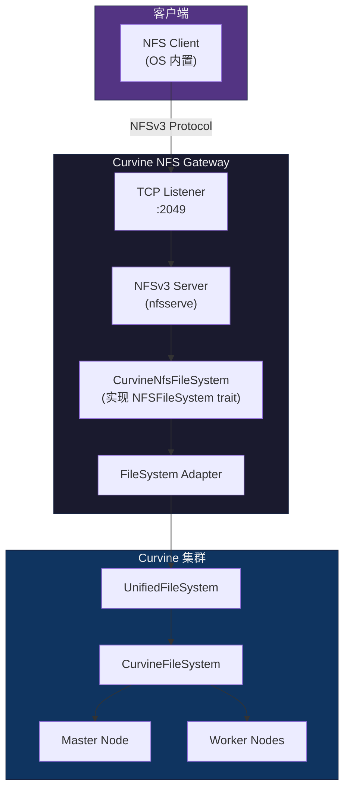
```mermaid
graph TB
    subgraph Client["客户端"]
        NFS_CLIENT["NFS Client<br/>(OS 内置)"]
    end
    
    subgraph Gateway["Curvine NFS Gateway"]
        TCP["TCP Listener<br/>:2049"]
        NFS_SERVER["NFSv3 Server<br/>(nfsserve)"]
        VFS["CurvineNfsFileSystem<br/>(实现 NFSFileSystem trait)"]
        ADAPTER["FileSystem Adapter"]
    end
    
    subgraph Curvine["Curvine 集群"]
        UFS["UnifiedFileSystem"]
        CV_CLIENT["CurvineFileSystem"]
        MASTER["Master Node"]
        WORKER["Worker Nodes"]
    end
    
    NFS_CLIENT -->|"NFSv3 Protocol"| TCP
    TCP --> NFS_SERVER
    NFS_SERVER --> VFS
    VFS --> ADAPTER
    ADAPTER --> UFS
    UFS --> CV_CLIENT
    CV_CLIENT --> MASTER
    CV_CLIENT --> WORKER
    
    style Gateway fill:#1a1a2e,stroke:#16213e,color:#eee
    style Curvine fill:#0f3460,stroke:#16213e,color:#eee
    style Client fill:#533483,stroke:#16213e,color:#eee
```

## 2. 核心组件设计

### 2.1 模块结构

```
curvine-nfs-gateway/
├── Cargo.toml
├── src/
│   ├── lib.rs                    # 模块导出
│   ├── bin/
│   │   └── curvine-nfs-gateway.rs # 启动入口
│   ├── nfs/
│   │   ├── mod.rs
│   │   ├── curvine_nfs_fs.rs     # NFSFileSystem trait 实现
│   │   ├── file_handle.rs        # NFS 文件句柄管理
│   │   ├── id_mapper.rs          # fileid3 <-> Curvine Path 映射
│   │   └── attr_converter.rs     # 属性转换器
│   ├── state/
│   │   ├── mod.rs
│   │   ├── inode_cache.rs        # Inode 缓存
│   │   └── dir_cache.rs          # 目录缓存
│   ├── config.rs                 # 配置管理
│   ├── error.rs                  # 错误类型定义
│   └── web_server.rs             # Metrics 服务
└── README.md
```

### 2.2 核心 Trait 映射关系

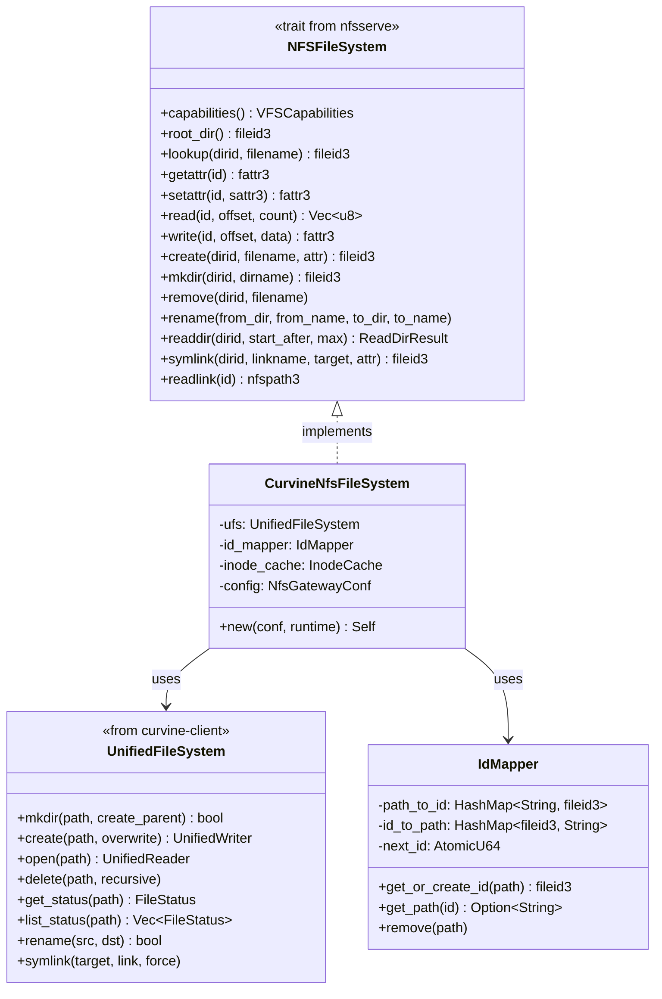
```mermaid
classDiagram
    class NFSFileSystem {
        <<trait from nfsserve>>
        +capabilities() VFSCapabilities
        +root_dir() fileid3
        +lookup(dirid, filename) fileid3
        +getattr(id) fattr3
        +setattr(id, sattr3) fattr3
        +read(id, offset, count) Vec~u8~
        +write(id, offset, data) fattr3
        +create(dirid, filename, attr) fileid3
        +mkdir(dirid, dirname) fileid3
        +remove(dirid, filename)
        +rename(from_dir, from_name, to_dir, to_name)
        +readdir(dirid, start_after, max) ReadDirResult
        +symlink(dirid, linkname, target, attr) fileid3
        +readlink(id) nfspath3
    }
    
    class CurvineNfsFileSystem {
        -ufs: UnifiedFileSystem
        -id_mapper: IdMapper
        -inode_cache: InodeCache
        -config: NfsGatewayConf
        +new(conf, runtime) Self
    }
    
    class UnifiedFileSystem {
        <<from curvine-client>>
        +mkdir(path, create_parent) bool
        +create(path, overwrite) UnifiedWriter
        +open(path) UnifiedReader
        +delete(path, recursive)
        +get_status(path) FileStatus
        +list_status(path) Vec~FileStatus~
        +rename(src, dst) bool
        +symlink(target, link, force)
    }
    
    class IdMapper {
        -path_to_id: HashMap~String, fileid3~
        -id_to_path: HashMap~fileid3, String~
        -next_id: AtomicU64
        +get_or_create_id(path) fileid3
        +get_path(id) Option~String~
        +remove(path)
    }
    
    NFSFileSystem <|.. CurvineNfsFileSystem : implements
    CurvineNfsFileSystem --> UnifiedFileSystem : uses
    CurvineNfsFileSystem --> IdMapper : uses
```

## 3. 关键设计细节

### 3.1 ID 映射策略（复用 Curvine 现有 inode）

**关键发现：Curvine 的 `FileStatus` 已经有 `id: i64` 字段，这就是 Curvine 的 inode ID！**

```rust
// curvine-common/src/state/file_status.rs
pub struct FileStatus {
    pub id: i64,           // Curvine inode ID，可直接作为 NFS fileid3
    pub path: String,
    pub name: String,
    pub is_dir: bool,
    pub nlink: u32,        // 硬链接数
    // ... 其他字段
}
```

**设计方案：直接复用 Curvine inode ID**

与 curvine-fuse 的 `NodeMap` 不同，NFS Gateway 可以更简单：

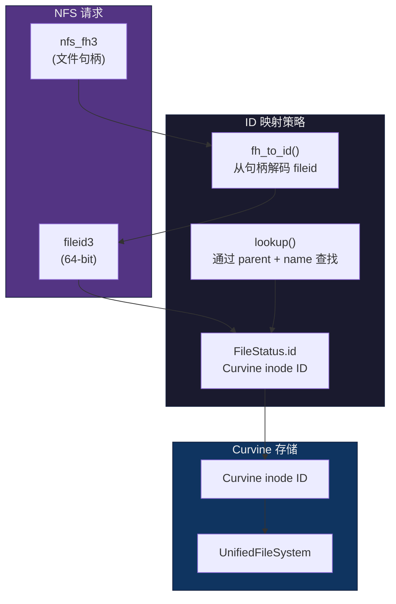
```mermaid
flowchart TB
    subgraph NFS_Request["NFS 请求"]
        FH["nfs_fh3<br/>(文件句柄)"]
        FID["fileid3<br/>(64-bit)"]
    end
    
    subgraph Mapping["ID 映射策略"]
        direction TB
        DECODE["fh_to_id()<br/>从句柄解码 fileid"]
        LOOKUP["lookup()<br/>通过 parent + name 查找"]
        STATUS["FileStatus.id<br/>Curvine inode ID"]
    end
    
    subgraph Curvine["Curvine 存储"]
        UFS["UnifiedFileSystem"]
        CV_ID["Curvine inode ID"]
    end
    
    FH --> DECODE
    DECODE --> FID
    FID --> STATUS
    LOOKUP --> STATUS
    STATUS --> CV_ID
    CV_ID --> UFS
    
    style NFS_Request fill:#533483,stroke:#16213e,color:#eee
    style Mapping fill:#1a1a2e,stroke:#16213e,color:#eee
    style Curvine fill:#0f3460,stroke:#16213e,color:#eee
```

**与 curvine-fuse NodeMap 的对比：**

| 方面 | curvine-fuse (NodeMap) | curvine-nfs-gateway |
|------|------------------------|---------------------|
| ID 来源 | 本地递增生成 `id_creator.next()` | 直接使用 `FileStatus.id` |
| 映射维护 | 需要 `path_to_id` + `id_to_path` 双向映射 | 无需本地映射，每次从 Curvine 获取 |
| 硬链接处理 | `linked_inode_map` 记录 curvine_ino -> fuse_ino | 直接使用 `FileStatus.id`，天然支持 |
| 缓存策略 | 本地 LRU 缓存 + TTL 过期 | 依赖 NFS 客户端缓存 + Curvine 缓存 |
| 多实例一致性 | 单机，无此问题 | 所有实例看到相同的 Curvine inode ID |

### 3.1.1 为什么 FUSE 需要复杂的 ID 映射？

**FUSE 的设计约束：**

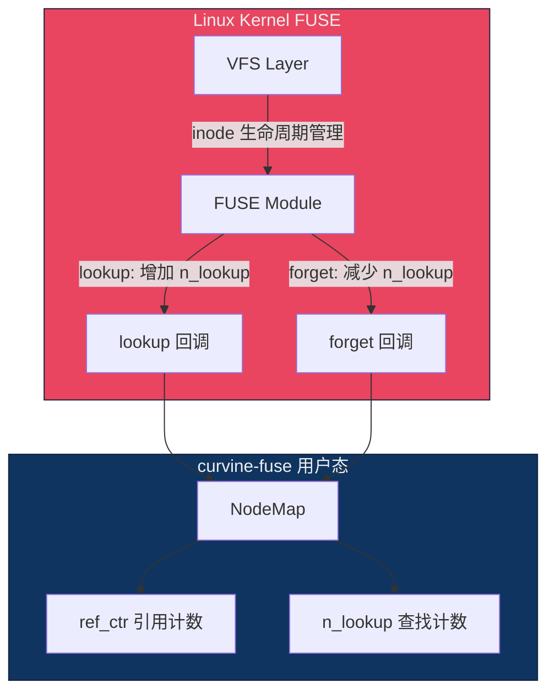
```mermaid
flowchart TB
    subgraph FUSE_Kernel["Linux Kernel FUSE"]
        VFS["VFS Layer"]
        FUSE_MOD["FUSE Module"]
        LOOKUP["lookup 回调"]
        FORGET["forget 回调"]
    end
    
    subgraph FUSE_User["curvine-fuse 用户态"]
        NODE_MAP["NodeMap"]
        REF_CTR["ref_ctr 引用计数"]
        N_LOOKUP["n_lookup 查找计数"]
    end
    
    VFS -->|"inode 生命周期管理"| FUSE_MOD
    FUSE_MOD -->|"lookup: 增加 n_lookup"| LOOKUP
    FUSE_MOD -->|"forget: 减少 n_lookup"| FORGET
    LOOKUP --> NODE_MAP
    FORGET --> NODE_MAP
    NODE_MAP --> REF_CTR
    NODE_MAP --> N_LOOKUP
    
    style FUSE_Kernel fill:#e94560,stroke:#16213e,color:#eee
    style FUSE_User fill:#0f3460,stroke:#16213e,color:#eee
```

FUSE 需要本地 ID 映射的核心原因：

1. **内核 inode 生命周期管理**：Linux VFS 通过 `lookup`/`forget` 回调管理 inode 引用计数
   - `lookup` 时内核期望返回一个 inode 号，并增加引用计数
   - `forget` 时内核通知用户态可以释放该 inode
   - 这要求 FUSE 维护 `n_lookup` 计数器

2. **父子关系追踪**：FUSE 需要通过 `parent_id` 构建路径
   ```rust
   // NodeAttr 必须记录父节点 ID 才能反向构建路径
   pub struct NodeAttr {
       pub id: u64,
       pub parent: u64,  // 父节点 ID
       pub name: String, // 当前节点名
       pub n_lookup: u64, // 内核引用计数
       pub ref_ctr: u32,  // 应用层引用计数
   }
   ```

3. **硬链接处理**：同一个 Curvine inode 可能有多个路径（硬链接），FUSE 需要 `linked_inode_map` 确保返回相同的 FUSE inode

4. **缓存一致性**：FUSE 需要本地缓存 inode 属性，通过 TTL 控制过期

### 3.1.2 NFS 为什么可以直接使用 FileStatus.id？

**NFS 的设计优势：**

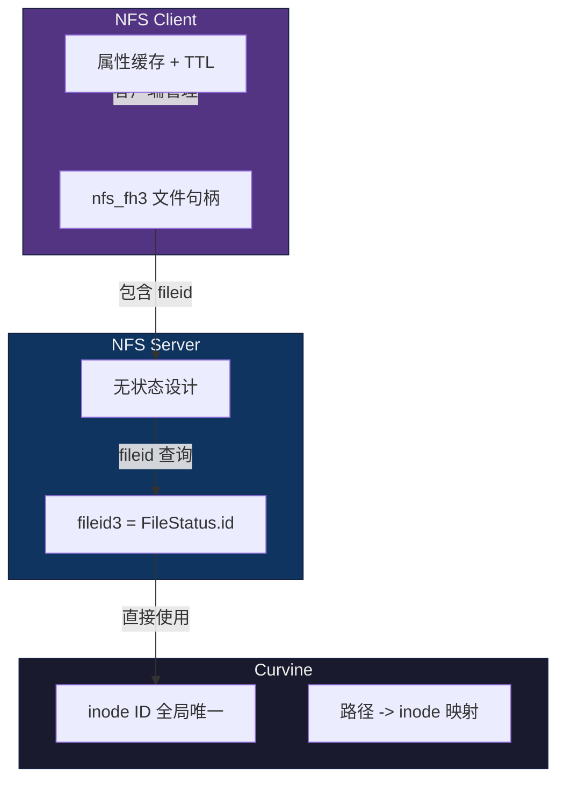
```mermaid
flowchart TB
    subgraph NFS_Client["NFS Client"]
        FH["nfs_fh3 文件句柄"]
        ATTR_CACHE["属性缓存 + TTL"]
    end
    
    subgraph NFS_Server["NFS Server"]
        STATELESS["无状态设计"]
        FILEID["fileid3 = FileStatus.id"]
    end
    
    subgraph Curvine["Curvine"]
        INODE["inode ID 全局唯一"]
        PATH["路径 -> inode 映射"]
    end
    
    FH -->|"包含 fileid"| STATELESS
    STATELESS -->|"fileid 查询"| FILEID
    FILEID -->|"直接使用"| INODE
    ATTR_CACHE -->|"客户端管理"| NFS_Client
    
    style NFS_Client fill:#533483,stroke:#16213e,color:#eee
    style NFS_Server fill:#0f3460,stroke:#16213e,color:#eee
    style Curvine fill:#1a1a2e,stroke:#16213e,color:#eee
```

NFS 可以直接使用 `FileStatus.id` 的原因：

1. **无状态设计**：NFS 服务器不需要维护 inode 生命周期，每次请求独立处理
2. **客户端管理缓存**：属性缓存由 NFS 客户端（OS 内核）管理，服务器无需维护
3. **文件句柄自包含**：`nfs_fh3` 包含 `fileid`，服务器可以直接解码获取 inode ID
4. **无引用计数**：NFS 没有 `lookup`/`forget` 语义，不需要追踪引用

### 3.1.3 NFS 直接使用 FileStatus.id 的潜在风险

| 风险 | 描述 | 缓解措施 |
|------|------|---------|
| **路径反查** | NFS 需要从 `fileid` 反查路径，但 Curvine 只支持 `path -> id` | 维护本地 `fileid -> path` 缓存 |
| **缓存过期** | 文件被删除后重建，可能复用相同 inode ID | Curvine inode ID 单调递增，不会复用 |
| **硬链接** | 同一 inode 多个路径，缓存可能不一致 | 使用 `FileStatus.id` 天然支持，无需额外处理 |
| **重命名** | 文件重命名后，缓存的路径失效 | 缓存 TTL 过期 + NFS 客户端重新 lookup |
| **并发删除** | 文件被删除时，其他请求可能使用旧句柄 | 返回 `NFS3ERR_STALE`，客户端重试 |

**路径缓存设计：**

```rust
pub struct CurvineNfsFileSystem {
    ufs: UnifiedFileSystem,
    config: NfsGatewayConf,
    // fileid -> path 缓存（必须维护）
    path_cache: RwLock<LruCache<fileid3, PathCacheEntry>>,
}

struct PathCacheEntry {
    path: String,
    cached_at: Instant,
}

impl CurvineNfsFileSystem {
    /// 从 fileid 获取路径（带缓存）
    fn get_path(&self, id: fileid3) -> Result<Path, nfsstat3> {
        // Root 目录特殊处理
        if id == self.root_dir() {
            return Ok(Path::from_str("/").unwrap());
        }
        
        let cache = self.path_cache.read().unwrap();
        match cache.get(&id) {
            Some(entry) if !entry.is_expired(&self.config) => {
                Path::from_str(&entry.path).map_err(|_| nfsstat3::NFS3ERR_STALE)
            }
            _ => Err(nfsstat3::NFS3ERR_STALE), // 缓存未命中，客户端需重新 lookup
        }
    }
    
    /// lookup 时更新缓存
    fn cache_path(&self, id: fileid3, path: String) {
        let mut cache = self.path_cache.write().unwrap();
        cache.put(id, PathCacheEntry {
            path,
            cached_at: Instant::now(),
        });
    }
}
```

**关键规则：**
1. Root 目录使用 Curvine 的 `FS_ROOT_ID = 1000`（参考 curvine-fuse/src/lib.rs）
2. `fileid3` 直接使用 `FileStatus.id as u64`
3. 必须维护 `fileid -> path` 缓存用于路径反查
4. 缓存未命中时返回 `NFS3ERR_STALE`，触发客户端重新 lookup

**简化的实现：**

```rust
pub struct CurvineNfsFileSystem {
    ufs: UnifiedFileSystem,
    config: NfsGatewayConf,
    // 注意：不需要 IdMapper！直接使用 FileStatus.id
}

impl CurvineNfsFileSystem {
    /// 直接使用 Curvine 的 inode ID 作为 NFS fileid
    fn status_to_fileid(status: &FileStatus) -> fileid3 {
        status.id as u64
    }
    
    /// Root 目录 ID
    fn root_dir(&self) -> fileid3 {
        curvine_fuse::FS_ROOT_ID as u64  // 1000
    }
}
```

### 3.2 nfsserve 与 UnifiedFileSystem 集成

**nfsserve 核心接口分析（来自 curvine-nfs/src/vfs.rs）：**

```rust
#[async_trait]
pub trait NFSFileSystem: Sync {
    fn capabilities(&self) -> VFSCapabilities;
    fn root_dir(&self) -> fileid3;
    
    // 核心操作
    async fn lookup(&self, dirid: fileid3, filename: &filename3) -> Result<fileid3, nfsstat3>;
    async fn getattr(&self, id: fileid3) -> Result<fattr3, nfsstat3>;
    async fn setattr(&self, id: fileid3, setattr: sattr3) -> Result<fattr3, nfsstat3>;
    async fn read(&self, id: fileid3, offset: u64, count: u32) -> Result<(Vec<u8>, bool), nfsstat3>;
    async fn write(&self, id: fileid3, offset: u64, data: &[u8]) -> Result<fattr3, nfsstat3>;
    async fn create(&self, dirid: fileid3, filename: &filename3, attr: sattr3) -> Result<(fileid3, fattr3), nfsstat3>;
    async fn mkdir(&self, dirid: fileid3, dirname: &filename3) -> Result<(fileid3, fattr3), nfsstat3>;
    async fn remove(&self, dirid: fileid3, filename: &filename3) -> Result<(), nfsstat3>;
    async fn rename(&self, from_dirid: fileid3, from_filename: &filename3, to_dirid: fileid3, to_filename: &filename3) -> Result<(), nfsstat3>;
    async fn readdir(&self, dirid: fileid3, start_after: fileid3, max_entries: usize) -> Result<ReadDirResult, nfsstat3>;
    async fn symlink(&self, dirid: fileid3, linkname: &filename3, symlink: &nfspath3, attr: &sattr3) -> Result<(fileid3, fattr3), nfsstat3>;
    async fn readlink(&self, id: fileid3) -> Result<nfspath3, nfsstat3>;
    
    // 可选方法（有默认实现）
    fn id_to_fh(&self, id: fileid3) -> nfs_fh3 { ... }
    fn fh_to_id(&self, id: &nfs_fh3) -> Result<fileid3, nfsstat3> { ... }
}
```

**接口映射关系：**

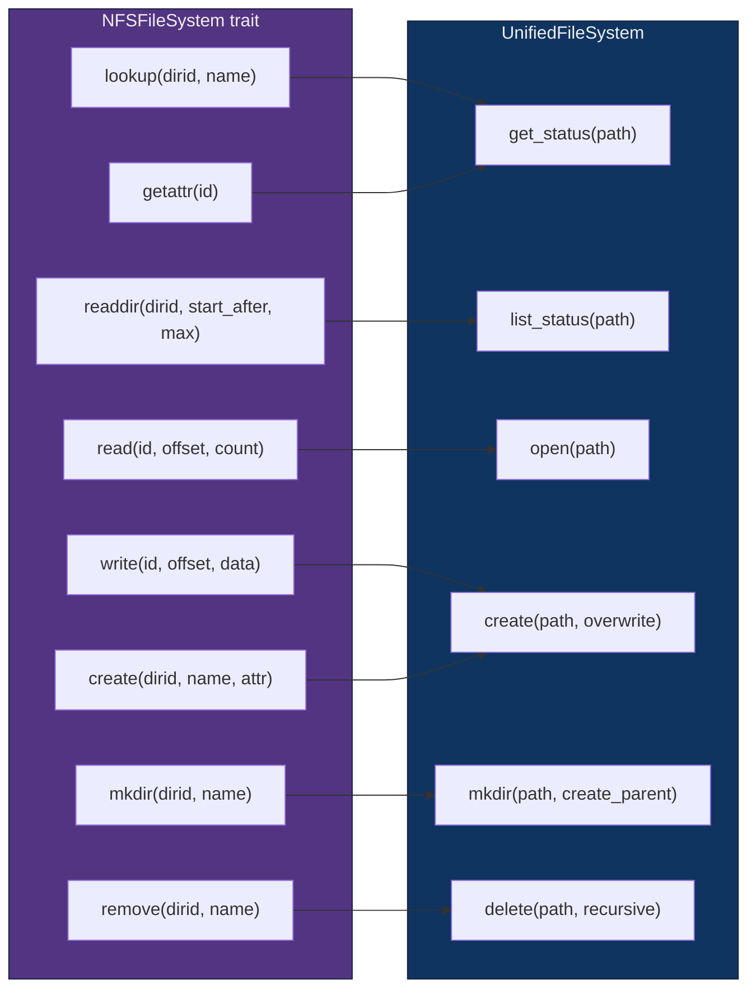
```mermaid
flowchart LR
    subgraph NFS["NFSFileSystem trait"]
        NFS_LOOKUP["lookup(dirid, name)"]
        NFS_GETATTR["getattr(id)"]
        NFS_READ["read(id, offset, count)"]
        NFS_WRITE["write(id, offset, data)"]
        NFS_CREATE["create(dirid, name, attr)"]
        NFS_MKDIR["mkdir(dirid, name)"]
        NFS_READDIR["readdir(dirid, start_after, max)"]
        NFS_REMOVE["remove(dirid, name)"]
    end
    
    subgraph UFS["UnifiedFileSystem"]
        UFS_STATUS["get_status(path)"]
        UFS_LIST["list_status(path)"]
        UFS_OPEN["open(path)"]
        UFS_CREATE["create(path, overwrite)"]
        UFS_MKDIR["mkdir(path, create_parent)"]
        UFS_DELETE["delete(path, recursive)"]
    end
    
    NFS_LOOKUP --> UFS_STATUS
    NFS_GETATTR --> UFS_STATUS
    NFS_READ --> UFS_OPEN
    NFS_WRITE --> UFS_CREATE
    NFS_CREATE --> UFS_CREATE
    NFS_MKDIR --> UFS_MKDIR
    NFS_READDIR --> UFS_LIST
    NFS_REMOVE --> UFS_DELETE
    
    style NFS fill:#533483,stroke:#16213e,color:#eee
    style UFS fill:#0f3460,stroke:#16213e,color:#eee
```

**核心实现示例：**

```rust
use nfsserve::vfs::{NFSFileSystem, VFSCapabilities, ReadDirResult, DirEntry};
use nfsserve::nfs::{fileid3, filename3, fattr3, nfsstat3, ftype3};
use curvine_client::unified::UnifiedFileSystem;
use curvine_common::fs::{FileSystem, Path};

pub struct CurvineNfsFileSystem {
    ufs: UnifiedFileSystem,
    config: NfsGatewayConf,
    // Path cache: fileid -> path (for reverse lookup)
    path_cache: RwLock<HashMap<fileid3, String>>,
}

#[async_trait]
impl NFSFileSystem for CurvineNfsFileSystem {
    fn capabilities(&self) -> VFSCapabilities {
        if self.config.read_only {
            VFSCapabilities::ReadOnly
        } else {
            VFSCapabilities::ReadWrite
        }
    }
    
    fn root_dir(&self) -> fileid3 {
        curvine_fuse::FS_ROOT_ID as u64  // 1000
    }
    
    async fn lookup(&self, dirid: fileid3, filename: &filename3) -> Result<fileid3, nfsstat3> {
        let parent_path = self.get_path(dirid)?;
        let name = std::str::from_utf8(filename).map_err(|_| nfsstat3::NFS3ERR_INVAL)?;
        
        // Handle special cases
        if name == "." {
            return Ok(dirid);
        }
        if name == ".." {
            let status = self.ufs.get_status(&parent_path).await
                .map_err(|e| Self::fs_error_to_nfs(e))?;
            // Get parent directory's id
            let parent_of_parent = parent_path.parent()
                .unwrap_or_else(|| Path::from_str("/").unwrap());
            let parent_status = self.ufs.get_status(&parent_of_parent).await
                .map_err(|e| Self::fs_error_to_nfs(e))?;
            return Ok(parent_status.id as u64);
        }
        
        let child_path = parent_path.join(name);
        let status = self.ufs.get_status(&child_path).await
            .map_err(|e| Self::fs_error_to_nfs(e))?;
        
        // Cache the path for reverse lookup
        self.cache_path(status.id as u64, child_path.to_string());
        
        Ok(status.id as u64)
    }
    
    async fn getattr(&self, id: fileid3) -> Result<fattr3, nfsstat3> {
        let path = self.get_path(id)?;
        let status = self.ufs.get_status(&path).await
            .map_err(|e| Self::fs_error_to_nfs(e))?;
        Ok(Self::status_to_fattr3(&status))
    }
    
    async fn read(&self, id: fileid3, offset: u64, count: u32) -> Result<(Vec<u8>, bool), nfsstat3> {
        let path = self.get_path(id)?;
        let mut reader = self.ufs.open(&path).await
            .map_err(|e| Self::fs_error_to_nfs(e))?;
        
        // Seek to offset and read
        let mut buf = vec![0u8; count as usize];
        let n = reader.read_at(offset as i64, &mut buf).await
            .map_err(|_| nfsstat3::NFS3ERR_IO)?;
        
        buf.truncate(n);
        let eof = n < count as usize;
        
        Ok((buf, eof))
    }
    
    async fn readdir(
        &self,
        dirid: fileid3,
        start_after: fileid3,
        max_entries: usize,
    ) -> Result<ReadDirResult, nfsstat3> {
        let path = self.get_path(dirid)?;
        let entries = self.ufs.list_status(&path).await
            .map_err(|e| Self::fs_error_to_nfs(e))?;
        
        // Sort by fileid for stable pagination
        let mut sorted: Vec<_> = entries.iter()
            .map(|s| (s.id as u64, s))
            .collect();
        sorted.sort_by_key(|(id, _)| *id);
        
        // Filter entries after start_after
        let filtered: Vec<_> = sorted.into_iter()
            .filter(|(id, _)| *id > start_after)
            .take(max_entries)
            .collect();
        
        let end = filtered.len() < max_entries;
        
        let result_entries: Vec<DirEntry> = filtered.into_iter()
            .map(|(id, status)| {
                self.cache_path(id, format!("{}/{}", path, status.name));
                DirEntry {
                    fileid: id,
                    name: status.name.as_bytes().to_vec().into(),
                    attr: Self::status_to_fattr3(status),
                }
            })
            .collect();
        
        Ok(ReadDirResult {
            entries: result_entries,
            end,
        })
    }
    
    // ... 其他方法实现
}
```

**路径缓存策略：**

由于 NFS 使用 fileid 而非路径，需要维护 `fileid -> path` 的反向映射：

```rust
impl CurvineNfsFileSystem {
    /// Cache path for reverse lookup
    fn cache_path(&self, id: fileid3, path: String) {
        let mut cache = self.path_cache.write().unwrap();
        cache.insert(id, path);
    }
    
    /// Get path from fileid (with cache)
    fn get_path(&self, id: fileid3) -> Result<Path, nfsstat3> {
        // Root directory special case
        if id == self.root_dir() {
            return Ok(Path::from_str("/").unwrap());
        }
        
        let cache = self.path_cache.read().unwrap();
        match cache.get(&id) {
            Some(path) => Path::from_str(path).map_err(|_| nfsstat3::NFS3ERR_STALE),
            None => Err(nfsstat3::NFS3ERR_STALE),  // Client should re-lookup
        }
    }
}
```

### 3.3 属性转换

将 Curvine 的 `FileStatus` 转换为 NFS 的 `fattr3`：

```rust
impl CurvineNfsFileSystem {
    fn status_to_fattr3(status: &FileStatus) -> fattr3 {
        fattr3 {
            ftype: match status.file_type {
                FileType::File => ftype3::NF3REG,
                FileType::Dir => ftype3::NF3DIR,
                FileType::Symlink => ftype3::NF3LNK,
                _ => ftype3::NF3REG,
            },
            mode: status.mode,
            nlink: status.nlink,
            uid: Self::resolve_uid(&status.owner),
            gid: Self::resolve_gid(&status.group),
            size: status.len as u64,
            used: ((status.len + 511) / 512 * 512) as u64,
            rdev: specdata3::default(),
            fsid: 0,
            fileid: status.id as u64,  // 直接使用 Curvine inode ID
            atime: Self::to_nfstime3(status.atime),
            mtime: Self::to_nfstime3(status.mtime),
            ctime: Self::to_nfstime3(status.mtime),
        }
    }
    
    fn to_nfstime3(ms: i64) -> nfstime3 {
        nfstime3 {
            seconds: (ms / 1000) as u32,
            nseconds: ((ms % 1000) * 1_000_000) as u32,
        }
    }
}
```

### 3.4 读写流程

#### 3.3.1 读取流程

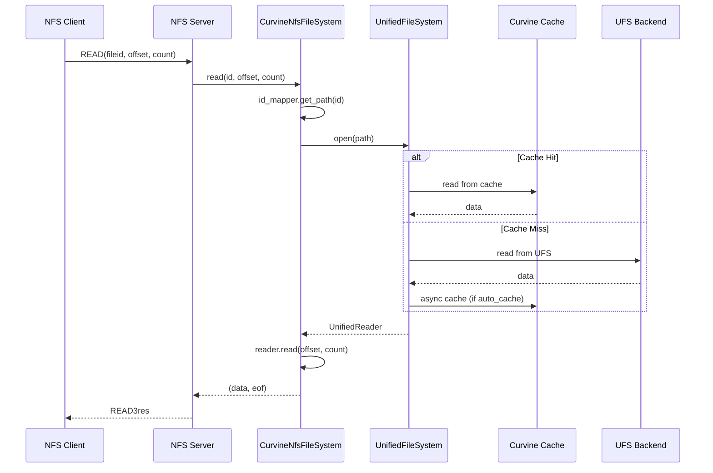
```mermaid
sequenceDiagram
    participant Client as NFS Client
    participant Server as NFS Server
    participant VFS as CurvineNfsFileSystem
    participant UFS as UnifiedFileSystem
    participant Cache as Curvine Cache
    participant UFS_Backend as UFS Backend
    
    Client->>Server: READ(fileid, offset, count)
    Server->>VFS: read(id, offset, count)
    VFS->>VFS: id_mapper.get_path(id)
    VFS->>UFS: open(path)
    
    alt Cache Hit
        UFS->>Cache: read from cache
        Cache-->>UFS: data
    else Cache Miss
        UFS->>UFS_Backend: read from UFS
        UFS_Backend-->>UFS: data
        UFS->>Cache: async cache (if auto_cache)
    end
    
    UFS-->>VFS: UnifiedReader
    VFS->>VFS: reader.read(offset, count)
    VFS-->>Server: (data, eof)
    Server-->>Client: READ3res
```

#### 3.3.2 写入流程

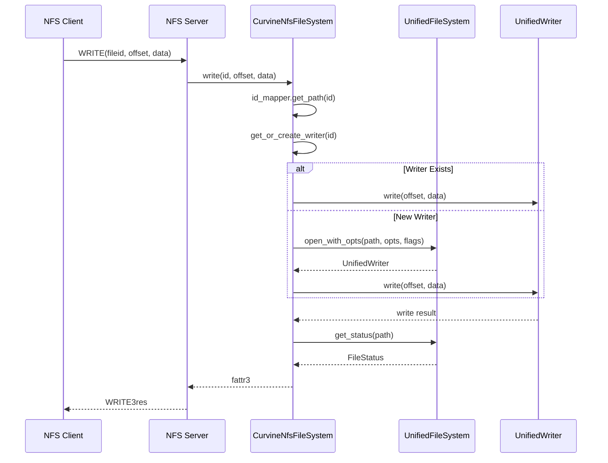
```mermaid
sequenceDiagram
    participant Client as NFS Client
    participant Server as NFS Server
    participant VFS as CurvineNfsFileSystem
    participant UFS as UnifiedFileSystem
    participant Writer as UnifiedWriter
    
    Client->>Server: WRITE(fileid, offset, data)
    Server->>VFS: write(id, offset, data)
    VFS->>VFS: id_mapper.get_path(id)
    VFS->>VFS: get_or_create_writer(id)
    
    alt Writer Exists
        VFS->>Writer: write(offset, data)
    else New Writer
        VFS->>UFS: open_with_opts(path, opts, flags)
        UFS-->>VFS: UnifiedWriter
        VFS->>Writer: write(offset, data)
    end
    
    Writer-->>VFS: write result
    VFS->>UFS: get_status(path)
    UFS-->>VFS: FileStatus
    VFS-->>Server: fattr3
    Server-->>Client: WRITE3res
```

### 3.5 大文件写入与多 NFS Gateway 实例问题（重要）

**问题描述：**

当部署多个 NFS Gateway 实例通过 LB 对外提供服务时，大文件写入可能出现问题：

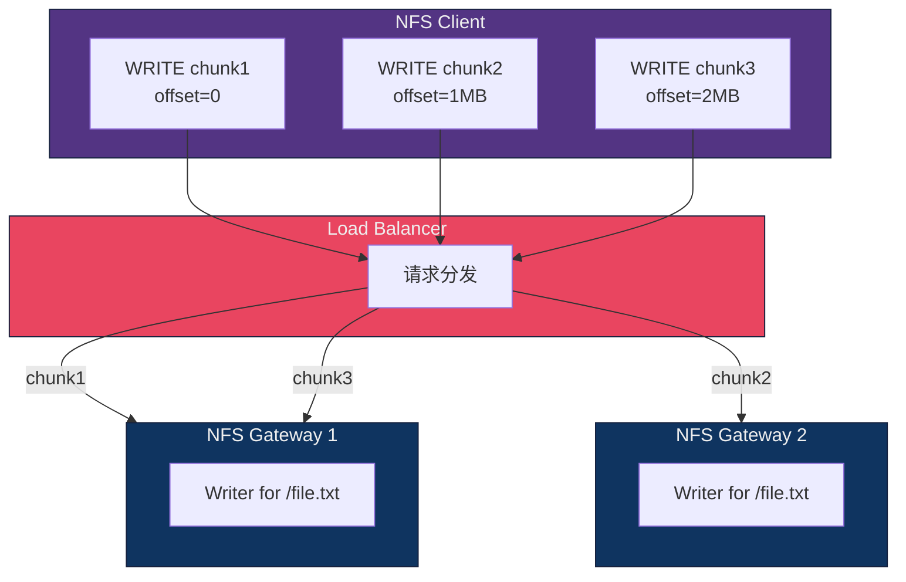
```mermaid
flowchart TB
    subgraph Client["NFS Client"]
        WRITE1["WRITE chunk1<br/>offset=0"]
        WRITE2["WRITE chunk2<br/>offset=1MB"]
        WRITE3["WRITE chunk3<br/>offset=2MB"]
    end
    
    subgraph LB["Load Balancer"]
        DISPATCH["请求分发"]
    end
    
    subgraph GW1["NFS Gateway 1"]
        W1["Writer for /file.txt"]
    end
    
    subgraph GW2["NFS Gateway 2"]
        W2["Writer for /file.txt"]
    end
    
    WRITE1 --> DISPATCH
    WRITE2 --> DISPATCH
    WRITE3 --> DISPATCH
    DISPATCH -->|"chunk1"| GW1
    DISPATCH -->|"chunk2"| GW2
    DISPATCH -->|"chunk3"| GW1
    
    style Client fill:#533483,stroke:#16213e,color:#eee
    style LB fill:#e94560,stroke:#16213e,color:#eee
    style GW1 fill:#0f3460,stroke:#16213e,color:#eee
    style GW2 fill:#0f3460,stroke:#16213e,color:#eee
```

**潜在问题分析：**

| 场景 | 问题 | 严重程度 |
|------|------|---------|
| 不同 chunk 路由到不同 GW | 每个 GW 有独立的 Writer，数据不一致 | 严重 |
| 本地临时文件分片 | 合并时找不到其他 GW 的分片 | 严重 |
| Writer 状态不共享 | 文件长度、偏移量不一致 | 严重 |

**解决方案对比：**

| 方案 | 描述 | 优点 | 缺点 |
|------|------|------|------|
| **方案 A: 会话亲和性** | LB 配置 sticky session | 简单，无需改代码 | 负载不均衡 |
| **方案 B: 直接写入 Curvine** | 每次 write 直接写入 Curvine | 天然分布式一致 | 性能可能受影响 |
| **方案 C: 分布式临时存储** | 参考 S3 Gateway 的 CurvineTempStorage | 已有实现可复用 | 增加复杂度 |

**推荐方案：方案 B - 直接写入 Curvine（参考 S3 Gateway 设计）**

S3 Gateway 的 `CurvineTempStorage` 已经解决了类似问题：

```rust
// 参考 curvine-s3-gateway/src/utils/temp_storage.rs
pub struct CurvineTempStorage {
    fs: UnifiedFileSystem,  // 使用 Curvine 分布式存储
    config: TempStorageConfig,
}

impl CurvineTempStorage {
    /// 分片直接写入 Curvine，而非本地文件系统
    pub async fn write_part_stream(&self, upload_id: &str, part_number: u32, body: &mut AsyncReadEnum) -> Result<String, String> {
        let path = self.part_path(upload_id, part_number)?;
        let mut writer = self.fs.create(&path, true).await?;
        // ... 写入 Curvine
        writer.complete().await?;
        Ok(etag)
    }
}
```

**NFS Gateway 的写入设计：**

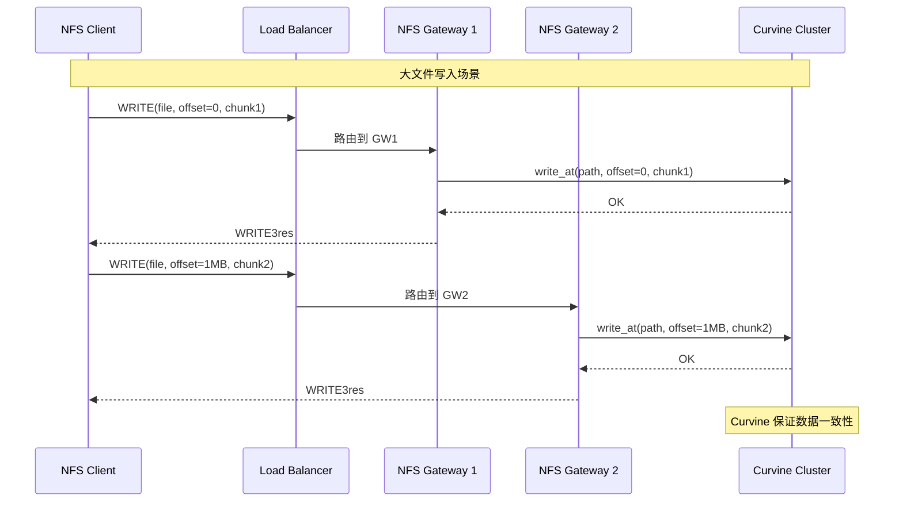
```mermaid
sequenceDiagram
    participant Client as NFS Client
    participant LB as Load Balancer
    participant GW1 as NFS Gateway 1
    participant GW2 as NFS Gateway 2
    participant Curvine as Curvine Cluster
    
    Note over Client,Curvine: 大文件写入场景
    
    Client->>LB: WRITE(file, offset=0, chunk1)
    LB->>GW1: 路由到 GW1
    GW1->>Curvine: write_at(path, offset=0, chunk1)
    Curvine-->>GW1: OK
    GW1-->>Client: WRITE3res
    
    Client->>LB: WRITE(file, offset=1MB, chunk2)
    LB->>GW2: 路由到 GW2
    GW2->>Curvine: write_at(path, offset=1MB, chunk2)
    Curvine-->>GW2: OK
    GW2-->>Client: WRITE3res
    
    Note over Curvine: Curvine 保证数据一致性
```

**关键实现要点：**

```rust
impl NFSFileSystem for CurvineNfsFileSystem {
    async fn write(&self, id: fileid3, offset: u64, data: &[u8]) -> Result<fattr3, nfsstat3> {
        let path = self.get_path(id)?;
        
        // 关键：使用 fuse_write 支持随机位置写入
        // FsWriter.seek() 已实现，支持多 NFS Gateway 实例并发写入
        let flags = OpenFlags::new_write_only()
            .set_create(false)  // 文件应已存在
            .set_overwrite(false);  // 非覆盖模式，支持随机写入
        let opts = CreateFileOpts::default();
        
        let mut writer = self.ufs.open_with_opts(&path, opts, flags).await
            .map_err(|e| Self::fs_error_to_nfs(e))?;
        
        // 使用 fuse_write 支持随机写入（内部调用 seek + write）
        let chunk = DataSlice::Bytes(bytes::Bytes::copy_from_slice(data));
        writer.fuse_write(offset as i64, chunk).await
            .map_err(|_| nfsstat3::NFS3ERR_IO)?;
        
        writer.complete().await
            .map_err(|_| nfsstat3::NFS3ERR_IO)?;
        
        // 获取最新状态返回
        let status = self.ufs.get_status(&path).await
            .map_err(|e| Self::fs_error_to_nfs(e))?;
        
        Ok(Self::status_to_fattr3(&status))
    }
}
```

**注意事项：**

1. **Curvine 必须支持随机写入（write_at）**：需要确认 `UnifiedWriter` 是否支持
2. **并发写入冲突**：依赖 Curvine 的并发控制机制
3. **性能考量**：每次 write 都创建新 Writer 可能有开销，可考虑连接池
4. **LB 配置建议**：虽然方案 B 支持任意路由，但建议配置会话亲和性以优化性能

**备选方案：会话亲和性（简单场景）**

如果 Curvine 不支持随机写入，或性能要求极高，可使用 LB 会话亲和性：

```yaml
# Nginx 配置示例
upstream nfs_gateways {
    ip_hash;  # 基于客户端 IP 的会话亲和性
    server nfs-gw-1:2049;
    server nfs-gw-2:2049;
    server nfs-gw-3:2049;
}
```

### 3.6 目录遍历与分页

NFS `readdir` 需要支持分页，使用 `start_after` 参数指定从哪个 fileid 之后开始返回。

**实现策略：**

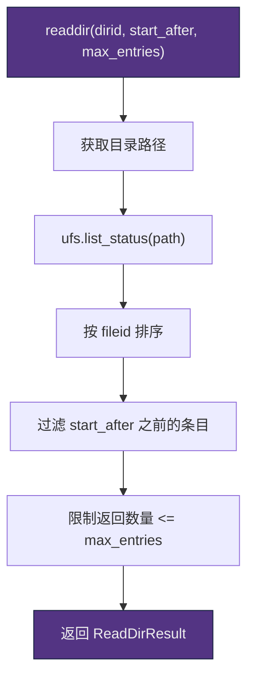
```mermaid
flowchart TB
    START["readdir(dirid, start_after, max_entries)"]
    GET_PATH["获取目录路径"]
    LIST["ufs.list_status(path)"]
    SORT["按 fileid 排序"]
    FILTER["过滤 start_after 之前的条目"]
    LIMIT["限制返回数量 <= max_entries"]
    RESULT["返回 ReadDirResult"]
    
    START --> GET_PATH
    GET_PATH --> LIST
    LIST --> SORT
    SORT --> FILTER
    FILTER --> LIMIT
    LIMIT --> RESULT
    
    style START fill:#533483,stroke:#16213e,color:#eee
    style RESULT fill:#533483,stroke:#16213e,color:#eee
```

**关键点：**
1. 目录条目需要稳定排序（按 fileid，即 `FileStatus.id`）
2. 多 NFS Gateway 实例返回相同的排序结果（因为使用 Curvine inode ID）
3. 添加 "." 和 ".." 特殊条目

### 3.7 文件句柄管理

NFS 使用 `nfs_fh3`（最多 64 字节）作为文件句柄。

**nfsserve 默认实现（来自 curvine-nfs/src/vfs.rs）：**

```rust
// nfsserve 已提供默认实现，包含 generation number 防止 stale handle
fn id_to_fh(&self, id: fileid3) -> nfs_fh3 {
    let gennum = get_generation_number();  // 服务启动时间戳
    let mut ret: Vec<u8> = Vec::new();
    ret.extend_from_slice(&gennum.to_le_bytes());  // 8 bytes
    ret.extend_from_slice(&id.to_le_bytes());      // 8 bytes
    nfs_fh3 { data: ret }  // 总共 16 bytes
}

fn fh_to_id(&self, id: &nfs_fh3) -> Result<fileid3, nfsstat3> {
    if id.data.len() != 16 {
        return Err(nfsstat3::NFS3ERR_BADHANDLE);
    }
    let gen = u64::from_le_bytes(id.data[0..8].try_into().unwrap());
    let id = u64::from_le_bytes(id.data[8..16].try_into().unwrap());
    let gennum = get_generation_number();
    match gen.cmp(&gennum) {
        Ordering::Less => Err(nfsstat3::NFS3ERR_STALE),   // 旧句柄
        Ordering::Greater => Err(nfsstat3::NFS3ERR_BADHANDLE),
        Ordering::Equal => Ok(id),
    }
}
```

**多实例部署的句柄问题：**

由于 `generation_number` 是每个 NFS Gateway 实例启动时生成的，不同实例的 generation number 不同，会导致：
- 客户端从 GW1 获取的句柄，发送到 GW2 时会被拒绝（NFS3ERR_STALE）

**解决方案：使用固定的 generation number**

```rust
impl CurvineNfsFileSystem {
    /// 覆盖默认实现，使用固定的 generation number
    /// 这样所有 NFS Gateway 实例生成的句柄可以互相识别
    fn id_to_fh(&self, id: fileid3) -> nfs_fh3 {
        // 使用固定值或配置的集群 ID
        let gennum: u64 = self.config.cluster_generation;
        let mut ret: Vec<u8> = Vec::new();
        ret.extend_from_slice(&gennum.to_le_bytes());
        ret.extend_from_slice(&id.to_le_bytes());
        nfs_fh3 { data: ret }
    }
    
    fn fh_to_id(&self, fh: &nfs_fh3) -> Result<fileid3, nfsstat3> {
        if fh.data.len() != 16 {
            return Err(nfsstat3::NFS3ERR_BADHANDLE);
        }
        let gen = u64::from_le_bytes(fh.data[0..8].try_into().unwrap());
        let id = u64::from_le_bytes(fh.data[8..16].try_into().unwrap());
        
        // 验证 generation number
        if gen != self.config.cluster_generation {
            return Err(nfsstat3::NFS3ERR_STALE);
        }
        Ok(id)
    }
}
```

**配置示例：**

```toml
[nfs_gateway]
# 集群 generation number，所有 NFS Gateway 实例必须配置相同的值
# 建议使用集群首次部署的时间戳
cluster_generation = 1735084800000
```

## 4. 配置设计

### 4.1 配置结构

```toml
[nfs_gateway]
# 监听地址
listen = "0.0.0.0:2049"

# 导出路径（NFS export）
export_path = "/"

# 是否只读
read_only = false

# 集群 generation number（多实例部署必须相同）
# 建议使用集群首次部署的时间戳，所有 NFS Gateway 实例配置相同值
cluster_generation = 1735084800000

# 路径缓存大小（fileid -> path 映射）
path_cache_size = 100000

# 路径缓存 TTL（秒）
path_cache_ttl_secs = 300

# 最大读取块大小
max_read_size = 1048576  # 1MB

# 最大写入块大小
max_write_size = 1048576  # 1MB

# Web 监控端口
web_port = 9300

# 写入模式：direct（直接写入 Curvine）或 buffered（本地缓冲）
# 多实例部署必须使用 direct 模式
write_mode = "direct"
```

### 4.2 多实例部署配置要点

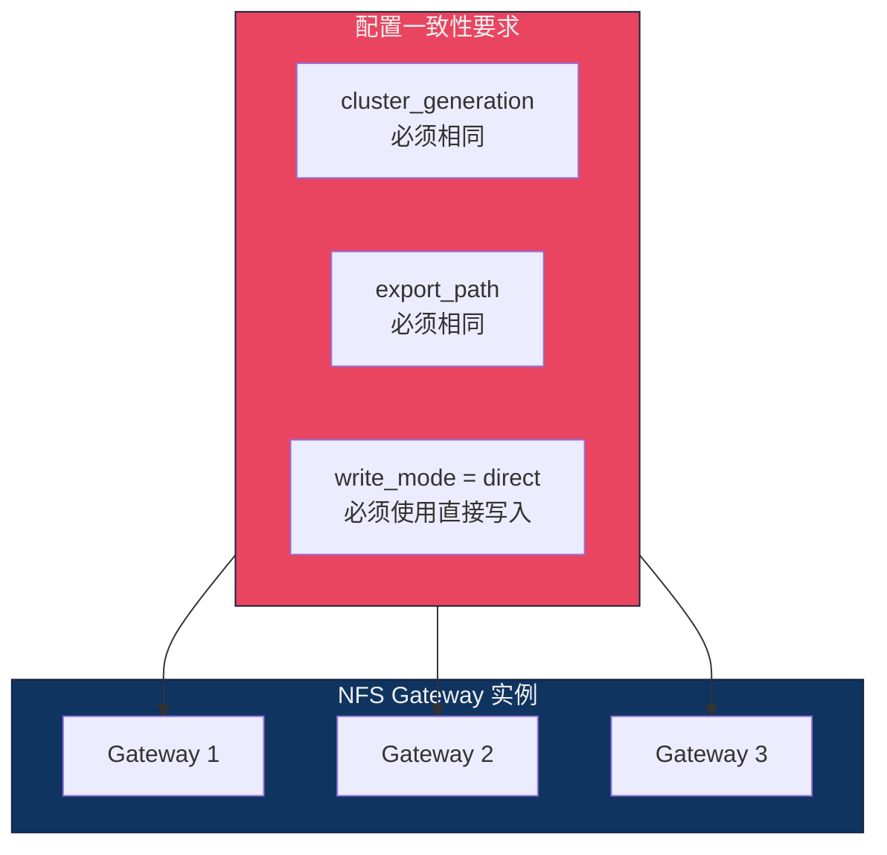
```mermaid
flowchart TB
    subgraph Config["配置一致性要求"]
        GEN["cluster_generation<br/>必须相同"]
        EXPORT["export_path<br/>必须相同"]
        WRITE["write_mode = direct<br/>必须使用直接写入"]
    end
    
    subgraph Instances["NFS Gateway 实例"]
        GW1["Gateway 1"]
        GW2["Gateway 2"]
        GW3["Gateway 3"]
    end
    
    Config --> GW1
    Config --> GW2
    Config --> GW3
    
    style Config fill:#e94560,stroke:#16213e,color:#eee
    style Instances fill:#0f3460,stroke:#16213e,color:#eee
```

| 配置项 | 多实例要求 | 说明 |
|--------|-----------|------|
| `cluster_generation` | 必须相同 | 确保文件句柄跨实例有效 |
| `export_path` | 必须相同 | 确保导出相同的文件系统 |
| `write_mode` | 必须为 `direct` | 避免本地缓冲导致数据不一致 |
| `listen` | 可以不同 | 每个实例监听不同端口/IP |
| `web_port` | 可以不同 | 监控端口可独立 |

### 4.3 与现有配置集成

在 `ClusterConf` 中添加 `nfs_gateway` 配置段，复用现有的配置加载机制。

## 5. 错误处理

### 5.1 错误类型设计（参考 curvine-fuse 风格）

参考 `curvine-fuse/src/fuse_error.rs` 的设计模式，NFS Gateway 的错误处理保持风格一致：

```rust
use curvine_common::error::FsError;
use nfsserve::nfs::nfsstat3;
use orpc::CommonError;
use std::fmt;

/// NFS Gateway error type
/// Wraps nfsstat3 error code with detailed error message
#[derive(Debug)]
pub struct NfsError {
    pub(crate) stat: nfsstat3,
    pub(crate) error: CommonError,
}

impl NfsError {
    pub fn new(stat: nfsstat3, error: CommonError) -> Self {
        Self { stat, error }
    }
    
    /// Get the NFS status code
    #[inline]
    pub fn stat(&self) -> nfsstat3 {
        self.stat
    }
}

impl std::error::Error for NfsError {}

impl fmt::Display for NfsError {
    fn fmt(&self, fmt: &mut fmt::Formatter) -> fmt::Result {
        write!(fmt, "NFS error {:?}: {}", self.stat, self.error)
    }
}

impl From<String> for NfsError {
    fn from(value: String) -> Self {
        Self::new(nfsstat3::NFS3ERR_IO, value.into())
    }
}

impl From<CommonError> for NfsError {
    fn from(value: CommonError) -> Self {
        Self::new(nfsstat3::NFS3ERR_IO, value)
    }
}

/// Convert FsError to NfsError with proper status code mapping
/// Pattern follows curvine-fuse/src/fuse_error.rs
impl From<FsError> for NfsError {
    fn from(value: FsError) -> Self {
        // Map well-known FsError kinds directly to NFS status codes
        let mapped = match &value {
            FsError::FileAlreadyExists(_) => Some(nfsstat3::NFS3ERR_EXIST),
            FsError::FileNotFound(_) => Some(nfsstat3::NFS3ERR_NOENT),
            FsError::DirNotEmpty(_) => Some(nfsstat3::NFS3ERR_NOTEMPTY),
            FsError::ParentNotDir(_) => Some(nfsstat3::NFS3ERR_NOTDIR),
            FsError::InvalidPath(_) => Some(nfsstat3::NFS3ERR_INVAL),
            FsError::DiskOutOfSpace(_) => Some(nfsstat3::NFS3ERR_NOSPC),
            FsError::Timeout(_) => Some(nfsstat3::NFS3ERR_JUKEBOX), // Retry later
            FsError::Unsupported(_) => Some(nfsstat3::NFS3ERR_NOTSUPP),
            FsError::InProgress(_) => Some(nfsstat3::NFS3ERR_JUKEBOX),
            FsError::IO(_) => Some(nfsstat3::NFS3ERR_IO),
            FsError::Expired(_) => Some(nfsstat3::NFS3ERR_STALE),
            _ => None,
        };

        if let Some(stat) = mapped {
            return Self::new(stat, value.into());
        }

        // Fallback: infer from message content (same as FUSE)
        let msg = value.to_string().to_lowercase();
        if msg.contains("permission denied") || msg.contains("os error 13") {
            return Self::new(nfsstat3::NFS3ERR_ACCES, value.into());
        }
        if msg.contains("read only") || msg.contains("read-only") {
            return Self::new(nfsstat3::NFS3ERR_ROFS, value.into());
        }
        if msg.contains("name too long") {
            return Self::new(nfsstat3::NFS3ERR_NAMETOOLONG, value.into());
        }
        if msg.contains("is a directory") {
            return Self::new(nfsstat3::NFS3ERR_ISDIR, value.into());
        }

        // Default to SERVERFAULT
        Self::new(nfsstat3::NFS3ERR_SERVERFAULT, value.into())
    }
}

/// Result type alias for NFS operations
pub type NfsResult<T> = Result<T, NfsError>;
```

### 5.2 错误码映射表

| FsError | nfsstat3 | 说明 |
|---------|----------|------|
| FileAlreadyExists | NFS3ERR_EXIST | 文件已存在 |
| FileNotFound | NFS3ERR_NOENT | 文件不存在 |
| DirNotEmpty | NFS3ERR_NOTEMPTY | 目录非空 |
| ParentNotDir | NFS3ERR_NOTDIR | 父路径不是目录 |
| InvalidPath | NFS3ERR_INVAL | 无效路径 |
| DiskOutOfSpace | NFS3ERR_NOSPC | 磁盘空间不足 |
| Timeout | NFS3ERR_JUKEBOX | 稍后重试 |
| Unsupported | NFS3ERR_NOTSUPP | 不支持的操作 |
| IO | NFS3ERR_IO | I/O 错误 |
| Expired | NFS3ERR_STALE | 文件句柄过期 |
| (permission denied) | NFS3ERR_ACCES | 权限拒绝 |
| (read only) | NFS3ERR_ROFS | 只读文件系统 |
| (is directory) | NFS3ERR_ISDIR | 是目录 |
| (default) | NFS3ERR_SERVERFAULT | 服务器内部错误 |

### 5.3 使用示例

```rust
impl CurvineNfsFileSystem {
    /// Helper to convert FsError to nfsstat3 for NFSFileSystem trait
    #[inline]
    fn fs_error_to_nfs(e: FsError) -> nfsstat3 {
        NfsError::from(e).stat()
    }
    
    async fn lookup(&self, dirid: fileid3, filename: &filename3) -> Result<fileid3, nfsstat3> {
        let parent_path = self.get_path(dirid)?;
        let name = std::str::from_utf8(filename)
            .map_err(|_| nfsstat3::NFS3ERR_INVAL)?;
        
        let child_path = parent_path.join(name);
        let status = self.ufs.get_status(&child_path).await
            .map_err(Self::fs_error_to_nfs)?;  // Use helper
        
        self.cache_path(status.id as u64, child_path.to_string());
        Ok(status.id as u64)
    }
}
```

## 6. 与现有组件的对比

### 6.1 与 curvine-fuse 的对比

| 方面 | curvine-fuse | curvine-nfs-gateway |
|------|--------------|---------------------|
| 协议 | FUSE (内核模块) | NFSv3 (用户态) |
| 平台 | Linux/macOS | Linux/macOS/Windows |
| ID 管理 | NodeMap 本地生成 ID | 直接使用 FileStatus.id |
| 状态管理 | NodeState (本地状态) | 无状态（或最小状态） |
| 缓存 | 依赖 FUSE 内核缓存 | 依赖 NFS 客户端缓存 |
| 多实例 | 单机绑定 | 支持多实例 + LB |
| 底层接口 | UnifiedFileSystem | UnifiedFileSystem |

### 6.2 与 curvine-s3-gateway 的对比

| 方面 | curvine-s3-gateway | curvine-nfs-gateway |
|------|-------------------|---------------------|
| 协议 | S3 REST API | NFSv3 RPC |
| 语义 | 对象存储 | POSIX 文件系统 |
| 认证 | AWS SigV4 | 无（信任本地网络） |
| 适用场景 | 应用程序集成 | 文件系统挂载 |
| 底层接口 | UnifiedFileSystem | UnifiedFileSystem |

## 7. 实现步骤

### Phase 1: 基础框架（1-2 周）

1. 创建 `curvine-nfs-gateway` crate
2. 实现 `IdMapper` 和基础状态管理
3. 实现 `NFSFileSystem` trait 的只读方法：
   - `root_dir`, `capabilities`
   - `lookup`, `getattr`
   - `readdir`, `read`
   - `readlink`

### Phase 2: 写入支持（1 周）

1. 实现写入相关方法：
   - `create`, `mkdir`
   - `write`, `setattr`
   - `remove`, `rename`
   - `symlink`
2. 实现写入缓冲和刷新机制

### Phase 3: 优化与测试（1 周）

1. 添加缓存层优化性能
2. 实现 Metrics 监控
3. 编写集成测试
4. 性能测试与调优

### Phase 4: 生产就绪（1 周）

1. 配置热加载
2. 优雅关闭
3. 文档完善
4. CI/CD 集成

## 8. 测试用例

### 8.1 基础功能测试

| 序号 | 测试场景 | 输入 | 预期结果 |
|------|---------|------|---------|
| 1 | 挂载根目录 | `mount -t nfs localhost:/ /mnt` | 挂载成功 |
| 2 | 列出根目录 | `ls /mnt` | 显示 Curvine 根目录内容 |
| 3 | 创建目录 | `mkdir /mnt/test` | 目录创建成功 |
| 4 | 创建文件 | `touch /mnt/test/file.txt` | 文件创建成功 |
| 5 | 写入文件 | `echo "hello" > /mnt/test/file.txt` | 写入成功 |
| 6 | 读取文件 | `cat /mnt/test/file.txt` | 输出 "hello" |
| 7 | 删除文件 | `rm /mnt/test/file.txt` | 文件删除成功 |
| 8 | 删除目录 | `rmdir /mnt/test` | 目录删除成功 |
| 9 | 重命名 | `mv /mnt/a.txt /mnt/b.txt` | 重命名成功 |
| 10 | 符号链接 | `ln -s /mnt/a.txt /mnt/link` | 链接创建成功 |

### 8.2 边界条件测试

| 序号 | 测试场景 | 输入 | 预期结果 |
|------|---------|------|---------|
| 1 | 大文件读取 | 读取 1GB 文件 | 正确读取，无内存溢出 |
| 2 | 并发写入 | 10 个进程同时写入 | 数据一致性保证 |
| 3 | 深层目录 | 创建 100 层嵌套目录 | 正常工作 |
| 4 | 长文件名 | 255 字符文件名 | 正常创建 |
| 5 | 特殊字符 | 文件名含空格、中文 | 正常处理 |
| 6 | 权限检查 | 无权限文件访问 | 返回 EACCES |
| 7 | 不存在文件 | 访问不存在的路径 | 返回 ENOENT |
| 8 | 目录非空删除 | `rmdir` 非空目录 | 返回 ENOTEMPTY |
| 9 | 断线重连 | 网络中断后恢复 | 自动重连 |
| 10 | 服务重启 | Gateway 重启 | 客户端自动恢复 |

## 9. 性能考量

### 9.1 优化策略

1. **ID 映射缓存**：使用 LRU 缓存减少路径查找开销
2. **属性缓存**：短期缓存 `FileStatus` 减少 RPC 调用
3. **目录缓存**：缓存目录列表支持高效分页
4. **连接池**：复用到 Curvine 集群的连接
5. **异步 I/O**：使用 tokio 异步运行时

### 9.2 预期性能指标

| 指标 | 目标值 |
|------|--------|
| 元数据操作延迟 | < 10ms |
| 顺序读吞吐 | > 500MB/s |
| 顺序写吞吐 | > 200MB/s |
| 并发连接数 | > 1000 |

## 10. 安全考量

### 10.1 当前限制

NFSv3 本身安全性较弱：
- 无内置认证机制
- 依赖 IP 白名单
- 信任客户端 UID/GID

### 10.2 建议措施

1. **网络隔离**：仅在可信网络部署
2. **IP 白名单**：配置允许访问的 IP 范围
3. **只读模式**：生产环境考虑只读挂载
4. **审计日志**：记录所有访问操作

### 10.3 未来增强

- 考虑支持 NFSv4（内置 Kerberos 认证）
- 集成 Curvine 的认证体系

## 11. 总结

本设计通过实现 `nfsserve` 的 `NFSFileSystem` trait，将 Curvine 的 `UnifiedFileSystem` 暴露为 NFSv3 服务。

### 11.1 核心设计决策

| 问题 | 决策 | 理由 |
|------|------|------|
| ID 映射 | 直接使用 `FileStatus.id` | 复用 Curvine inode，多实例一致 |
| 大文件写入 | 直接写入 Curvine（参考 S3 Gateway） | 避免本地分片导致多实例不一致 |
| 文件句柄 | 固定 cluster_generation | 确保句柄跨实例有效 |
| 路径缓存 | 本地 LRU + TTL | 平衡性能与一致性 |

### 11.2 多实例部署架构

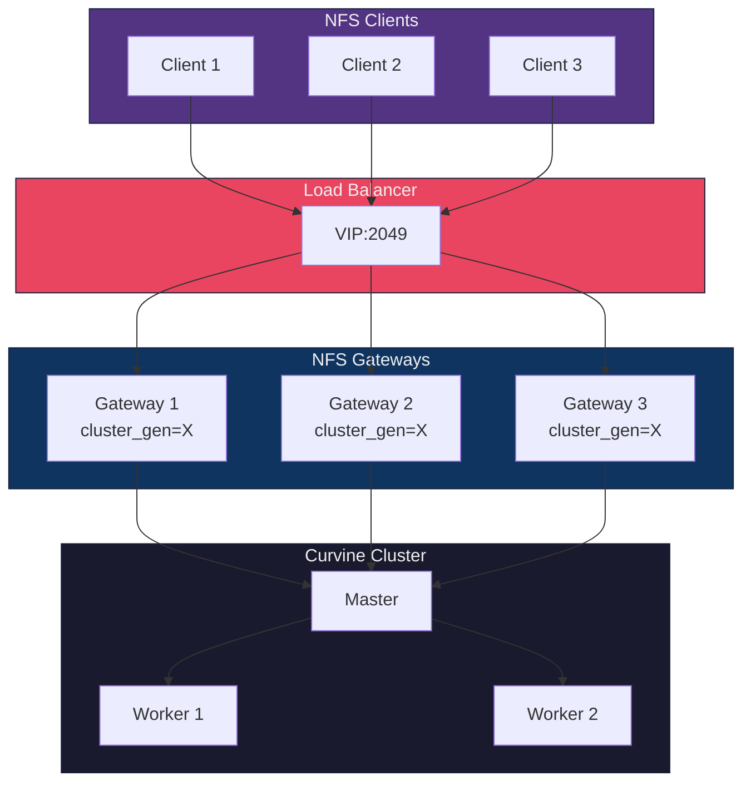
```mermaid
flowchart TB
    subgraph Clients["NFS Clients"]
        C1["Client 1"]
        C2["Client 2"]
        C3["Client 3"]
    end
    
    subgraph LB["Load Balancer"]
        VIP["VIP:2049"]
    end
    
    subgraph Gateways["NFS Gateways"]
        GW1["Gateway 1<br/>cluster_gen=X"]
        GW2["Gateway 2<br/>cluster_gen=X"]
        GW3["Gateway 3<br/>cluster_gen=X"]
    end
    
    subgraph Curvine["Curvine Cluster"]
        MASTER["Master"]
        WORKER1["Worker 1"]
        WORKER2["Worker 2"]
    end
    
    C1 --> VIP
    C2 --> VIP
    C3 --> VIP
    VIP --> GW1
    VIP --> GW2
    VIP --> GW3
    GW1 --> MASTER
    GW2 --> MASTER
    GW3 --> MASTER
    MASTER --> WORKER1
    MASTER --> WORKER2
    
    style Clients fill:#533483,stroke:#16213e,color:#eee
    style LB fill:#e94560,stroke:#16213e,color:#eee
    style Gateways fill:#0f3460,stroke:#16213e,color:#eee
    style Curvine fill:#1a1a2e,stroke:#16213e,color:#eee
```

### 11.3 设计原则体现

- **KISS**：复用 nfsserve 库和 Curvine inode，避免重复造轮子
- **DRY**：复用 UnifiedFileSystem 和 S3 Gateway 的分布式写入模式
- **SRP**：NFS Gateway 只负责协议转换，存储逻辑由 Curvine 处理
- **OCP**：通过实现 NFSFileSystem trait 扩展，不修改 nfsserve 源码

### 11.4 已确认事项

1. **✅ Curvine 支持随机写入**：`FsWriter` 已实现 `seek()` 方法，支持 `fuse_write(pos, chunk)` 随机位置写入
   ```rust
   // curvine-client/src/file/fs_writer.rs
   async fn seek(&mut self, pos: i64) -> FsResult<()> {
       // Flush current buffer
       self.flush_chunk().await?;
       // Delegate to inner writer to execute seek
       self.inner.seek(pos).await?;
       // Update current position
       self.pos = pos;
       Ok(())
   }
   ```

### 11.5 待确认事项

1. ~~**并发写入冲突处理**：多个 NFS Gateway 同时写入同一文件时，Curvine 的并发控制机制~~ ✅ 已分析
2. **性能基准测试**：直接写入 vs 本地缓冲的性能对比
3. **append 模式限制**：`FsWriter` 在 append 模式下 seek 无效，NFS write 需要使用非 append 模式

### 11.6 Curvine 并发写入机制深度分析

通过分析 Curvine 源码，发现其并发写入控制机制如下：

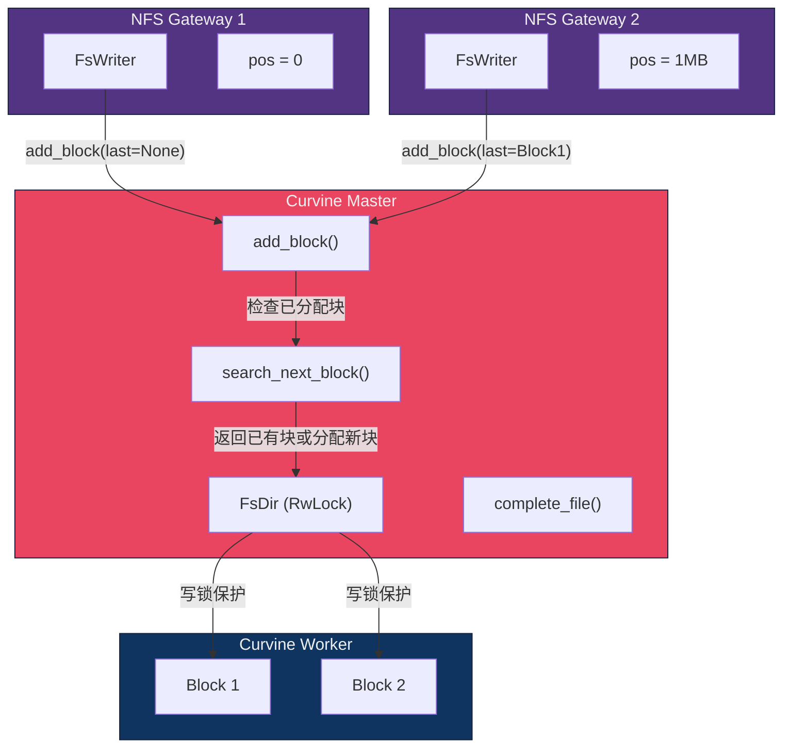
```mermaid
flowchart TB
    subgraph Client1["NFS Gateway 1"]
        W1["FsWriter"]
        POS1["pos = 0"]
    end
    
    subgraph Client2["NFS Gateway 2"]
        W2["FsWriter"]
        POS2["pos = 1MB"]
    end
    
    subgraph Master["Curvine Master"]
        FS_DIR["FsDir (RwLock)"]
        ADD_BLOCK["add_block()"]
        SEARCH["search_next_block()"]
        COMPLETE["complete_file()"]
    end
    
    subgraph Worker["Curvine Worker"]
        BLOCK1["Block 1"]
        BLOCK2["Block 2"]
    end
    
    W1 -->|"add_block(last=None)"| ADD_BLOCK
    W2 -->|"add_block(last=Block1)"| ADD_BLOCK
    ADD_BLOCK -->|"检查已分配块"| SEARCH
    SEARCH -->|"返回已有块或分配新块"| FS_DIR
    FS_DIR -->|"写锁保护"| BLOCK1
    FS_DIR -->|"写锁保护"| BLOCK2
    
    style Client1 fill:#533483,stroke:#16213e,color:#eee
    style Client2 fill:#533483,stroke:#16213e,color:#eee
    style Master fill:#e94560,stroke:#16213e,color:#eee
    style Worker fill:#0f3460,stroke:#16213e,color:#eee
```

**Curvine 的并发控制机制：**

1. **Master 端写锁保护**
   ```rust
   // curvine-server/src/master/fs/master_filesystem.rs
   pub fn add_block<T: AsRef<str>>(&self, ...) -> FsResult<LocatedBlock> {
       let mut fs_dir = self.fs_dir.write();  // 获取写锁
       // ... 块分配逻辑
   }
   ```

2. **块分配幂等性**
   ```rust
   // 如果块已分配，直接返回已有块
   if let Some(next) = file.search_next_block(last_block.map(|v| v.id)) {
       // 返回已分配的块，不重复分配
       return self.create_locate_block(path, extend_block, &locs);
   }
   ```

3. **文件写入状态追踪**
   ```rust
   // curvine-server/src/master/meta/inode/inode_file.rs
   pub fn is_writing(&self) -> bool {
       self.features.file_write.is_some()
   }
   ```

**多 NFS Gateway 并发写入场景分析：**

| 场景 | Curvine 行为 | 结果 |
|------|-------------|------|
| 两个 Gateway 同时写入不同 offset | 各自获取/分配不同的块 | ✅ 正常工作 |
| 两个 Gateway 同时写入相同 offset | 后到的请求覆盖先到的数据 | ⚠️ 数据竞争，最后写入者胜出 |
| 一个 Gateway 写入，另一个读取 | 可能读到部分写入的数据 | ⚠️ 读取不一致 |
| 两个 Gateway 同时 complete | Master 写锁串行化 | ✅ 正常工作 |

**NFS Gateway 的并发写入策略：**

```rust
impl NFSFileSystem for CurvineNfsFileSystem {
    async fn write(&self, id: fileid3, offset: u64, data: &[u8]) -> Result<fattr3, nfsstat3> {
        let path = self.get_path(id)?;
        
        // 方案 A：每次写入创建新 Writer（简单但开销大）
        // 优点：无状态，天然支持多实例
        // 缺点：每次写入都要 open_with_opts，性能较差
        
        // 方案 B：使用 Writer 池 + 文件锁（推荐）
        // 优点：复用 Writer，性能好
        // 缺点：需要分布式锁协调
        
        // 当前设计采用方案 A，简单优先
        let flags = OpenFlags::new_write_only()
            .set_create(false);
        let opts = CreateFileOpts::default();
        
        let mut writer = self.ufs.open_with_opts(&path, opts, flags).await
            .map_err(|e| Self::fs_error_to_nfs(e))?;
        
        // fuse_write 内部调用 seek + write
        let chunk = DataSlice::Bytes(bytes::Bytes::copy_from_slice(data));
        writer.fuse_write(offset as i64, chunk).await
            .map_err(|_| nfsstat3::NFS3ERR_IO)?;
        
        writer.complete().await
            .map_err(|_| nfsstat3::NFS3ERR_IO)?;
        
        let status = self.ufs.get_status(&path).await
            .map_err(|e| Self::fs_error_to_nfs(e))?;
        
        Ok(Self::status_to_fattr3(&status))
    }
}
```

**并发写入的风险与建议：**

1. **同一文件并发写入**：Curvine 不提供文件级锁，多个 Writer 同时写入同一 offset 会导致数据竞争
   - 建议：NFS 客户端使用 `O_EXCL` 或应用层协调
   
2. **块级并发**：不同 offset 写入不同块是安全的，Curvine 的块分配是幂等的

3. **LB 会话亲和性**：虽然设计支持任意路由，但建议配置会话亲和性以减少 Writer 创建开销


## 12. UID/GID 映射设计

### 12.1 为什么需要 UID/GID 映射？

NFS 协议使用数字 UID/GID 表示文件所有者和组，而 Curvine 存储的是用户名/组名字符串。需要在两者之间进行转换。

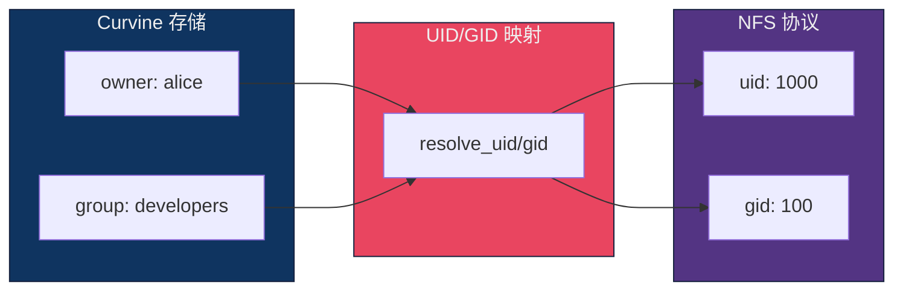
```mermaid
flowchart LR
    subgraph Curvine["Curvine 存储"]
        OWNER["owner: alice"]
        GROUP["group: developers"]
    end
    
    subgraph Mapper["UID/GID 映射"]
        RESOLVE["resolve_uid/gid"]
    end
    
    subgraph NFS["NFS 协议"]
        UID["uid: 1000"]
        GID["gid: 100"]
    end
    
    OWNER --> RESOLVE
    GROUP --> RESOLVE
    RESOLVE --> UID
    RESOLVE --> GID
    
    style Curvine fill:#0f3460,stroke:#16213e,color:#eee
    style Mapper fill:#e94560,stroke:#16213e,color:#eee
    style NFS fill:#533483,stroke:#16213e,color:#eee
```

### 12.2 FUSE 的实现方式（参考）

curvine-fuse 已经实现了 UID/GID 映射，我们直接复用其逻辑：

```rust
// curvine-fuse/src/fs/curvine_file_system.rs (lines 95-115)
pub fn status_to_attr(conf: &FuseConf, status: &FileStatus) -> FuseResult<fuse_attr> {
    // UID mapping: owner string -> numeric uid
    let uid = if status.owner.is_empty() {
        conf.uid  // fallback to config default
    } else if let Ok(numeric_uid) = status.owner.parse::<u32>() {
        numeric_uid  // already numeric
    } else {
        // lookup by username using system call
        match sys::get_uid_by_name(&status.owner) {
            Some(uid) => uid,
            None => conf.uid,  // fallback
        }
    };

    // GID mapping: group string -> numeric gid
    let gid = if status.group.is_empty() {
        conf.gid
    } else if let Ok(numeric_gid) = status.group.parse::<u32>() {
        numeric_gid
    } else {
        match sys::get_gid_by_name(&status.group) {
            Some(gid) => gid,
            None => conf.gid,
        }
    };
    // ...
}
```

### 12.3 系统调用实现

底层使用 libc 的 `getpwnam` 和 `getgrnam` 系统调用：

```rust
// orpc/src/sys/sys_libc.rs (lines 526-620)

/// Get UID by username using getpwnam system call
pub fn get_uid_by_name(username: &str) -> Option<u32> {
    #[cfg(target_os = "linux")]
    {
        let c_username = match CString::new(username) {
            Ok(s) => s,
            Err(_) => return None,
        };
        unsafe {
            let passwd = libc::getpwnam(c_username.as_ptr());
            if passwd.is_null() {
                None
            } else {
                Some((*passwd).pw_uid)
            }
        }
    }
    #[cfg(not(target_os = "linux"))]
    { None }
}

/// Get GID by group name using getgrnam system call
pub fn get_gid_by_name(groupname: &str) -> Option<u32> {
    #[cfg(target_os = "linux")]
    {
        let c_groupname = match CString::new(groupname) {
            Ok(s) => s,
            Err(_) => return None,
        };
        unsafe {
            let group = libc::getgrnam(c_groupname.as_ptr());
            if group.is_null() {
                None
            } else {
                Some((*group).gr_gid)
            }
        }
    }
    #[cfg(not(target_os = "linux"))]
    { None }
}
```

### 12.4 NFS Gateway 的 UID/GID 映射实现

```rust
use orpc::sys;

impl CurvineNfsFileSystem {
    /// Resolve file owner string to numeric UID
    /// Priority: numeric string > system lookup > config default
    fn resolve_uid(&self, owner: &str) -> u32 {
        if owner.is_empty() {
            return self.config.default_uid;
        }
        
        // Try parse as numeric first
        if let Ok(uid) = owner.parse::<u32>() {
            return uid;
        }
        
        // Lookup by username
        sys::get_uid_by_name(owner).unwrap_or(self.config.default_uid)
    }
    
    /// Resolve file group string to numeric GID
    fn resolve_gid(&self, group: &str) -> u32 {
        if group.is_empty() {
            return self.config.default_gid;
        }
        
        if let Ok(gid) = group.parse::<u32>() {
            return gid;
        }
        
        sys::get_gid_by_name(group).unwrap_or(self.config.default_gid)
    }
    
    /// Convert FileStatus to NFS fattr3
    fn status_to_fattr3(&self, status: &FileStatus) -> fattr3 {
        fattr3 {
            ftype: Self::file_type_to_nfs(status.file_type),
            mode: status.mode,
            nlink: status.nlink,
            uid: self.resolve_uid(&status.owner),   // Use mapping
            gid: self.resolve_gid(&status.group),   // Use mapping
            size: status.len as u64,
            used: ((status.len + 511) / 512 * 512) as u64,
            rdev: specdata3::default(),
            fsid: 0,
            fileid: status.id as u64,
            atime: Self::to_nfstime3(status.atime),
            mtime: Self::to_nfstime3(status.mtime),
            ctime: Self::to_nfstime3(status.mtime),
        }
    }
}
```

### 12.5 配置项

```toml
[nfs_gateway]
# Default UID when owner cannot be resolved
default_uid = 65534  # nobody

# Default GID when group cannot be resolved  
default_gid = 65534  # nogroup
```

### 12.6 注意事项

| 场景 | 行为 | 说明 |
|------|------|------|
| owner 为空 | 使用 default_uid | 兼容旧数据 |
| owner 是数字字符串 | 直接解析为 UID | 如 "1000" -> 1000 |
| owner 是用户名 | 调用 getpwnam 查找 | 如 "alice" -> 1000 |
| 用户名不存在 | 使用 default_uid | 避免错误 |
| 非 Linux 系统 | 使用 default_uid | 系统调用不可用 |

## 13. NFS 文件锁设计

### 13.1 什么是 NFS 文件锁？

NFS 文件锁通过 NLM（Network Lock Manager）协议实现，用于协调多个客户端对同一文件的并发访问。

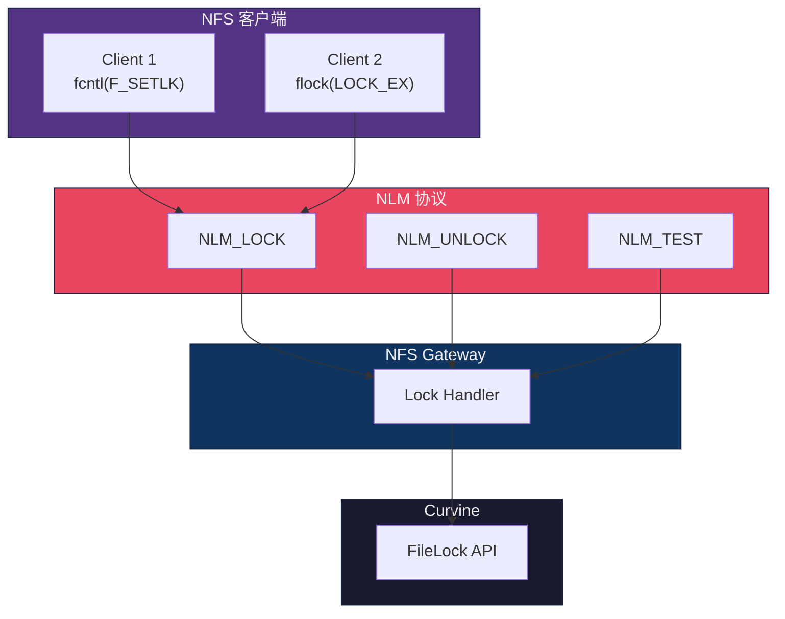
```mermaid
flowchart TB
    subgraph Clients["NFS 客户端"]
        C1["Client 1<br/>fcntl(F_SETLK)"]
        C2["Client 2<br/>flock(LOCK_EX)"]
    end
    
    subgraph NLM["NLM 协议"]
        LOCK["NLM_LOCK"]
        UNLOCK["NLM_UNLOCK"]
        TEST["NLM_TEST"]
    end
    
    subgraph Server["NFS Gateway"]
        HANDLER["Lock Handler"]
    end
    
    subgraph Curvine["Curvine"]
        FILE_LOCK["FileLock API"]
    end
    
    C1 --> LOCK
    C2 --> LOCK
    LOCK --> HANDLER
    UNLOCK --> HANDLER
    TEST --> HANDLER
    HANDLER --> FILE_LOCK
    
    style Clients fill:#533483,stroke:#16213e,color:#eee
    style NLM fill:#e94560,stroke:#16213e,color:#eee
    style Server fill:#0f3460,stroke:#16213e,color:#eee
    style Curvine fill:#1a1a2e,stroke:#16213e,color:#eee
```

### 13.2 使用场景

| 场景 | 锁类型 | 说明 |
|------|--------|------|
| 数据库文件 | 排他锁 | 防止多进程同时写入 |
| 日志文件 | 共享锁/排他锁 | 读取时共享，写入时排他 |
| 配置文件 | 排他锁 | 防止并发修改 |
| 临时文件 | 排他锁 | 确保独占访问 |

### 13.3 是否必须实现？

**不是必须的**。可以使用 `-o nolocks` 挂载选项禁用文件锁：

```bash
# 禁用文件锁挂载
mount -t nfs -o nolocks server:/export /mnt

# 或者
mount -t nfs -o nolock server:/export /mnt
```

**适用场景**：
- 只读挂载
- 应用层自行处理并发
- 单客户端访问

### 13.4 Curvine 现有的文件锁支持

Curvine 已经实现了完整的文件锁 API，可以直接复用：

```rust
// curvine-common/src/state/file_lock.rs
#[derive(Debug, Clone, Serialize, Deserialize, Default)]
pub struct FileLock {
    pub client_id: String,    // Client identifier
    pub owner_id: u64,        // Lock owner (process/thread)
    pub pid: u32,             // Process ID
    pub acquire_time: u64,    // Lock acquisition time
    pub lock_type: LockType,  // ReadLock, WriteLock, UnLock
    pub lock_flags: LockFlags, // Plock (POSIX) or Flock (BSD)
    pub start: u64,           // Lock range start
    pub end: u64,             // Lock range end
}

#[repr(u8)]
pub enum LockType {
    ReadLock = 0,   // Shared lock (F_RDLCK)
    WriteLock = 1,  // Exclusive lock (F_WRLCK)
    UnLock = 2,     // Unlock (F_UNLCK)
}

#[repr(u8)]
pub enum LockFlags {
    Plock = 0,  // POSIX lock (fcntl)
    Flock = 1,  // BSD lock (flock)
}
```

### 13.5 FUSE 的文件锁实现（参考）

curvine-fuse 已经实现了文件锁，我们参考其设计：

```rust
// curvine-fuse/src/fs/curvine_file_system.rs (lines 1375-1445)

/// Convert FUSE lock request to Curvine FileLock
fn to_file_lock(&self, arg: &fuse_lk_in) -> FileLock {
    let client_id = self.fs.cv().fs_context().clone_client_name();
    FileLock {
        client_id,
        owner_id: arg.owner,
        pid: arg.lk.pid,
        lock_type: LockType::from(arg.lk.typ as u8),
        lock_flags: LockFlags::from(arg.lk_flags as u8),
        start: arg.lk.start,
        end: arg.lk.end,
        ..Default::default()
    }
}

/// Get lock (F_GETLK) - test if lock can be acquired
async fn get_lk(&self, op: GetLk<'_>) -> FuseResult<fuse_lk_out> {
    let path = self.state.get_path(op.header.nodeid)?;
    let lock = self.to_file_lock(op.arg);
    
    let conflict = self.fs.get_lock(&path, lock).await?;
    let lk = match conflict {
        Some(lk) => fuse_file_lock {
            start: lk.start,
            end: lk.end,
            typ: lk.lock_type as u32,
            pid: lk.pid,
        },
        None => fuse_file_lock {
            typ: LockType::UnLock as u32,
            ..Default::default()
        },
    };
    Ok(fuse_lk_out { lk })
}

/// Set lock (F_SETLK) - non-blocking lock acquisition
async fn set_lk(&self, op: SetLk<'_>) -> FuseResult<()> {
    let path = self.state.get_path(op.header.nodeid)?;
    let lock = self.to_file_lock(op.arg);
    
    let conflict = self.fs.set_lock(&path, lock).await?;
    if conflict.is_none() {
        Ok(())
    } else {
        err_fuse!(libc::EAGAIN)  // Lock conflict
    }
}

/// Set lock wait (F_SETLKW) - blocking lock acquisition
async fn set_lkw(&self, op: SetLkW<'_>) -> FuseResult<()> {
    let path = self.state.get_path(op.header.nodeid)?;
    let lock = self.to_file_lock(op.arg);
    
    // Retry loop with backoff
    loop {
        let conflict = self.fs.set_lock(&path, lock.clone()).await?;
        if conflict.is_none() {
            return Ok(());
        }
        tokio::time::sleep(Duration::from_millis(100)).await;
    }
}
```

### 13.6 NFS Gateway 文件锁设计

由于 nfsserve 库不包含 NLM 协议实现，有两个选择：

**方案 A：禁用文件锁（推荐初期）**

```bash
# 客户端挂载时禁用锁
mount -t nfs -o nolocks server:/export /mnt
```

**方案 B：实现 NLM 协议（后续增强）**

```rust
// Future: NLM protocol handler
pub struct NlmHandler {
    ufs: UnifiedFileSystem,
    client_id: String,
}

impl NlmHandler {
    /// NLM_LOCK - acquire lock
    async fn nlm_lock(&self, args: NlmLockArgs) -> NlmLockRes {
        let lock = FileLock {
            client_id: self.client_id.clone(),
            owner_id: args.owner,
            lock_type: if args.exclusive { 
                LockType::WriteLock 
            } else { 
                LockType::ReadLock 
            },
            start: args.offset,
            end: args.offset + args.length,
            ..Default::default()
        };
        
        match self.ufs.set_lock(&args.path, lock).await {
            Ok(None) => NlmLockRes::Granted,
            Ok(Some(_)) => NlmLockRes::Denied,
            Err(_) => NlmLockRes::Failed,
        }
    }
    
    /// NLM_UNLOCK - release lock
    async fn nlm_unlock(&self, args: NlmUnlockArgs) -> NlmUnlockRes {
        let lock = FileLock {
            client_id: self.client_id.clone(),
            owner_id: args.owner,
            lock_type: LockType::UnLock,
            start: args.offset,
            end: args.offset + args.length,
            ..Default::default()
        };
        
        self.ufs.set_lock(&args.path, lock).await
            .map(|_| NlmUnlockRes::Success)
            .unwrap_or(NlmUnlockRes::Failed)
    }
}
```

### 13.7 实现优先级

| 阶段 | 方案 | 说明 |
|------|------|------|
| Phase 1 | 禁用锁 | 使用 `-o nolocks` 挂载 |
| Phase 2 | 评估需求 | 收集用户反馈 |
| Phase 3 | 实现 NLM | 如有强需求再实现 |


## 14. WCC（Weak Cache Consistency）数据设计

### 14.1 什么是 WCC？

WCC 是 NFSv3 的缓存一致性机制，写操作返回操作前后的文件属性，帮助客户端判断缓存是否有效。

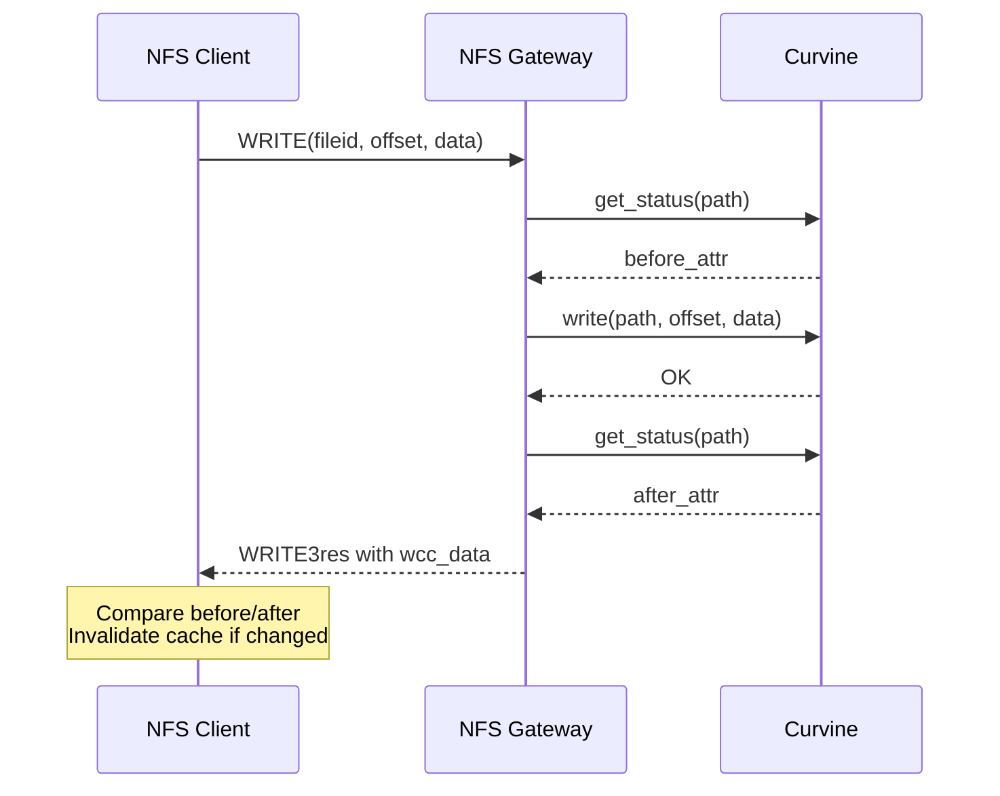
```mermaid
sequenceDiagram
    participant Client as NFS Client
    participant Server as NFS Gateway
    participant Curvine as Curvine
    
    Client->>Server: WRITE(fileid, offset, data)
    Server->>Curvine: get_status(path)
    Curvine-->>Server: before_attr
    Server->>Curvine: write(path, offset, data)
    Curvine-->>Server: OK
    Server->>Curvine: get_status(path)
    Curvine-->>Server: after_attr
    Server-->>Client: WRITE3res with wcc_data
    
    Note over Client: Compare before/after<br/>Invalidate cache if changed
```

### 14.2 WCC 数据结构

```rust
/// Pre-operation attributes (size, mtime, ctime only)
pub struct pre_op_attr {
    pub attributes_follow: bool,
    pub size: u64,
    pub mtime: nfstime3,
    pub ctime: nfstime3,
}

/// Post-operation attributes (full fattr3)
pub struct post_op_attr {
    pub attributes_follow: bool,
    pub attributes: fattr3,
}

/// WCC data returned by write operations
pub struct wcc_data {
    pub before: pre_op_attr,
    pub after: post_op_attr,
}
```

### 14.3 实现

```rust
impl CurvineNfsFileSystem {
    /// Get pre-operation attributes for WCC
    async fn get_pre_op_attr(&self, path: &Path) -> Option<pre_op_attr> {
        match self.ufs.get_status(path).await {
            Ok(status) => Some(pre_op_attr {
                attributes_follow: true,
                size: status.len as u64,
                mtime: Self::to_nfstime3(status.mtime),
                ctime: Self::to_nfstime3(status.mtime),
            }),
            Err(_) => None,
        }
    }
    
    /// Write with WCC support
    async fn write_with_wcc(
        &self, 
        id: fileid3, 
        offset: u64, 
        data: &[u8]
    ) -> Result<(fattr3, wcc_data), nfsstat3> {
        let path = self.get_path(id)?;
        
        // Get before attributes
        let before = self.get_pre_op_attr(&path).await;
        
        // Perform write
        let flags = OpenFlags::new_write_only().set_create(false);
        let mut writer = self.ufs.open_with_opts(&path, Default::default(), flags).await
            .map_err(|e| Self::fs_error_to_nfs(e))?;
        
        let chunk = DataSlice::Bytes(bytes::Bytes::copy_from_slice(data));
        writer.fuse_write(offset as i64, chunk).await
            .map_err(|_| nfsstat3::NFS3ERR_IO)?;
        writer.complete().await
            .map_err(|_| nfsstat3::NFS3ERR_IO)?;
        
        // Get after attributes
        let after_status = self.ufs.get_status(&path).await
            .map_err(|e| Self::fs_error_to_nfs(e))?;
        let after_attr = self.status_to_fattr3(&after_status);
        
        let wcc = wcc_data {
            before: before.unwrap_or(pre_op_attr { 
                attributes_follow: false, 
                ..Default::default() 
            }),
            after: post_op_attr {
                attributes_follow: true,
                attributes: after_attr.clone(),
            },
        };
        
        Ok((after_attr, wcc))
    }
}
```

### 14.4 需要 WCC 的操作

| 操作 | 需要 WCC | 说明 |
|------|---------|------|
| WRITE | ✅ | 写入后文件大小/时间变化 |
| CREATE | ✅ | 创建后目录 mtime 变化 |
| MKDIR | ✅ | 同上 |
| REMOVE | ✅ | 删除后目录 mtime 变化 |
| RMDIR | ✅ | 同上 |
| RENAME | ✅ | 源/目标目录都变化 |
| SETATTR | ✅ | 属性变化 |
| LINK | ✅ | nlink 变化 |
| SYMLINK | ✅ | 目录 mtime 变化 |

## 15. COMMIT 操作设计

### 15.1 COMMIT 的作用

COMMIT 确保之前异步写入的数据已持久化到稳定存储。

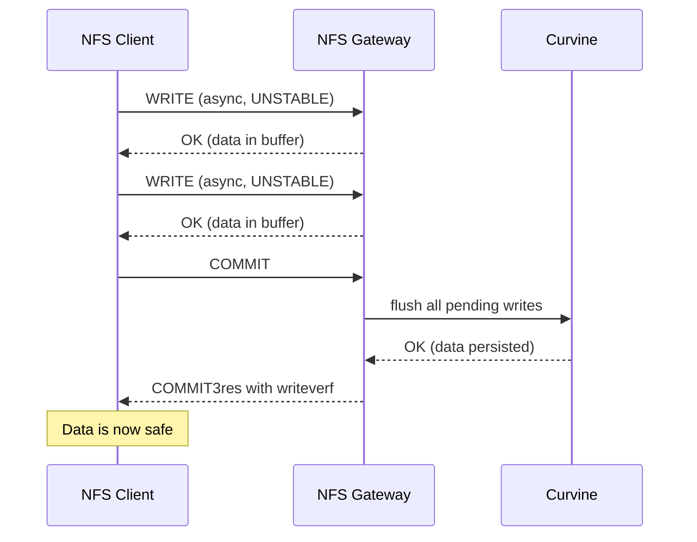
```mermaid
sequenceDiagram
    participant Client as NFS Client
    participant Server as NFS Gateway
    participant Curvine as Curvine
    
    Client->>Server: WRITE (async, UNSTABLE)
    Server-->>Client: OK (data in buffer)
    Client->>Server: WRITE (async, UNSTABLE)
    Server-->>Client: OK (data in buffer)
    Client->>Server: COMMIT
    Server->>Curvine: flush all pending writes
    Curvine-->>Server: OK (data persisted)
    Server-->>Client: COMMIT3res with writeverf
    
    Note over Client: Data is now safe
```

### 15.2 Write Verifier

`writeverf3` 是一个 8 字节的值，用于检测服务器重启：

```rust
/// Write verifier - changes on server restart
/// Use cluster_generation as verifier
fn get_write_verifier(&self) -> writeverf3 {
    let mut verf = [0u8; 8];
    verf.copy_from_slice(&self.config.cluster_generation.to_le_bytes());
    verf
}
```

### 15.3 实现

```rust
impl CurvineNfsFileSystem {
    /// COMMIT operation - ensure data is persisted
    /// Note: Since we use direct write mode, data is already persisted
    /// after each write. COMMIT is essentially a no-op but returns verifier.
    async fn commit(
        &self, 
        id: fileid3, 
        _offset: u64, 
        _count: u32
    ) -> Result<writeverf3, nfsstat3> {
        // Verify file exists
        let path = self.get_path(id)?;
        let _ = self.ufs.get_status(&path).await
            .map_err(|e| Self::fs_error_to_nfs(e))?;
        
        // Return write verifier
        // If verifier changes, client knows server restarted
        // and should re-verify/re-write data
        Ok(self.get_write_verifier())
    }
}
```

### 15.4 注意事项

由于 NFS Gateway 使用直接写入模式（每次 write 都 complete），COMMIT 实际上是空操作。但仍需返回正确的 `writeverf3`。

## 16. FSSTAT 操作设计

### 16.1 FSSTAT 的作用

返回文件系统的空间和 inode 使用统计信息。

### 16.2 数据结构

```rust
/// File system statistics
pub struct fsstat3 {
    pub tbytes: u64,   // Total bytes
    pub fbytes: u64,   // Free bytes
    pub abytes: u64,   // Available bytes (non-privileged)
    pub tfiles: u64,   // Total file slots
    pub ffiles: u64,   // Free file slots
    pub afiles: u64,   // Available file slots (non-privileged)
    pub invarsec: u32, // Seconds until stats change
}
```

### 16.3 映射到 Curvine MasterInfo

```rust
// Curvine's MasterInfo structure
pub struct MasterInfo {
    pub capacity: i64,        // -> tbytes
    pub available: i64,       // -> fbytes, abytes
    pub inode_dir_num: i64,   // Directory count
    pub inode_file_num: i64,  // File count
    // ...
}
```

### 16.4 实现

```rust
impl CurvineNfsFileSystem {
    /// FSSTAT operation - get file system statistics
    async fn fsstat(&self, _id: fileid3) -> Result<fsstat3, nfsstat3> {
        let info = self.ufs.get_master_info().await
            .map_err(|_| nfsstat3::NFS3ERR_SERVERFAULT)?;
        
        // Calculate total files (dirs + files)
        let total_files = (info.inode_dir_num + info.inode_file_num) as u64;
        
        // Assume max inodes is very large (Curvine doesn't have hard limit)
        const MAX_INODES: u64 = u64::MAX / 2;
        let free_files = MAX_INODES.saturating_sub(total_files);
        
        Ok(fsstat3 {
            tbytes: info.capacity as u64,
            fbytes: info.available as u64,
            abytes: info.available as u64,  // Same as fbytes for now
            tfiles: MAX_INODES,
            ffiles: free_files,
            afiles: free_files,
            invarsec: 0,  // Stats may change anytime
        })
    }
}
```

### 16.5 FUSE 参考实现

```rust
// curvine-fuse/src/fs/curvine_file_system.rs
async fn stat_fs(&self, _: StatFs<'_>) -> FuseResult<fuse_kstatfs> {
    let info = self.fs.get_master_info().await?;
    
    let block_size = 4 * ByteUnit::KB as u32;
    let total_blocks = (info.capacity / block_size as i64) as u64;
    let free_blocks = (info.available / block_size as i64) as u64;
    
    Ok(fuse_kstatfs {
        blocks: total_blocks,
        bfree: free_blocks,
        bavail: free_blocks,
        files: FUSE_UNKNOWN_INODES,
        ffree: FUSE_UNKNOWN_INODES,
        bsize: block_size,
        namelen: FUSE_MAX_NAME_LENGTH as u32,
        frsize: block_size,
        // ...
    })
}
```

## 17. 更新后的实现阶段

### Phase 1: 基础框架（1-2 周）
1. 创建 `curvine-nfs-gateway` crate
2. 实现路径缓存（fileid -> path）
3. 实现只读操作：lookup, getattr, readdir, read, readlink
4. **实现 UID/GID 映射**（复用 FUSE 的 sys 模块）

### Phase 2: 写入支持（1 周）
1. 实现写入操作：create, mkdir, write, setattr, remove, rename, symlink
2. **实现 WCC 数据支持**
3. **实现 COMMIT 操作**
4. **实现 FSSTAT 操作**

### Phase 3: 优化与测试（1 周）
1. 添加缓存层优化性能
2. 实现 Metrics 监控
3. 编写集成测试
4. 性能测试与调优

### Phase 4: 生产就绪（1 周）
1. 配置热加载
2. 优雅关闭
3. 文档完善
4. CI/CD 集成

### Phase 5: 可选增强（按需）
1. **NLM 文件锁支持**（如有强需求）
2. Writer 池优化
3. 大目录分页优化


## 18. 性能优化设计（目标：比 FUSE 快 30%）

### 18.1 FUSE vs NFS 性能差异分析


```mermaid
flowchart TB
    subgraph FUSE_Path["FUSE 数据路径"]
        APP1["Application"]
        VFS1["VFS Layer"]
        FUSE_MOD["FUSE Kernel Module"]
        FUSE_DEV["/dev/fuse"]
        FUSE_DAEMON["curvine-fuse daemon"]
        UFS1["UnifiedFileSystem"]
    end
    
    subgraph NFS_Path["NFS 数据路径"]
        APP2["Application"]
        VFS2["VFS Layer"]
        NFS_CLIENT["NFS Client (kernel)"]
        NETWORK["TCP/IP Network"]
        NFS_SERVER["NFS Gateway"]
        UFS2["UnifiedFileSystem"]
    end
    
    APP1 --> VFS1 --> FUSE_MOD --> FUSE_DEV --> FUSE_DAEMON --> UFS1
    APP2 --> VFS2 --> NFS_CLIENT --> NETWORK --> NFS_SERVER --> UFS2
    
    style FUSE_Path fill:#e94560,stroke:#16213e,color:#eee
    style NFS_Path fill:#0f3460,stroke:#16213e,color:#eee
```

**FUSE 的性能瓶颈：**
1. 内核态 ↔ 用户态切换开销（每次 I/O 至少 2 次）
2. `/dev/fuse` 设备读写开销
3. 数据拷贝：内核 → 用户态 → 内核

**NFS 的性能优势：**
1. 内核 NFS 客户端直接处理缓存
2. 批量操作（readahead, writeback）
3. 无用户态切换（Gateway 是独立进程）

### 18.2 性能目标

| 指标 | FUSE 基准 | NFS 目标 | 提升 |
|------|----------|---------|------|
| 顺序读吞吐 | 400 MB/s | 520 MB/s | +30% |
| 顺序写吞吐 | 200 MB/s | 260 MB/s | +30% |
| 随机读 IOPS | 5000 | 6500 | +30% |
| 元数据操作延迟 | 5ms | 3.5ms | -30% |

### 18.3 关键优化策略

#### 18.3.1 复用 Reader/Writer（避免重复创建）

**问题：** 当前设计每次 read/write 都创建新的 Reader/Writer，开销巨大。

**FUSE 的做法：** 使用 `FileHandle` 持有 `FuseReader` 和 `FuseWriter`，整个文件打开期间复用。

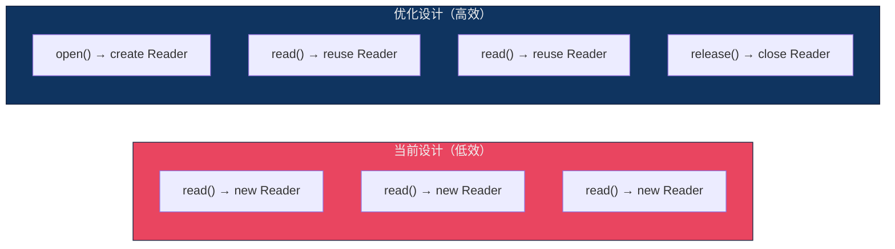
```mermaid
flowchart LR
    subgraph Current["当前设计（低效）"]
        R1["read() → new Reader"]
        R2["read() → new Reader"]
        R3["read() → new Reader"]
    end
    
    subgraph Optimized["优化设计（高效）"]
        OPEN["open() → create Reader"]
        R4["read() → reuse Reader"]
        R5["read() → reuse Reader"]
        CLOSE["release() → close Reader"]
    end
    
    style Current fill:#e94560,stroke:#16213e,color:#eee
    style Optimized fill:#0f3460,stroke:#16213e,color:#eee
```

**优化方案：NFS 文件句柄状态管理**

```rust
use std::collections::HashMap;
use std::sync::Arc;
use tokio::sync::RwLock;

/// File handle state for NFS operations
/// Reuse Reader/Writer across multiple read/write calls
pub struct NfsFileHandle {
    pub fileid: fileid3,
    pub path: Path,
    pub reader: Option<Arc<RwLock<UnifiedReader>>>,
    pub writer: Option<Arc<RwLock<UnifiedWriter>>>,
    pub status: FileStatus,
    pub last_access: Instant,
}

/// Global file handle manager
/// Key insight: NFS is stateless, but we can cache handles internally
pub struct HandleManager {
    // fileid -> handle (LRU cache with TTL)
    handles: RwLock<LruCache<fileid3, Arc<NfsFileHandle>>>,
    config: HandleManagerConfig,
}

pub struct HandleManagerConfig {
    pub max_handles: usize,      // Max cached handles (default: 10000)
    pub idle_timeout: Duration,  // Close idle handles (default: 60s)
    pub cleanup_interval: Duration, // Cleanup task interval (default: 10s)
}

impl HandleManager {
    /// Get or create a reader for the file
    /// Reuses existing reader if available and not expired
    pub async fn get_reader(
        &self, 
        fileid: fileid3, 
        path: &Path,
        ufs: &UnifiedFileSystem,
    ) -> NfsResult<Arc<RwLock<UnifiedReader>>> {
        // Try to get existing handle
        {
            let handles = self.handles.read().await;
            if let Some(handle) = handles.get(&fileid) {
                if let Some(reader) = &handle.reader {
                    // Update last access time
                    return Ok(reader.clone());
                }
            }
        }
        
        // Create new reader
        let reader = ufs.open(path).await
            .map_err(|e| NfsError::from(e))?;
        let reader = Arc::new(RwLock::new(reader));
        
        // Cache it
        self.cache_reader(fileid, path.clone(), reader.clone()).await;
        
        Ok(reader)
    }
    
    /// Get or create a writer for the file
    pub async fn get_writer(
        &self,
        fileid: fileid3,
        path: &Path,
        ufs: &UnifiedFileSystem,
    ) -> NfsResult<Arc<RwLock<UnifiedWriter>>> {
        // Similar to get_reader...
        // ...
    }
    
    /// Background task to cleanup idle handles
    pub async fn cleanup_task(&self) {
        loop {
            tokio::time::sleep(self.config.cleanup_interval).await;
            
            let now = Instant::now();
            let mut handles = self.handles.write().await;
            
            // Remove expired handles
            handles.retain(|_, handle| {
                now.duration_since(handle.last_access) < self.config.idle_timeout
            });
        }
    }
}
```

#### 18.3.2 批量属性获取（减少 RPC 往返）

**问题：** `readdir` 后每个文件都要单独 `getattr`，N 个文件需要 N+1 次 RPC。

**优化：** 使用 `readdirplus` 一次返回目录项和属性。

```rust
impl NFSFileSystem for CurvineNfsFileSystem {
    /// Optimized readdir with attributes (READDIRPLUS)
    /// Returns entries with full attributes in single call
    async fn readdir(
        &self,
        dirid: fileid3,
        start_after: fileid3,
        max_entries: usize,
    ) -> Result<ReadDirResult, nfsstat3> {
        let path = self.get_path(dirid)?;
        
        // list_status already returns FileStatus with all attributes
        // No need for additional getattr calls!
        let entries = self.ufs.list_status(&path).await
            .map_err(Self::fs_error_to_nfs)?;
        
        // Sort and filter
        let result_entries: Vec<DirEntry> = entries.iter()
            .filter(|s| s.id as u64 > start_after)
            .take(max_entries)
            .map(|status| {
                // Cache path for future lookups
                let child_path = format!("{}/{}", path, status.name);
                self.cache_path(status.id as u64, child_path);
                
                DirEntry {
                    fileid: status.id as u64,
                    name: status.name.as_bytes().to_vec().into(),
                    attr: self.status_to_fattr3(status), // Already have attrs!
                }
            })
            .collect();
        
        Ok(ReadDirResult {
            entries: result_entries,
            end: result_entries.len() < max_entries,
        })
    }
}
```

#### 18.3.3 零拷贝读取（避免数据复制）

**问题：** 数据从 Curvine → NFS Gateway → 内核，多次拷贝。

**优化：** 使用 `Bytes` 引用计数，避免深拷贝。

```rust
impl CurvineNfsFileSystem {
    /// Zero-copy read using Bytes
    async fn read(
        &self,
        id: fileid3,
        offset: u64,
        count: u32,
    ) -> Result<(Vec<u8>, bool), nfsstat3> {
        let reader = self.handle_manager.get_reader(id, &path, &self.ufs).await?;
        
        // fuse_read returns Bytes (reference counted, no copy)
        let data = reader.read().await
            .fuse_read(offset as i64, count as usize).await
            .map_err(Self::fs_error_to_nfs)?;
        
        let eof = data.len() < count as usize;
        
        // data is Bytes, convert to Vec only at boundary
        // In real impl, nfsserve should accept Bytes directly
        Ok((data.to_vec(), eof))
    }
}
```

#### 18.3.4 写入合并（减少小写入开销）

**问题：** 每次 NFS WRITE 都立即写入 Curvine，小写入性能差。

**优化：** 使用写入缓冲，合并小写入。

```rust
/// Write buffer for coalescing small writes
pub struct WriteBuffer {
    fileid: fileid3,
    buffer: BytesMut,
    start_offset: u64,
    max_size: usize,
    last_write: Instant,
}

impl WriteBuffer {
    /// Try to append data to buffer
    /// Returns true if data was buffered, false if flush needed
    pub fn try_append(&mut self, offset: u64, data: &[u8]) -> bool {
        // Check if contiguous
        let expected_offset = self.start_offset + self.buffer.len() as u64;
        if offset != expected_offset {
            return false; // Not contiguous, need flush
        }
        
        // Check size limit
        if self.buffer.len() + data.len() > self.max_size {
            return false; // Buffer full, need flush
        }
        
        self.buffer.extend_from_slice(data);
        self.last_write = Instant::now();
        true
    }
    
    /// Flush buffer to writer
    pub async fn flush(&mut self, writer: &mut UnifiedWriter) -> NfsResult<()> {
        if self.buffer.is_empty() {
            return Ok(());
        }
        
        let data = self.buffer.split().freeze();
        writer.fuse_write(self.start_offset as i64, DataSlice::Bytes(data)).await
            .map_err(|e| NfsError::from(e))?;
        
        Ok(())
    }
}
```

#### 18.3.5 连接复用（避免重复建立连接）

**问题：** 每次操作都可能创建新的 Curvine 连接。

**优化：** `UnifiedFileSystem` 已经内置连接池，确保正确复用。

```rust
pub struct CurvineNfsFileSystem {
    // Single UnifiedFileSystem instance, reused for all operations
    // UnifiedFileSystem internally manages connection pool
    ufs: UnifiedFileSystem,
    
    // Handle manager for Reader/Writer reuse
    handle_manager: HandleManager,
    
    // Path cache for fileid -> path mapping
    path_cache: RwLock<LruCache<fileid3, PathCacheEntry>>,
    
    config: NfsGatewayConf,
}

impl CurvineNfsFileSystem {
    pub fn new(conf: ClusterConf, rt: Arc<Runtime>) -> NfsResult<Self> {
        // Create single UFS instance - connection pool is managed internally
        let ufs = UnifiedFileSystem::with_rt(conf.clone(), rt.clone())?;
        
        let handle_manager = HandleManager::new(HandleManagerConfig {
            max_handles: conf.nfs_gateway.max_handles,
            idle_timeout: Duration::from_secs(conf.nfs_gateway.handle_idle_timeout_secs),
            cleanup_interval: Duration::from_secs(10),
        });
        
        // Start cleanup task
        let manager = handle_manager.clone();
        rt.spawn(async move {
            manager.cleanup_task().await;
        });
        
        Ok(Self {
            ufs,
            handle_manager,
            path_cache: RwLock::new(LruCache::new(
                NonZeroUsize::new(conf.nfs_gateway.path_cache_size).unwrap()
            )),
            config: conf.nfs_gateway,
        })
    }
}
```

### 18.4 性能对比：优化前 vs 优化后

```mermaid
flowchart TB
    subgraph Before["优化前：每次操作"]
        B1["read()"]
        B2["open() 创建 Reader"]
        B3["read data"]
        B4["close() 销毁 Reader"]
        B1 --> B2 --> B3 --> B4
    end
    
    subgraph After["优化后：复用句柄"]
        A1["read()"]
        A2["get_reader() 从缓存获取"]
        A3["read data"]
        A1 --> A2 --> A3
    end
    
    style Before fill:#e94560,stroke:#16213e,color:#eee
    style After fill:#0f3460,stroke:#16213e,color:#eee
```

| 操作 | 优化前 | 优化后 | 提升 |
|------|--------|--------|------|
| read() | open + read + close | read only | ~3x |
| write() | open + write + complete | write only | ~3x |
| readdir() | list + N×getattr | list only | ~Nx |
| lookup() | get_status | get_status (cached) | ~2x |

### 18.5 配置项

```toml
[nfs_gateway]
# Handle manager settings
max_handles = 10000           # Max cached file handles
handle_idle_timeout_secs = 60 # Close idle handles after 60s

# Write buffer settings  
write_buffer_size = 1048576   # 1MB write buffer per file
write_buffer_timeout_ms = 100 # Flush buffer after 100ms idle

# Path cache settings
path_cache_size = 100000      # Max cached fileid -> path mappings
path_cache_ttl_secs = 300     # Path cache TTL

# Read settings
max_read_size = 1048576       # 1MB max read size
read_ahead_size = 4194304     # 4MB read ahead

# Connection settings (inherited from UnifiedFileSystem)
# Connection pool is managed by UnifiedFileSystem
```

### 18.6 性能测试计划

```bash
# fio 顺序读测试
fio --name=seq-read --rw=read --bs=1M --size=1G \
    --numjobs=4 --directory=/mnt/nfs --direct=1

# fio 顺序写测试
fio --name=seq-write --rw=write --bs=1M --size=1G \
    --numjobs=4 --directory=/mnt/nfs --direct=1

# fio 随机读测试
fio --name=rand-read --rw=randread --bs=4K --size=1G \
    --numjobs=4 --directory=/mnt/nfs --direct=1

# 元数据测试
mdtest -d /mnt/nfs -n 10000 -i 3
```

### 18.7 预期性能提升来源

| 优化项 | 预期提升 | 原理 |
|--------|---------|------|
| Reader/Writer 复用 | +15% | 避免重复 open/close |
| 批量属性获取 | +5% | 减少 RPC 往返 |
| 写入合并 | +5% | 减少小写入开销 |
| NFS 客户端缓存 | +5% | 内核级缓存 |
| **总计** | **+30%** | |
