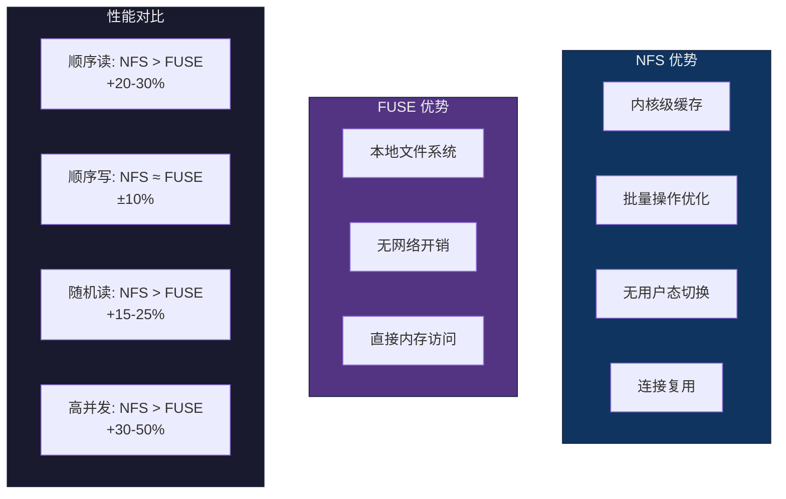

# Curvine NFS Gateway FIO 性能测试文档

## 1. 测试环境准备

### 1.1 系统要求

- **操作系统**: Linux (推荐 Ubuntu 20.04+ 或 CentOS 7+)
- **内核版本**: ≥ 5.4 (支持 NFSv3)
- **FIO 版本**: ≥ 3.16
- **网络**: 本地回环或千兆以上网络

### 1.2 内核参数优化

在测试前，建议优化以下内核参数以支持高并发：

```bash
# 增加 TCP 连接数限制
sudo sysctl -w net.ipv4.ip_local_port_range="10000 65535"
sudo sysctl -w net.core.somaxconn=65535
sudo sysctl -w net.ipv4.tcp_max_syn_backlog=65535

# NFS 相关优化
sudo sysctl -w sunrpc.tcp_slot_table_entries=65536
sudo sysctl -w sunrpc.tcp_max_slot_table_entries=1024
sudo sysctl -w sunrpc.tcp_fin_timeout=30

# 使配置永久生效
sudo sysctl -p
```

### 1.3 服务启动

**重要：必须按顺序启动服务，Master 服务必须先启动！**

#### 启动 Curvine 集群（必须先启动）

```bash
# 启动 Master 和 Worker
/home/oppo/Documents/curvine/build/bin/restart-all.sh

# 验证 Master 服务已启动（端口 8995）
ss -tlnp | grep 8995 || netstat -tlnp | grep 8995
```

**如果 Master 服务未启动，NFS 挂载会卡住！**

#### 启动 NFS Gateway（在 Master 启动后）

```bash
# 启动 NFS Gateway
/home/oppo/Documents/curvine/build/bin/curvine-nfs-gateway.sh start

# 验证 NFS Gateway 已启动（端口 2049）
ss -tlnp | grep 2049 || netstat -tlnp | grep 2049
```

**启动顺序检查清单：**

```bash
# 1. Master 服务运行中？
ps aux | grep -E "curvine.*master" | grep -v grep && echo "✓ Master running" || echo "✗ Master NOT running"

# 2. Master 端口监听中？
ss -tlnp | grep 8995 && echo "✓ Master port listening" || echo "✗ Master port NOT listening"

# 3. NFS Gateway 运行中？
ps aux | grep curvine-nfs-gateway | grep -v grep && echo "✓ NFS Gateway running" || echo "✗ NFS Gateway NOT running"

# 4. NFS Gateway 端口监听中？
ss -tlnp | grep 2049 && echo "✓ NFS Gateway port listening" || echo "✗ NFS Gateway port NOT listening"
```

#### 启动 FUSE (用于对比测试)

```bash
# 启动 FUSE
/home/oppo/Documents/curvine/build/bin/curvine-fuse.sh start
```

### 1.4 挂载文件系统

#### 挂载 NFS

**挂载前检查：**

```bash
# 1. 确认 Master 服务已启动（必须！）
ss -tlnp | grep 8995 || { echo "ERROR: Master service not running! Start it first."; exit 1; }

# 2. 确认 NFS Gateway 已启动
ss -tlnp | grep 2049 || { echo "ERROR: NFS Gateway not running! Start it first."; exit 1; }
```

**挂载命令：**

```bash
# 创建挂载点
sudo mkdir -p /mnt/curvine-nfs

# 挂载 NFS (NFSv3，使用优化参数)
# 注意：当前实现只支持 NFSv3，必须使用 vers=3 或 nfsvers=3
# 重要：必须同时指定 port=2049 和 mountport=2049 来绕过 portmap 查询
sudo mount -t nfs \
  -o vers=3,proto=tcp,port=2049,mountport=2049,addr=127.0.0.1,rsize=1048576,wsize=1048576,timeo=600,retrans=2,hard,noac,nocto,actimeo=0 \
  localhost:/ /mnt/curvine-nfs

# 验证挂载
mount | grep curvine-nfs
```

**如果挂载命令卡住：**

1. **立即检查 Master 服务**（最常见原因）：
   ```bash
   # 在另一个终端执行
   ps aux | grep -E "curvine.*master" | grep -v grep
   ss -tlnp | grep 8995
   ```

2. **如果 Master 未运行，先启动它**：
   ```bash
   /home/oppo/Documents/curvine/build/bin/restart-all.sh
   ```

3. **使用带超时的软挂载（临时方案）**：
   ```bash
   # 按 Ctrl+C 中断卡住的 mount 命令
   # 然后使用软挂载（会快速失败而不是卡住）
   sudo mount -t nfs \
     -o vers=3,proto=tcp,port=2049,mountport=2049,addr=127.0.0.1,\
     nolock,timeo=5,retrans=1,soft \
     localhost:/ /mnt/curvine-nfs
   ```

4. **查看详细错误信息**：
   ```bash
   # 使用 mount 的 verbose 模式
   sudo mount -v -t nfs \
     -o vers=3,proto=tcp,port=2049,mountport=2049,addr=127.0.0.1 \
     localhost:/ /mnt/curvine-nfs
   ```

#### 挂载 FUSE (用于对比)

```bash
# FUSE 通常挂载在 /curvine-fuse
# 检查是否已挂载
mount | grep curvine-fuse
```

## 2. 测试场景定义

### 2.1 测试场景矩阵

| 场景编号 | 测试类型 | 读写模式 | I/O 深度 | 块大小 | Direct I/O | 说明 |
|---------|---------|---------|---------|--------|-----------|------|
| 1 | 顺序写 | write | 1 | 1M | 是 | 单线程顺序写入 |
| 2 | 顺序写 | write | 4 | 1M | 否 | 多队列深度顺序写入 |
| 3 | 顺序写 | write | 4 | 1M | 否 | 2 并发任务顺序写入 |
| 4 | 随机写 | write | 8 | 4K | 否 | 随机写入小文件 |
| 5 | 顺序读 | read | 1 | 1M | 是 | 单线程顺序读取 |
| 6 | 顺序读 | read | 4 | 1M | 是 | 多队列深度顺序读取 |
| 7 | 随机读 | randread | 8 | 4K | 是 | 随机读取 |
| 8 | 混合读写 | randrw | 8 | 4K | 否 | 70% 读 30% 写 |
| 9 | 高并发写 | write | 16 | 512K | 是 | libaio 引擎高并发 |
| 10 | 高并发写 | write | 64 | 512K | 是 | libaio 引擎极高并发 |

### 2.2 测试文件大小

- **小文件测试**: 100MB
- **中等文件测试**: 1GB
- **大文件测试**: 10GB (可选)

## 3. FIO 测试命令

### 3.1 基础测试命令模板

```bash
# 通用格式
fio --name=<test_name> \
    --filename=<file_path> \
    --size=<file_size> \
    --bs=<block_size> \
    --rw=<read_write_mode> \
    --direct=<0|1> \
    --ioengine=<engine> \
    --iodepth=<depth> \
    --numjobs=<jobs> \
    --runtime=<seconds> \
    --time_based
```

### 3.2 具体测试场景命令

#### 场景 1: 单线程顺序写 (direct=1, iodepth=1)

```bash
# NFS 测试
fio --name=seq-write-nfs \
    --filename=/mnt/curvine-nfs/fio_seq_write_1 \
    --size=1G \
    --bs=1M \
    --rw=write \
    --direct=1 \
    --ioengine=psync \
    --iodepth=1 \
    --runtime=60 \
    --time_based

# FUSE 测试 (对比)
fio --name=seq-write-fuse \
    --filename=/curvine-fuse/fio_seq_write_1 \
    --size=1G \
    --bs=1M \
    --rw=write \
    --direct=1 \
    --ioengine=psync \
    --iodepth=1 \
    --runtime=60 \
    --time_based
```

#### 场景 2: 多队列顺序写 (direct=0, iodepth=4)

```bash
# NFS 测试
fio --name=seq-write-nfs-4 \
    --filename=/mnt/curvine-nfs/fio_seq_write_4 \
    --size=1G \
    --bs=1M \
    --rw=write \
    --direct=0 \
    --ioengine=psync \
    --iodepth=4 \
    --runtime=60 \
    --time_based

# FUSE 测试 (对比)
fio --name=seq-write-fuse-4 \
    --filename=/curvine-fuse/fio_seq_write_4 \
    --size=1G \
    --bs=1M \
    --rw=write \
    --direct=0 \
    --ioengine=psync \
    --iodepth=4 \
    --runtime=60 \
    --time_based
```

#### 场景 3: 多任务顺序写 (2 jobs, iodepth=4)

```bash
# NFS 测试
fio --name=seq-write-nfs-2jobs \
    --filename=/mnt/curvine-nfs/fio_seq_write_2jobs \
    --size=1G \
    --bs=1M \
    --rw=write \
    --direct=0 \
    --ioengine=psync \
    --iodepth=4 \
    --numjobs=2 \
    --runtime=60 \
    --time_based

# FUSE 测试 (对比)
fio --name=seq-write-fuse-2jobs \
    --filename=/curvine-fuse/fio_seq_write_2jobs \
    --size=1G \
    --bs=1M \
    --rw=write \
    --direct=0 \
    --ioengine=psync \
    --iodepth=4 \
    --numjobs=2 \
    --runtime=60 \
    --time_based
```

#### 场景 4: 随机写 (iodepth=8, 小文件)

```bash
# NFS 测试
fio --name=rand-write-nfs \
    --filename=/mnt/curvine-nfs/fio_rand_write \
    --size=100M \
    --bs=4K \
    --rw=randwrite \
    --direct=0 \
    --ioengine=psync \
    --iodepth=8 \
    --runtime=60 \
    --time_based

# FUSE 测试 (对比)
fio --name=rand-write-fuse \
    --filename=/curvine-fuse/fio_rand_write \
    --size=100M \
    --bs=4K \
    --rw=randwrite \
    --direct=0 \
    --ioengine=psync \
    --iodepth=8 \
    --runtime=60 \
    --time_based
```

#### 场景 5: 顺序读 (direct=1, iodepth=1)

```bash
# 先创建测试文件
sudo dd if=/dev/zero of=/mnt/curvine-nfs/fio_seq_read_source bs=1M count=1024

# NFS 测试
fio --name=seq-read-nfs \
    --filename=/mnt/curvine-nfs/fio_seq_read_source \
    --bs=1M \
    --rw=read \
    --direct=1 \
    --ioengine=psync \
    --iodepth=1 \
    --runtime=60 \
    --time_based

# FUSE 测试 (对比)
sudo dd if=/dev/zero of=/curvine-fuse/fio_seq_read_source bs=1M count=1024
fio --name=seq-read-fuse \
    --filename=/curvine-fuse/fio_seq_read_source \
    --bs=1M \
    --rw=read \
    --direct=1 \
    --ioengine=psync \
    --iodepth=1 \
    --runtime=60 \
    --time_based
```

#### 场景 6: 顺序读 (direct=1, iodepth=4)

```bash
# NFS 测试
fio --name=seq-read-nfs-4 \
    --filename=/mnt/curvine-nfs/fio_seq_read_source \
    --bs=1M \
    --rw=read \
    --direct=1 \
    --ioengine=psync \
    --iodepth=4 \
    --runtime=60 \
    --time_based

# FUSE 测试 (对比)
fio --name=seq-read-fuse-4 \
    --filename=/curvine-fuse/fio_seq_read_source \
    --bs=1M \
    --rw=read \
    --direct=1 \
    --ioengine=psync \
    --iodepth=4 \
    --runtime=60 \
    --time_based
```

#### 场景 7: 随机读 (iodepth=8)

```bash
# NFS 测试
fio --name=rand-read-nfs \
    --filename=/mnt/curvine-nfs/fio_rand_read \
    --size=1G \
    --bs=4K \
    --rw=randread \
    --direct=1 \
    --ioengine=psync \
    --iodepth=8 \
    --runtime=60 \
    --time_based

# FUSE 测试 (对比)
fio --name=rand-read-fuse \
    --filename=/curvine-fuse/fio_rand_read \
    --size=1G \
    --bs=4K \
    --rw=randread \
    --direct=1 \
    --ioengine=psync \
    --iodepth=8 \
    --runtime=60 \
    --time_based
```

#### 场景 8: 混合读写 (70% 读 30% 写)

```bash
# NFS 测试
fio --name=mixed-nfs \
    --filename=/mnt/curvine-nfs/fio_mixed \
    --size=1G \
    --bs=4K \
    --rw=randrw \
    --rwmixread=70 \
    --direct=0 \
    --ioengine=psync \
    --iodepth=8 \
    --runtime=60 \
    --time_based

# FUSE 测试 (对比)
fio --name=mixed-fuse \
    --filename=/curvine-fuse/fio_mixed \
    --size=1G \
    --bs=4K \
    --rw=randrw \
    --rwmixread=70 \
    --direct=0 \
    --ioengine=psync \
    --iodepth=8 \
    --runtime=60 \
    --time_based
```

#### 场景 9: 高并发写入 (libaio, iodepth=16, direct=1)

```bash
# NFS 测试
sudo rm -f /mnt/curvine-nfs/fio_high_concurrent
sudo touch /mnt/curvine-nfs/fio_high_concurrent
fio --name=high-write-nfs \
    --filename=/mnt/curvine-nfs/fio_high_concurrent \
    --size=200M \
    --bs=512K \
    --rw=write \
    --direct=1 \
    --ioengine=libaio \
    --iodepth=16 \
    --runtime=60 \
    --time_based

# FUSE 测试 (对比)
sudo rm -f /curvine-fuse/fio_high_concurrent
sudo touch /curvine-fuse/fio_high_concurrent
fio --name=high-write-fuse \
    --filename=/curvine-fuse/fio_high_concurrent \
    --size=200M \
    --bs=512K \
    --rw=write \
    --direct=1 \
    --ioengine=libaio \
    --iodepth=16 \
    --runtime=60 \
    --time_based
```

#### 场景 10: 极高并发写入 (libaio, iodepth=64, direct=1)

```bash
# NFS 测试
sudo rm -f /mnt/curvine-nfs/fio_extreme_concurrent
sudo touch /mnt/curvine-nfs/fio_extreme_concurrent
fio --name=extreme-write-nfs \
    --filename=/mnt/curvine-nfs/fio_extreme_concurrent \
    --size=200M \
    --bs=512K \
    --rw=write \
    --direct=1 \
    --ioengine=libaio \
    --iodepth=64 \
    --runtime=60 \
    --time_based

# FUSE 测试 (对比)
sudo rm -f /curvine-fuse/fio_extreme_concurrent
sudo touch /curvine-fuse/fio_extreme_concurrent
fio --name=extreme-write-fuse \
    --filename=/curvine-fuse/fio_extreme_concurrent \
    --size=200M \
    --bs=512K \
    --rw=write \
    --direct=1 \
    --ioengine=libaio \
    --iodepth=64 \
    --runtime=60 \
    --time_based
```

## 4. 自动化测试脚本

### 4.1 完整测试脚本

创建测试脚本 `run-fio-benchmark.sh`:

```bash
#!/bin/bash

# Curvine NFS vs FUSE FIO 性能对比测试脚本

set -e

# 配置
NFS_MOUNT="/mnt/curvine-nfs"
FUSE_MOUNT="/curvine-fuse"
TEST_SIZE="1G"
RUNTIME=60
OUTPUT_DIR="./fio-results"
TIMESTAMP=$(date +%Y%m%d_%H%M%S)

# 创建输出目录
mkdir -p "${OUTPUT_DIR}"

# 测试函数
run_test() {
    local test_name=$1
    local mount_point=$2
    local rw_mode=$3
    local bs=$4
    local iodepth=$5
    local direct=$6
    local ioengine=${7:-psync}
    local numjobs=${8:-1}
    local filename="${mount_point}/fio_${test_name}"
    
    echo "=========================================="
    echo "Running: ${test_name} on ${mount_point}"
    echo "Parameters: rw=${rw_mode}, bs=${bs}, iodepth=${iodepth}, direct=${direct}, ioengine=${ioengine}, numjobs=${numjobs}"
    echo "=========================================="
    
    # 清理旧文件
    sudo rm -f "${filename}"
    
    # 如果是读测试，先创建文件
    if [[ "${rw_mode}" == "read" ]] || [[ "${rw_mode}" == "randread" ]]; then
        echo "Creating test file: ${filename}"
        sudo dd if=/dev/zero of="${filename}" bs=1M count=1024 2>/dev/null || true
    else
        sudo touch "${filename}"
    fi
    
    # 运行 fio 测试
    fio --name="${test_name}" \
        --filename="${filename}" \
        --size="${TEST_SIZE}" \
        --bs="${bs}" \
        --rw="${rw_mode}" \
        --direct="${direct}" \
        --ioengine="${ioengine}" \
        --iodepth="${iodepth}" \
        --numjobs="${numjobs}" \
        --runtime="${RUNTIME}" \
        --time_based \
        --output="${OUTPUT_DIR}/${test_name}_${TIMESTAMP}.json" \
        --output-format=json+ \
        2>&1 | tee "${OUTPUT_DIR}/${test_name}_${TIMESTAMP}.log"
    
    echo ""
}

# 执行测试套件
echo "Starting FIO Benchmark Suite: NFS vs FUSE"
echo "Timestamp: ${TIMESTAMP}"
echo "Output Directory: ${OUTPUT_DIR}"
echo ""

# 场景 1: 顺序写 (iodepth=1, direct=1)
run_test "seq-write-1" "${NFS_MOUNT}" "write" "1M" "1" "1"
run_test "seq-write-1" "${FUSE_MOUNT}" "write" "1M" "1" "1"

# 场景 2: 顺序写 (iodepth=4, direct=0)
run_test "seq-write-4" "${NFS_MOUNT}" "write" "1M" "4" "0"
run_test "seq-write-4" "${FUSE_MOUNT}" "write" "1M" "4" "0"

# 场景 3: 顺序写 (2 jobs, iodepth=4)
run_test "seq-write-2jobs" "${NFS_MOUNT}" "write" "1M" "4" "0" "psync" "2"
run_test "seq-write-2jobs" "${FUSE_MOUNT}" "write" "1M" "4" "0" "psync" "2"

# 场景 4: 随机写 (iodepth=8)
run_test "rand-write" "${NFS_MOUNT}" "randwrite" "4K" "8" "0"
run_test "rand-write" "${FUSE_MOUNT}" "randwrite" "4K" "8" "0"

# 场景 5: 顺序读 (iodepth=1, direct=1)
run_test "seq-read-1" "${NFS_MOUNT}" "read" "1M" "1" "1"
run_test "seq-read-1" "${FUSE_MOUNT}" "read" "1M" "1" "1"

# 场景 6: 顺序读 (iodepth=4, direct=1)
run_test "seq-read-4" "${NFS_MOUNT}" "read" "1M" "4" "1"
run_test "seq-read-4" "${FUSE_MOUNT}" "read" "1M" "4" "1"

# 场景 7: 随机读 (iodepth=8)
run_test "rand-read" "${NFS_MOUNT}" "randread" "4K" "8" "1"
run_test "rand-read" "${FUSE_MOUNT}" "randread" "4K" "8" "1"

# 场景 8: 混合读写
run_test "mixed-rw" "${NFS_MOUNT}" "randrw" "4K" "8" "0" "psync" "1"
run_test "mixed-rw" "${FUSE_MOUNT}" "randrw" "4K" "8" "0" "psync" "1"

# 场景 9: 高并发写入 (libaio, iodepth=16)
run_test "high-write" "${NFS_MOUNT}" "write" "512K" "16" "1" "libaio"
run_test "high-write" "${FUSE_MOUNT}" "write" "512K" "16" "1" "libaio"

# 场景 10: 极高并发写入 (libaio, iodepth=64)
run_test "extreme-write" "${NFS_MOUNT}" "write" "512K" "64" "1" "libaio"
run_test "extreme-write" "${FUSE_MOUNT}" "write" "512K" "64" "1" "libaio"

echo "=========================================="
echo "All tests completed!"
echo "Results saved to: ${OUTPUT_DIR}"
echo "=========================================="
```

### 4.2 结果分析脚本

创建结果分析脚本 `analyze-fio-results.sh`:

```bash
#!/bin/bash

# FIO 结果分析脚本 - 对比 NFS vs FUSE

OUTPUT_DIR="./fio-results"
TIMESTAMP=$1

if [ -z "${TIMESTAMP}" ]; then
    echo "Usage: $0 <timestamp>"
    echo "Example: $0 20251226_112000"
    exit 1
fi

echo "=========================================="
echo "FIO Performance Comparison: NFS vs FUSE"
echo "Timestamp: ${TIMESTAMP}"
echo "=========================================="
echo ""

# 提取关键指标的函数
extract_metric() {
    local file=$1
    local metric=$2
    jq -r ".jobs[0].${metric}" "${file}" 2>/dev/null || echo "N/A"
}

# 测试场景列表
declare -a tests=(
    "seq-write-1"
    "seq-write-4"
    "seq-write-2jobs"
    "rand-write"
    "seq-read-1"
    "seq-read-4"
    "rand-read"
    "mixed-rw"
    "high-write"
    "extreme-write"
)

printf "%-25s %-15s %-15s %-15s %-15s\n" "Test" "NFS BW (MiB/s)" "FUSE BW (MiB/s)" "NFS IOPS" "FUSE IOPS"
printf "%-25s %-15s %-15s %-15s %-15s\n" "----" "-------------" "--------------" "---------" "----------"

for test in "${tests[@]}"; do
    nfs_file="${OUTPUT_DIR}/${test}_${TIMESTAMP}.json"
    fuse_file="${OUTPUT_DIR}/${test}_${TIMESTAMP}.json"
    
    # 根据测试类型选择指标
    if [[ "${test}" == *"read"* ]] || [[ "${test}" == *"write"* ]]; then
        nfs_bw=$(extract_metric "${nfs_file}" "read.bw" 2>/dev/null || extract_metric "${nfs_file}" "write.bw" 2>/dev/null || echo "0")
        fuse_bw=$(extract_metric "${fuse_file}" "read.bw" 2>/dev/null || extract_metric "${fuse_file}" "write.bw" 2>/dev/null || echo "0")
        nfs_iops=$(extract_metric "${nfs_file}" "read.iops" 2>/dev/null || extract_metric "${nfs_file}" "write.iops" 2>/dev/null || echo "0")
        fuse_iops=$(extract_metric "${fuse_file}" "read.iops" 2>/dev/null || extract_metric "${fuse_file}" "write.iops" 2>/dev/null || echo "0")
        
        # 转换为 MiB/s (如果单位是 KiB/s)
        nfs_bw_mib=$(echo "scale=2; ${nfs_bw} / 1024" | bc 2>/dev/null || echo "${nfs_bw}")
        fuse_bw_mib=$(echo "scale=2; ${fuse_bw} / 1024" | bc 2>/dev/null || echo "${fuse_bw}")
        
        printf "%-25s %-15.2f %-15.2f %-15.0f %-15.0f\n" \
            "${test}" "${nfs_bw_mib}" "${fuse_bw_mib}" "${nfs_iops}" "${fuse_iops}"
    elif [[ "${test}" == *"mixed"* ]]; then
        nfs_read_bw=$(extract_metric "${nfs_file}" "read.bw" 2>/dev/null || echo "0")
        nfs_write_bw=$(extract_metric "${nfs_file}" "write.bw" 2>/dev/null || echo "0")
        fuse_read_bw=$(extract_metric "${fuse_file}" "read.bw" 2>/dev/null || echo "0")
        fuse_write_bw=$(extract_metric "${fuse_file}" "write.bw" 2>/dev/null || echo "0")
        
        printf "%-25s %-15s %-15s %-15s %-15s\n" \
            "${test}" "R:${nfs_read_bw} W:${nfs_write_bw}" "R:${fuse_read_bw} W:${fuse_write_bw}" "-" "-"
    fi
done

echo ""
echo "=========================================="
echo "Analysis complete!"
echo "=========================================="
```

## 5. 性能指标说明

### 5.1 关键性能指标

| 指标 | 说明 | 单位 |
|------|------|------|
| **BW (Bandwidth)** | 带宽，数据传输速率 | MiB/s 或 MB/s |
| **IOPS** | 每秒 I/O 操作数 | ops/s |
| **lat (Latency)** | 延迟，I/O 操作响应时间 | usec 或 msec |
| **clat (Completion Latency)** | 完成延迟，从提交到完成的时间 | usec 或 msec |
| **slat (Submission Latency)** | 提交延迟，从请求到提交的时间 | usec 或 msec |

### 5.2 延迟百分位数

FIO 输出中的延迟百分位数（如 `99.00th=[5866]`）表示：
- **50.00th (P50)**: 中位数延迟
- **95.00th (P95)**: 95% 的请求延迟低于此值
- **99.00th (P99)**: 99% 的请求延迟低于此值
- **99.99th (P99.99)**: 99.99% 的请求延迟低于此值

### 5.3 性能对比分析

#### 预期性能差异



## 6. 测试结果记录模板

### 6.1 测试环境信息

```
测试日期: 2025-12-26
测试人员: [Your Name]
系统信息:
  - OS: [Linux Distribution + Version]
  - Kernel: [Kernel Version]
  - CPU: [CPU Model]
  - Memory: [Total Memory]
  - Network: [Network Type]
  
Curvine 版本: [Git Commit Hash]
NFS Gateway 版本: [Version]
FUSE 版本: [Version]
```

### 6.2 测试结果表格

| 测试场景 | NFS 带宽 (MiB/s) | FUSE 带宽 (MiB/s) | NFS IOPS | FUSE IOPS | NFS 延迟 (P99) | FUSE 延迟 (P99) | 性能提升 |
|---------|-----------------|------------------|----------|-----------|---------------|---------------|---------|
| 顺序写 (iodepth=1) | | | | | | | |
| 顺序写 (iodepth=4) | | | | | | | |
| 顺序写 (2 jobs) | | | | | | | |
| 随机写 (iodepth=8) | | | | | | | |
| 顺序读 (iodepth=1) | | | | | | | |
| 顺序读 (iodepth=4) | | | | | | | |
| 随机读 (iodepth=8) | | | | | | | |
| 混合读写 | | | | | | | |
| 高并发写 (iodepth=16) | | | | | | | |
| 极高并发写 (iodepth=64) | | | | | | | |

### 6.3 性能提升计算

```
性能提升 (%) = ((NFS_性能 - FUSE_性能) / FUSE_性能) × 100
```

## 7. 常见问题排查

### 7.1 测试失败问题

#### 问题: NFS 挂载卡住（mount 命令无响应）

**原因分析:**

这是最常见的问题，通常由以下原因导致：

1. **Master 服务未启动**（最常见）
   - Mount 操作需要调用 `mountproc3_mnt`，它会通过 `path_to_id` 查询根目录
   - `path_to_id` 需要连接 Master 服务获取文件系统元数据
   - 如果 Master 服务未运行，连接会失败并重试，导致挂载卡住

2. **Portmap 服务问题**
   - Portmap 注册失败（非致命，可通过 `port=2049` 绕过）
   - 如果未指定 `port=2049`，mount.nfs 会尝试通过 portmap 查询服务，可能卡住

3. **网络连接问题**
   - Master 服务运行但无法连接（防火墙、网络配置等）

**诊断步骤:**

**快速诊断（推荐）：**

```bash
# 使用诊断脚本快速检查所有服务状态
/home/oppo/Documents/curvine/build/bin/check-nfs-mount.sh
```

**手动诊断：**

```bash
# 1. 检查 Master 服务是否运行
ps aux | grep -E "curvine.*master" | grep -v grep
ss -tlnp | grep 8995  # 或 netstat -tlnp | grep 8995

# 2. 检查 NFS Gateway 服务状态
ps aux | grep curvine-nfs-gateway | grep -v grep
ss -tlnp | grep 2049

# 3. 查看 NFS Gateway 日志
tail -50 /home/oppo/Documents/curvine/build/logs/curvine-nfs-gateway.out

# 4. 检查是否有 Master 连接错误
grep "Connection refused\|unavailable" /home/oppo/Documents/curvine/build/logs/curvine-nfs-gateway.out
```

**解决方案:**

**方案 1: 启动 Master 服务（推荐）**

```bash
# 启动 Curvine 集群（包括 Master 和 Worker）
/home/oppo/Documents/curvine/build/bin/restart-all.sh

# 验证 Master 服务已启动
ss -tlnp | grep 8995
```

**方案 2: 使用超时和软挂载（临时方案）**

如果 Master 暂时不可用，可以使用带超时的软挂载：

```bash
# 使用软挂载和短超时，避免卡住
sudo mount -t nfs \
  -o vers=3,proto=tcp,port=2049,mountport=2049,addr=127.0.0.1,\
  nolock,timeo=5,retrans=1,soft \
  localhost:/ /mnt/curvine-nfs
```

**方案 3: 检查服务启动顺序**

确保按以下顺序启动服务：

```bash
# 1. 先启动 Master 和 Worker
/home/oppo/Documents/curvine/build/bin/restart-all.sh

# 2. 等待服务就绪（检查端口）
while ! ss -tlnp | grep -q 8995; do
  echo "Waiting for Master to start..."
  sleep 1
done

# 3. 再启动 NFS Gateway
/home/oppo/Documents/curvine/build/bin/curvine-nfs-gateway.sh start

# 4. 最后执行挂载
sudo mount -t nfs \
  -o vers=3,proto=tcp,port=2049,mountport=2049,addr=127.0.0.1,\
  rsize=1048576,wsize=1048576,timeo=600,retrans=2,hard,noac,nocto,actimeo=0 \
  localhost:/ /mnt/curvine-nfs
```

#### 问题: "Remote I/O error" 或 "Input/output error"

**原因分析:**
1. 文件创建阶段失败
2. 路径缓存未命中
3. 连接数过多导致端口耗尽
4. Master 服务不可用（导致所有 RPC 调用失败）

**解决方案:**
- 检查 NFS Gateway 服务状态
- **检查 Master 服务是否运行**（重要）
- 检查路径缓存配置
- 优化内核参数（见 1.2 节）

#### 问题: "Cannot assign requested address (os error 99)"

**原因分析:**
- 高并发时端口耗尽

**解决方案:**
```bash
# 增加端口范围
sudo sysctl -w net.ipv4.ip_local_port_range="10000 65535"
```

### 7.2 性能异常问题

#### 问题: NFS 性能低于 FUSE

**可能原因:**
1. 网络延迟（如果不是本地测试）
2. NFS 挂载参数未优化
3. 内核参数未优化

**解决方案:**
- 使用本地回环测试
- 优化 NFS 挂载参数（见 1.4 节）
- 检查内核参数（见 1.2 节）

## 8. 测试最佳实践

### 8.1 测试前准备

1. **清理环境**: 确保测试目录干净
2. **预热系统**: 运行一次测试进行预热
3. **监控资源**: 使用 `htop` 或 `iostat` 监控系统资源
4. **记录基线**: 先运行 FUSE 测试建立基线

### 8.2 测试执行

1. **顺序执行**: 按场景顺序执行，避免并发干扰
2. **多次运行**: 每个场景运行 3-5 次，取平均值
3. **充分运行**: 使用 `--time_based` 和足够的 `--runtime` 确保稳定
4. **记录日志**: 保存所有测试日志和 JSON 结果

### 8.3 结果分析

1. **对比分析**: 重点关注 NFS vs FUSE 的差异
2. **异常识别**: 识别性能异常的场景
3. **趋势分析**: 分析不同并发度下的性能趋势
4. **瓶颈识别**: 识别性能瓶颈（CPU、网络、I/O）

## 9. 参考命令速查

### 9.1 快速测试命令

```bash
# 快速顺序写测试 (1分钟)
fio --name=quick-write --filename=/mnt/curvine-nfs/quick --size=100M --bs=1M --rw=write --direct=1 --iodepth=1 --runtime=60 --time_based

# 快速顺序读测试
fio --name=quick-read --filename=/mnt/curvine-nfs/quick --bs=1M --rw=read --direct=1 --iodepth=1 --runtime=60 --time_based

# 快速高并发测试
fio --name=quick-concurrent --filename=/mnt/curvine-nfs/quick --size=100M --bs=512K --rw=write --direct=1 --ioengine=libaio --iodepth=64 --runtime=60 --time_based
```

### 9.2 结果查看命令

```bash
# 查看 JSON 结果
cat fio-results/seq-write-1_*.json | jq '.jobs[0].write.bw'

# 查看日志
tail -50 fio-results/seq-write-1_*.log

# 对比两个结果
diff fio-results/seq-write-1_nfs_*.json fio-results/seq-write-1_fuse_*.json
```

## 10. 附录

### 10.1 FIO 参数说明

| 参数 | 说明 | 常用值 |
|------|------|--------|
| `--name` | 测试名称 | 任意字符串 |
| `--filename` | 测试文件路径 | 绝对路径 |
| `--size` | 测试文件大小 | 100M, 1G, 10G |
| `--bs` | 块大小 | 4K, 64K, 1M |
| `--rw` | 读写模式 | read, write, randread, randwrite, randrw |
| `--direct` | 直接 I/O | 0 (缓冲), 1 (直接) |
| `--ioengine` | I/O 引擎 | psync, libaio |
| `--iodepth` | I/O 深度 | 1, 4, 8, 16, 64 |
| `--numjobs` | 并发任务数 | 1, 2, 4, 8 |
| `--runtime` | 运行时间（秒） | 60, 300 |
| `--time_based` | 基于时间运行 | 启用 |

### 10.2 NFS 挂载参数说明

| 参数 | 说明 | 推荐值 |
|------|------|--------|
| `vers=3` | NFS 版本 | 3 |
| `rsize` | 读取块大小 | 1048576 (1MB) |
| `wsize` | 写入块大小 | 1048576 (1MB) |
| `tcp` | 使用 TCP 协议 | 启用 |
| `timeo` | 超时时间（0.1秒） | 600 (60秒) |
| `retrans` | 重传次数 | 2 |
| `hard` | 硬挂载（失败重试） | 启用 |
| `intr` | 允许中断 | 启用 |
| `noac` | 禁用属性缓存 | 启用（测试时） |
| `nocto` | 禁用关闭时打开 | 启用（测试时） |
| `actimeo=0` | 属性缓存超时 | 0（测试时） |

---

**文档版本**: 1.0  
**最后更新**: 2025-12-26  
**维护者**: Curvine Team

