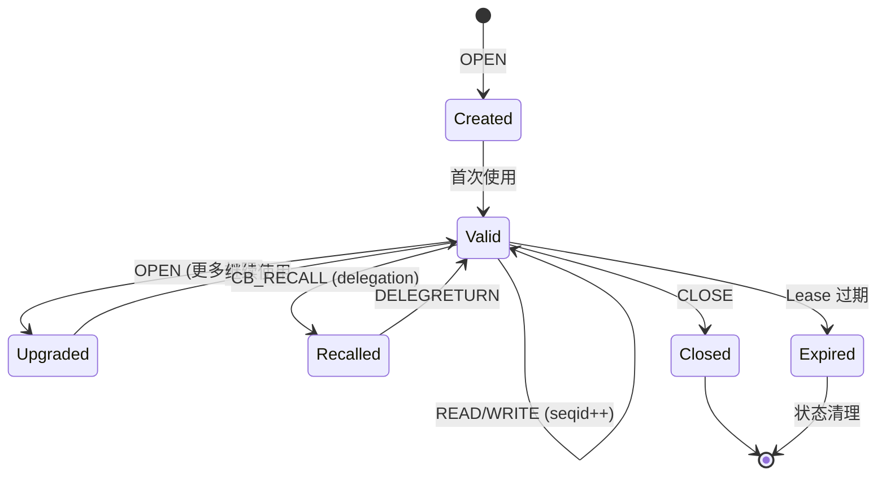
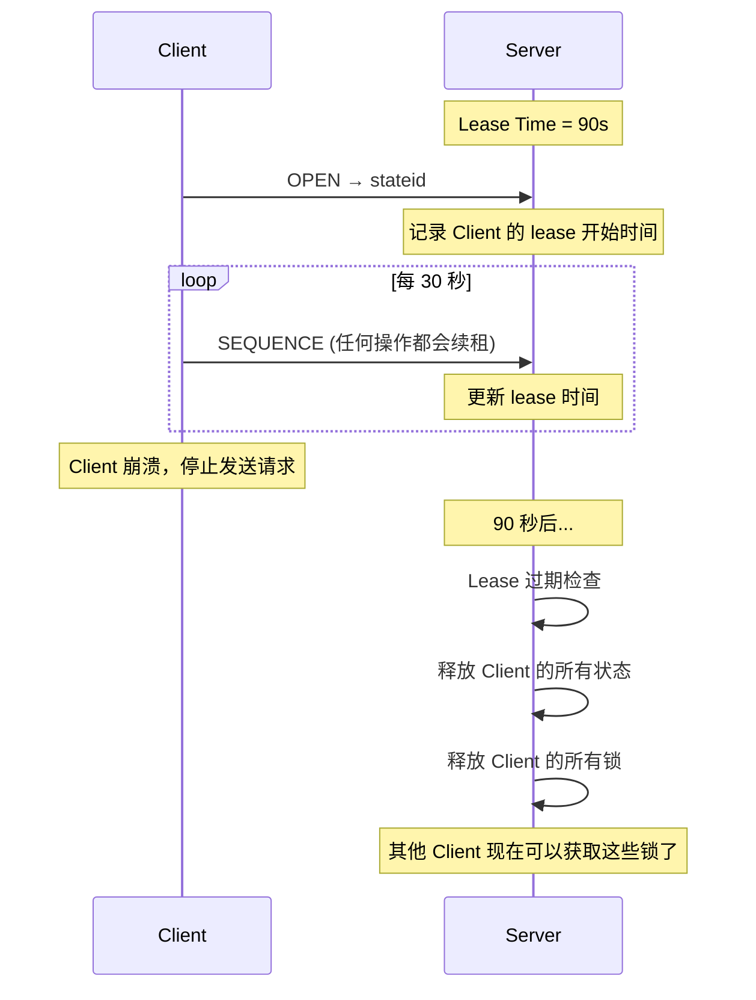
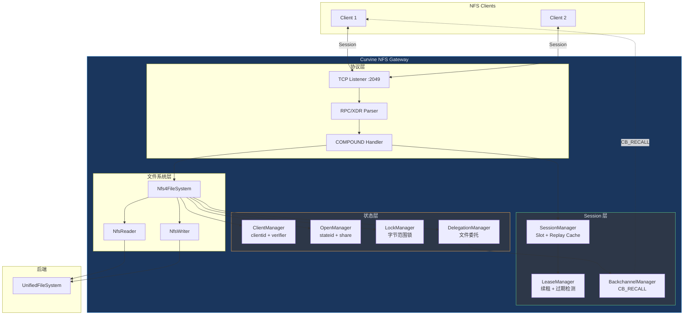
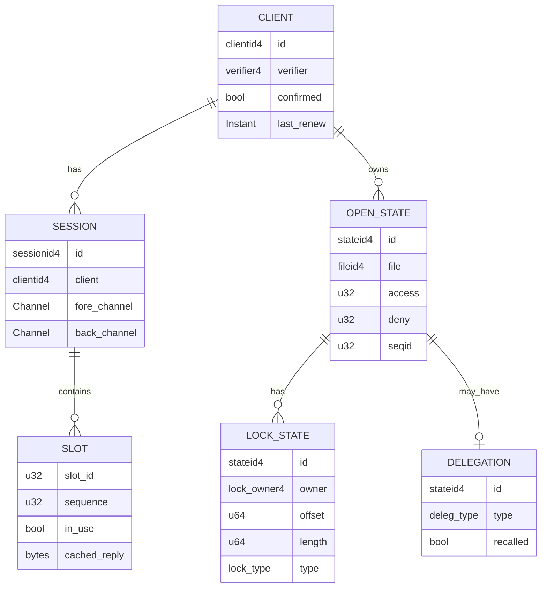
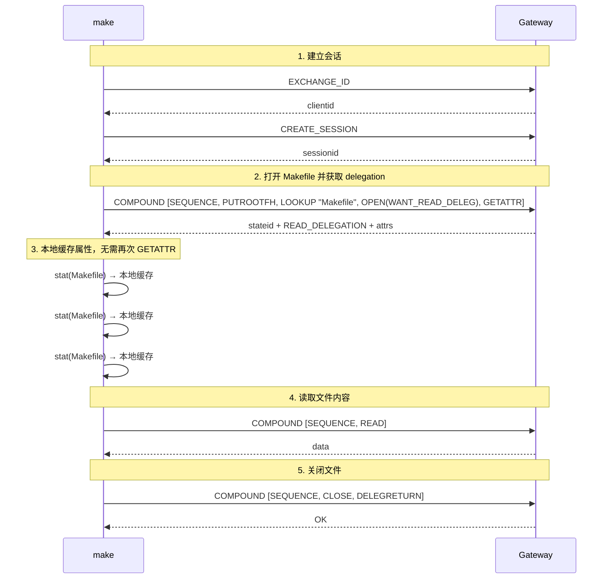
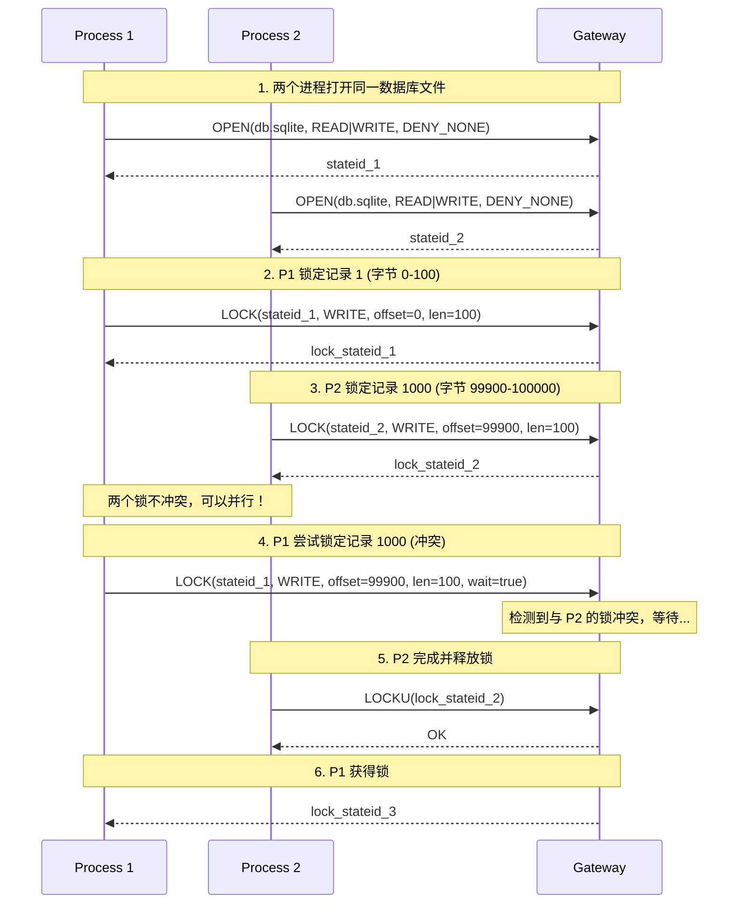
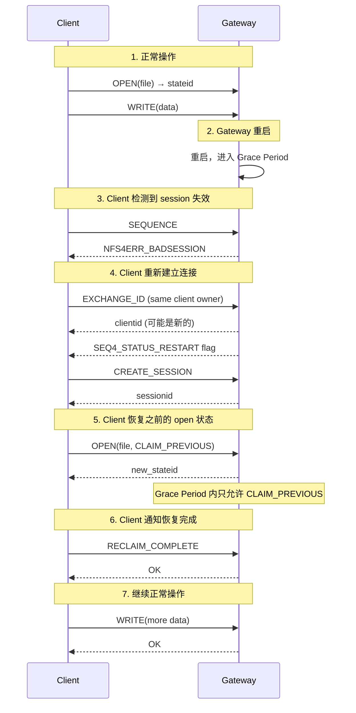
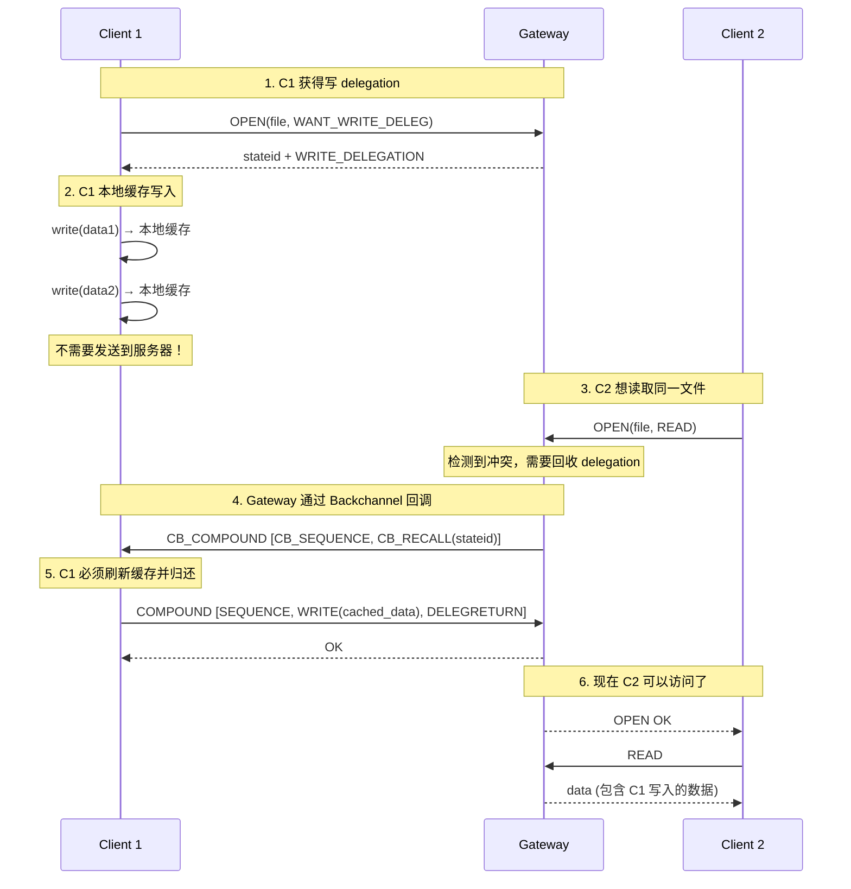

# Curvine NFS Gateway NFSv4.1 设计文档 v4.0

## 0. 自我反思与批评

在深入设计之前，我需要先回答几个关键问题，确保不是为了做而做。

### 问题 1: Session 的作用是什么？

**错误理解**: Session 只是为了管理连接。

**正确理解**: Session 提供 **Exactly-Once 语义**，解决网络不可靠导致的重复执行问题。

```
场景：客户端发送 WRITE 请求，网络超时

Without Session (NFSv3):
  Client: WRITE(offset=0, data="ABC")  ---> [网络超时]
  Client: 不知道服务器是否执行了，只能重试
  Client: WRITE(offset=0, data="ABC")  ---> Server 执行
  
  问题：如果第一次请求其实成功了，数据可能被写两次！
  对于非幂等操作（如 append），这会导致数据损坏。

With Session (NFSv4.1):
  Client: SEQUENCE(slot=0, seq=1) + WRITE  ---> [网络超时]
  Client: 重试相同的 slot 和 seq
  Client: SEQUENCE(slot=0, seq=1) + WRITE  ---> Server
  
  Server 检查: "slot=0, seq=1 我已经执行过了，返回缓存的结果"
  
  结果：无论重试多少次，操作只执行一次！
```

**真实场景**:
- 数据库写入日志文件
- 金融交易记录
- 任何不能重复执行的操作

### 问题 2: 为什么要维护客户端状态？

**错误理解**: 无状态更简单，为什么要搞复杂？

**正确理解**: 状态是实现 **一致性** 和 **性能优化** 的基础。

```
需要维护的状态：
1. Open 状态 (stateid) - 谁打开了什么文件
2. Lock 状态 - 谁锁了哪些字节范围
3. Delegation 状态 - 谁被授权缓存
4. Session 状态 - 请求序列号，防止重复执行

为什么需要？

场景 1: 文件被删除但仍在使用
  Client A: OPEN(/tmp/file) → stateid_A
  Client B: REMOVE(/tmp/file)
  Client A: READ(stateid_A) → 仍然可以读！
  
  服务器知道 Client A 还在用这个文件，不会真正删除。
  这就是 Unix "unlink but still open" 语义。

场景 2: 检测客户端崩溃
  Client A: OPEN(/tmp/file) + LOCK(0-100)
  Client A: [崩溃，不再续租]
  
  服务器: "Client A 的 lease 过期了，释放它的所有锁"
  Client B: 现在可以获取锁了
  
  没有状态，服务器不知道锁该什么时候释放。
```

### 问题 3: Delegation 的作用是什么？

**错误理解**: Delegation 是可选的高级特性。

**正确理解**: Delegation 是 **客户端缓存一致性** 的核心机制。

```
场景：编译大型项目，频繁 stat 同一文件

Without Delegation:
  make: stat(Makefile) → Server: GETATTR → 10ms
  make: stat(Makefile) → Server: GETATTR → 10ms
  make: stat(Makefile) → Server: GETATTR → 10ms
  ... (重复 1000 次)
  
  总延迟: 1000 * 10ms = 10 秒！

With Delegation:
  make: OPEN(Makefile, WANT_READ_DELEG)
  Server: "给你 Read Delegation，你可以缓存这个文件的属性"
  make: stat(Makefile) → 本地缓存 → 0ms
  make: stat(Makefile) → 本地缓存 → 0ms
  ... (重复 1000 次)
  
  总延迟: 1 * 10ms = 10ms！

Delegation 的安全性保证：
  Client A: 持有 Read Delegation
  Client B: 想要写入同一文件
  
  Server → Client A: CB_RECALL (通过 Backchannel)
  Client A: "好的，我放弃 delegation"
  Client A → Server: DELEGRETURN
  Server → Client B: "现在你可以写了"
  
  关键：服务器可以随时收回 delegation，保证一致性！
```

Curvine 现在已经把 delegation 主路径落地：OPEN 授予、冲突 recall、DELEGRETURN、超时 revocation、FREE_STATEID 收尾、stateid 验证和 SEQUENCE revoked-state 报告都在链路里。`BIND_CONN_TO_SESSION` 也已经能在 Curvine 进程内建立可用的 backchannel 队列，发送最小 `CB_COMPOUND [CB_SEQUENCE, CB_RECALL]`，并在 reply 后释放 callback slot。当前仍不完整的是更完整的 callback 互操作细节和 delegation recovery，所以恢复和回调语义还没有完全闭环。

**真实场景**:
- `make` 编译：频繁检查文件时间戳
- `git status`：检查大量文件状态
- IDE：监控项目文件变化
- 任何读多写少的场景

### 问题 4: 字节范围锁有什么用？

**错误理解**: 文件锁就够了，字节范围锁太复杂。

**正确理解**: 字节范围锁支持 **细粒度并发**，是数据库等应用的基础。

```
场景：多进程并发更新同一个数据库文件

Without 字节范围锁 (只有文件锁):
  Process A: LOCK(entire file)
  Process A: UPDATE record 1
  Process B: LOCK(entire file) → 阻塞！等待 A 释放
  Process A: UNLOCK
  Process B: UPDATE record 1000
  
  问题：即使操作不同的记录，也必须串行执行！

With 字节范围锁:
  Process A: LOCK(offset=0, length=100)      # 锁记录 1
  Process B: LOCK(offset=99900, length=100)  # 锁记录 1000
  
  两个进程可以并行执行！只有访问相同字节范围才会阻塞。

实际应用:
  SQLite on NFS:
    - 使用字节范围锁实现 WAL 模式
    - 多个读者可以并发，写者独占
  
  Berkeley DB:
    - 每个 page 用字节范围锁保护
    - 支持高并发事务
  
  邮件服务器 (Maildir):
    - 每个邮件文件独立锁定
    - 支持并发投递和读取
```

### 问题 5: 状态恢复指的是什么？

**错误理解**: 服务器重启后客户端重连就行了。

**正确理解**: 状态恢复确保 **服务器重启不会破坏客户端的工作**。

```
场景：服务器重启，客户端正在写入大文件

Without 状态恢复 (NFSv3):
  Client: WRITE(offset=0, 1GB data) → 写了 500MB
  Server: [重启]
  Client: WRITE(offset=500MB, ...) → Server: "我不认识你"
  Client: 必须重新打开文件，之前的写入可能丢失！

With 状态恢复 (NFSv4.1):
  Client: OPEN + WRITE(500MB)
  Server: [重启，进入 Grace Period]
  
  Client: SEQUENCE → Server: NFS4ERR_BADSESSION
  Client: "服务器重启了，我需要恢复状态"
  
  Client: EXCHANGE_ID (same client owner)
  Server: "我认出你了，进入恢复模式"
  
  Client: CREATE_SESSION
  Client: OPEN(CLAIM_PREVIOUS) → "我之前打开过这个文件"
  Server: "好的，恢复你的 open 状态"
  
  Client: 继续 WRITE(offset=500MB, ...)
  
  结果：客户端无感知地继续工作！

Grace Period 的作用:
  - 服务器重启后的一段时间（通常 90 秒）
  - 只允许恢复操作，不允许新的 open/lock
  - 确保旧客户端有机会恢复状态
  - 防止新客户端抢占旧客户端的锁
```

### 问题 6: 当前设计还缺什么？

对照 NFS-Ganesha 等成熟实现，我的设计存在以下不足：

| 缺失项 | 重要性 | 说明 |
|--------|--------|------|
| **Lease 续租机制** | 🔴 高 | 客户端必须定期续租，否则状态被清理 |
| **Client ID 确认流程** | 🔴 高 | EXCHANGE_ID 后需要 CREATE_SESSION 确认 |
| **Stateid 版本管理** | 🔴 高 | 每次操作 stateid.seqid 必须递增 |
| **Share Reservation** | 🟡 中 | OPEN 的 deny 模式，防止冲突访问 |
| **Open Upgrade/Downgrade** | 🟡 中 | 同一文件多次 OPEN 的处理 |
| **Delegation 恢复持久化** | 🟡 中 | open state 持久化已有框架，仍需补齐 delegation state 持久化 |
| **Backchannel on-wire RPC** | 🔴 高 | Delegation 主路径已完成，但真实回调链路还未完整 |
| **Delegation 恢复** | 🟡 中 | `CLAIM_DELEGATE_PREV` 和 persisted delegation state 仍待闭环 |
| **ACL 支持** | 🟢 低 | NFSv4 ACL，比 Unix mode 更细粒度 |

## 1. 设计目标（修订版）

> 2026-04-15 实现状态补充：Curvine 已实现 `TEST_STATEID`、`DESTROY_CLIENTID`、`FREE_STATEID`，delegation 主路径也已包含授予、冲突触发 recall、`DELEGRETURN`、超时回收和 revoked-state 清理；`OPEN` 已支持 `CLAIM_DELEGATE_CUR` 和 `CLAIM_DELEG_CUR_FH`。仍待补的是真实 on-wire backchannel 互操作细节、`CLAIM_DELEGATE_PREV` 和 delegation 持久化恢复。

基于以上反思，重新定义目标：

### 1.1 必须实现 (P0)

| 特性 | 价值 | 复杂度 |
|------|------|--------|
| Session + Slot | Exactly-once 语义，防止重复执行 | 中 |
| COMPOUND | 减少网络往返，提升性能 | 中 |
| Stateid 管理 | 跟踪 open/lock 状态 | 中 |
| Lease 续租 | 检测客户端崩溃，释放资源 | 低 |
| 字节范围锁 | 支持数据库等并发应用 | 中 |

### 1.2 应该实现 (P1)

| 特性 | 价值 | 复杂度 |
|------|------|--------|
| Delegation 主路径 | 客户端缓存优化，减少 GETATTR | 高 |
| Backchannel on-wire RPC | Delegation 的前提 | 高 |
| Share Reservation | 防止冲突的文件访问模式 | 中 |
| Grace Period | 服务器重启后的状态恢复 | 中 |

### 1.3 可以不做 (P2)

| 特性 | 原因 |
|------|------|
| pNFS 数据面 | metadata plane 已启动，但 Worker 仍没有真实 DS NFS 服务 |
| Directory Delegation | 复杂度高，收益有限 |
| NFSv4 ACL | Unix mode 够用 |
| Delegation Recovery | 复杂度高，先完成 delegation 主路径 |

## 2. 核心概念详解

### 2.1 Stateid 生命周期



### 2.2 Lease 续租机制



### 2.3 Share Reservation (共享预留)

```
OPEN 的 access 和 deny 参数：

access: 我要什么权限
  - OPEN4_SHARE_ACCESS_READ   (读)
  - OPEN4_SHARE_ACCESS_WRITE  (写)
  - OPEN4_SHARE_ACCESS_BOTH   (读写)

deny: 我不允许别人做什么
  - OPEN4_SHARE_DENY_NONE   (不限制)
  - OPEN4_SHARE_DENY_READ   (禁止别人读)
  - OPEN4_SHARE_DENY_WRITE  (禁止别人写)
  - OPEN4_SHARE_DENY_BOTH   (禁止别人读写)

场景：独占写入
  Client A: OPEN(access=WRITE, deny=WRITE)
  Client B: OPEN(access=WRITE, deny=NONE) → 失败！NFS4ERR_SHARE_DENIED
  
  A 说"我要写，而且不允许别人写"，所以 B 的写请求被拒绝。

场景：共享读取
  Client A: OPEN(access=READ, deny=NONE)
  Client B: OPEN(access=READ, deny=NONE) → 成功！
  
  两个客户端都可以读，因为没有人设置 deny。
```

## 3. 架构设计（修订版）

### 3.1 整体架构



### 3.2 状态关系图



## 4. 核心组件设计（修订版）

### 4.1 ClientManager - 客户端管理

```rust
/// Client Manager
/// 管理客户端身份和确认流程
pub struct ClientManager {
    /// Client ID -> Client State
    clients: RwLock<HashMap<clientid4, Arc<RwLock<ClientState>>>>,
    /// Client Owner -> Client ID (用于重连识别)
    owner_to_client: RwLock<HashMap<client_owner4, clientid4>>,
    /// Next client ID
    next_clientid: AtomicU64,
    /// Server boot time (用于生成 clientid)
    boot_time: u64,
}

pub struct ClientState {
    pub clientid: clientid4,
    pub owner: client_owner4,
    pub verifier: verifier4,
    /// 是否已确认 (CREATE_SESSION 后确认)
    pub confirmed: bool,
    /// 最后续租时间
    pub last_renew: Instant,
    /// 该客户端的所有 session
    pub sessions: Vec<sessionid4>,
    /// 该客户端的所有 open state
    pub open_states: HashMap<stateid4, Arc<OpenState>>,
    /// Callback 信息
    pub cb_program: Option<u32>,
}

impl ClientManager {
    /// EXCHANGE_ID - 客户端注册/重连
    pub async fn exchange_id(&self, args: EXCHANGE_ID4args) -> Result<EXCHANGE_ID4res> {
        let owner = &args.eia_clientowner;
        
        // 检查是否是重连的客户端
        if let Some(&existing_clientid) = self.owner_to_client.read().get(owner) {
            let clients = self.clients.read();
            if let Some(client) = clients.get(&existing_clientid) {
                let client = client.read();
                
                // 相同 verifier = 客户端重连
                if client.verifier == args.eia_clientowner.co_verifier {
                    return Ok(EXCHANGE_ID4res {
                        eir_clientid: existing_clientid,
                        eir_sequenceid: 1,
                        eir_flags: EXCHGID4_FLAG_CONFIRMED_R,
                        ..Default::default()
                    });
                }
                
                // 不同 verifier = 客户端重启，需要清理旧状态
                drop(client);
                drop(clients);
                self.purge_client(existing_clientid).await;
            }
        }
        
        // 新客户端
        let clientid = self.generate_clientid();
        let client = ClientState {
            clientid,
            owner: owner.clone(),
            verifier: owner.co_verifier,
            confirmed: false,  // 等待 CREATE_SESSION 确认
            last_renew: Instant::now(),
            sessions: vec![],
            open_states: HashMap::new(),
            cb_program: None,
        };
        
        self.clients.write().insert(clientid, Arc::new(RwLock::new(client)));
        self.owner_to_client.write().insert(owner.clone(), clientid);
        
        Ok(EXCHANGE_ID4res {
            eir_clientid: clientid,
            eir_sequenceid: 1,
            eir_flags: 0,  // 未确认
            ..Default::default()
        })
    }
    
    /// 确认客户端 (CREATE_SESSION 成功后调用)
    pub fn confirm_client(&self, clientid: clientid4) -> Result<()> {
        let clients = self.clients.read();
        let client = clients.get(&clientid).ok_or(Nfs4Error::StaleClientid)?;
        client.write().confirmed = true;
        Ok(())
    }
    
    /// 续租
    pub fn renew_lease(&self, clientid: clientid4) -> Result<()> {
        let clients = self.clients.read();
        let client = clients.get(&clientid).ok_or(Nfs4Error::StaleClientid)?;
        client.write().last_renew = Instant::now();
        Ok(())
    }
}
```

### 4.2 LeaseManager - 租约管理

```rust
/// Lease Manager
/// 管理客户端租约，检测崩溃的客户端
pub struct LeaseManager {
    /// Lease 时间 (默认 90 秒)
    lease_time: Duration,
    /// Client manager reference
    clients: Arc<ClientManager>,
    /// Open manager reference (用于清理 open state)
    opens: Arc<OpenManager>,
    /// Lock manager reference (用于清理锁)
    locks: Arc<LockManager>,
    /// Delegation manager reference
    delegations: Arc<DelegationManager>,
}

impl LeaseManager {
    /// 启动后台 lease 检查任务
    pub fn start_lease_checker(self: Arc<Self>) {
        tokio::spawn(async move {
            let check_interval = self.lease_time / 4;  // 每 22.5 秒检查一次
            
            loop {
                tokio::time::sleep(check_interval).await;
                self.check_expired_leases().await;
            }
        });
    }
    
    /// 检查并清理过期的客户端
    async fn check_expired_leases(&self) {
        let now = Instant::now();
        let expired_clients: Vec<clientid4> = {
            let clients = self.clients.clients.read();
            clients.iter()
                .filter(|(_, client)| {
                    let client = client.read();
                    client.confirmed && 
                    now.duration_since(client.last_renew) > self.lease_time
                })
                .map(|(&id, _)| id)
                .collect()
        };
        
        for clientid in expired_clients {
            log::warn!("Client {} lease expired, cleaning up state", clientid);
            self.cleanup_client(clientid).await;
        }
    }
    
    /// 清理客户端的所有状态
    async fn cleanup_client(&self, clientid: clientid4) {
        // 1. 回收所有 delegation
        self.delegations.revoke_all_for_client(clientid).await;
        
        // 2. 释放所有锁
        self.locks.release_all_for_client(clientid).await;
        
        // 3. 关闭所有 open state
        self.opens.close_all_for_client(clientid).await;
        
        // 4. 销毁所有 session
        self.clients.destroy_all_sessions(clientid).await;
        
        // 5. 移除客户端
        self.clients.remove_client(clientid);
        
        log::info!("Client {} state cleaned up", clientid);
    }
}
```

### 4.3 OpenManager - Open 状态管理

```rust
/// Open State Manager
/// 管理文件的 open 状态和 share reservation
pub struct OpenManager {
    /// Stateid -> Open State
    states: RwLock<HashMap<stateid4, Arc<RwLock<OpenState>>>>,
    /// File ID -> Open States (用于检查 share 冲突)
    file_opens: RwLock<HashMap<fileid4, Vec<stateid4>>>,
    /// Next stateid
    next_stateid: AtomicU32,
}

pub struct OpenState {
    pub stateid: stateid4,
    pub clientid: clientid4,
    pub fileid: fileid4,
    pub path: Path,
    /// 访问模式
    pub access: u32,
    /// 拒绝模式
    pub deny: u32,
    /// Stateid 序列号 (每次操作递增)
    pub seqid: AtomicU32,
    /// Reader (复用 FuseReader)
    pub reader: Option<RawPtr<FuseReader>>,
    /// Writer (复用 FuseWriter)
    pub writer: Option<Arc<Mutex<FuseWriter>>>,
    /// 关联的锁
    pub locks: RwLock<Vec<stateid4>>,
    /// 关联的 delegation
    pub delegation: Option<stateid4>,
}

impl OpenManager {
    /// 检查 share reservation 冲突
    fn check_share_conflict(
        &self,
        fileid: fileid4,
        access: u32,
        deny: u32,
    ) -> Result<()> {
        let file_opens = self.file_opens.read();
        let states = self.states.read();
        
        if let Some(open_stateids) = file_opens.get(&fileid) {
            for stateid in open_stateids {
                if let Some(state) = states.get(stateid) {
                    let state = state.read();
                    
                    // 检查：我的 access 是否被别人 deny？
                    if (access & OPEN4_SHARE_ACCESS_READ != 0) && 
                       (state.deny & OPEN4_SHARE_DENY_READ != 0) {
                        return Err(Nfs4Error::ShareDenied);
                    }
                    if (access & OPEN4_SHARE_ACCESS_WRITE != 0) && 
                       (state.deny & OPEN4_SHARE_DENY_WRITE != 0) {
                        return Err(Nfs4Error::ShareDenied);
                    }
                    
                    // 检查：我的 deny 是否与别人的 access 冲突？
                    if (deny & OPEN4_SHARE_DENY_READ != 0) && 
                       (state.access & OPEN4_SHARE_ACCESS_READ != 0) {
                        return Err(Nfs4Error::ShareDenied);
                    }
                    if (deny & OPEN4_SHARE_DENY_WRITE != 0) && 
                       (state.access & OPEN4_SHARE_ACCESS_WRITE != 0) {
                        return Err(Nfs4Error::ShareDenied);
                    }
                }
            }
        }
        
        Ok(())
    }
    
    /// OPEN 操作
    pub async fn open(
        &self,
        clientid: clientid4,
        fileid: fileid4,
        path: &Path,
        access: u32,
        deny: u32,
        fs: &UnifiedFileSystem,
    ) -> Result<OpenState> {
        // 1. 检查 share 冲突
        self.check_share_conflict(fileid, access, deny)?;
        
        // 2. 创建 reader/writer (复用 FUSE 逻辑)
        let (reader, writer) = self.create_reader_writer(path, access, fs).await?;
        
        // 3. 生成 stateid
        let stateid = self.generate_stateid();
        
        // 4. 创建 open state
        let state = OpenState {
            stateid,
            clientid,
            fileid,
            path: path.clone(),
            access,
            deny,
            seqid: AtomicU32::new(1),
            reader,
            writer,
            locks: RwLock::new(vec![]),
            delegation: None,
        };
        
        // 5. 记录状态
        let state = Arc::new(RwLock::new(state));
        self.states.write().insert(stateid, state.clone());
        self.file_opens.write()
            .entry(fileid)
            .or_default()
            .push(stateid);
        
        Ok(state.read().clone())
    }
    
    /// 验证并更新 stateid
    pub fn verify_stateid(&self, stateid: &stateid4, update: bool) -> Result<Arc<RwLock<OpenState>>> {
        let states = self.states.read();
        let state = states.get(stateid).ok_or(Nfs4Error::BadStateid)?;
        
        let state_guard = state.read();
        
        // 检查 seqid (0 表示任意序列号)
        if stateid.seqid != 0 && stateid.seqid != state_guard.seqid.load(Ordering::Relaxed) {
            return Err(Nfs4Error::OldStateid);
        }
        
        drop(state_guard);
        
        // 更新 seqid
        if update {
            state.write().seqid.fetch_add(1, Ordering::Relaxed);
        }
        
        Ok(state.clone())
    }
}
```

### 4.4 LockManager - 字节范围锁（修订版）

```rust
/// Lock Manager
/// 管理 NFSv4 字节范围锁
pub struct LockManager {
    /// File ID -> Locks
    file_locks: RwLock<HashMap<fileid4, Vec<Nfs4Lock>>>,
    /// Lock stateid -> Lock info
    lock_states: RwLock<HashMap<stateid4, Nfs4Lock>>,
    /// Next lock stateid
    next_stateid: AtomicU32,
}

#[derive(Clone)]
pub struct Nfs4Lock {
    pub stateid: stateid4,
    pub clientid: clientid4,
    pub owner: lock_owner4,
    pub fileid: fileid4,
    pub lock_type: nfs_lock_type4,
    pub offset: u64,
    pub length: u64,  // 0 或 u64::MAX 表示到文件末尾
}

impl LockManager {
    /// LOCK 操作
    pub async fn lock(
        &self,
        open_stateid: &stateid4,
        owner: &lock_owner4,
        lock_type: nfs_lock_type4,
        offset: u64,
        length: u64,
        wait: bool,
    ) -> Result<stateid4> {
        let fileid = self.get_fileid_from_open(open_stateid)?;
        
        loop {
            // 检查冲突
            if let Some(conflict) = self.find_conflict(fileid, lock_type, offset, length, owner) {
                if !wait {
                    return Err(Nfs4Error::Denied(conflict));
                }
                // 等待锁释放
                tokio::time::sleep(Duration::from_millis(100)).await;
                continue;
            }
            
            // 授予锁
            let stateid = self.generate_lock_stateid();
            let lock = Nfs4Lock {
                stateid,
                clientid: owner.clientid,
                owner: owner.clone(),
                fileid,
                lock_type,
                offset,
                length,
            };
            
            self.file_locks.write()
                .entry(fileid)
                .or_default()
                .push(lock.clone());
            self.lock_states.write().insert(stateid, lock);
            
            return Ok(stateid);
        }
    }
    
    /// 查找冲突的锁
    fn find_conflict(
        &self,
        fileid: fileid4,
        lock_type: nfs_lock_type4,
        offset: u64,
        length: u64,
        owner: &lock_owner4,
    ) -> Option<Nfs4Lock> {
        let file_locks = self.file_locks.read();
        let locks = file_locks.get(&fileid)?;
        
        let is_write = matches!(lock_type, WRITE_LT | WRITEW_LT);
        let end = if length == 0 { u64::MAX } else { offset + length };
        
        for lock in locks {
            // 同一 owner 不冲突
            if &lock.owner == owner {
                continue;
            }
            
            // 检查范围重叠
            let lock_end = if lock.length == 0 { u64::MAX } else { lock.offset + lock.length };
            if offset >= lock_end || end <= lock.offset {
                continue;  // 不重叠
            }
            
            // 读锁 vs 读锁不冲突
            let existing_is_write = matches!(lock.lock_type, WRITE_LT | WRITEW_LT);
            if !is_write && !existing_is_write {
                continue;
            }
            
            // 冲突！
            return Some(lock.clone());
        }
        
        None
    }
    
    /// LOCKT 操作 - 测试锁
    pub fn test_lock(
        &self,
        fileid: fileid4,
        owner: &lock_owner4,
        lock_type: nfs_lock_type4,
        offset: u64,
        length: u64,
    ) -> Option<Nfs4Lock> {
        self.find_conflict(fileid, lock_type, offset, length, owner)
    }
    
    /// LOCKU 操作 - 解锁
    pub fn unlock(&self, stateid: &stateid4) -> Result<()> {
        let lock = self.lock_states.write().remove(stateid)
            .ok_or(Nfs4Error::BadStateid)?;
        
        let mut file_locks = self.file_locks.write();
        if let Some(locks) = file_locks.get_mut(&lock.fileid) {
            locks.retain(|l| &l.stateid != stateid);
        }
        
        Ok(())
    }
}
```

### 4.5 SessionManager - 会话管理（修订版）

```rust
/// Session Manager
/// 管理 NFSv4.1 会话和 Slot
pub struct SessionManager {
    /// Session ID -> Session
    sessions: RwLock<HashMap<sessionid4, Arc<Session>>>,
    /// Client manager
    clients: Arc<ClientManager>,
    /// Next session ID
    next_sessionid: AtomicU64,
}

pub struct Session {
    pub sessionid: sessionid4,
    pub clientid: clientid4,
    /// Fore channel slots
    pub slots: Vec<Mutex<Slot>>,
    /// Back channel (for callbacks)
    pub back_channel: Option<BackChannel>,
    /// TCP connection
    pub conn: Arc<TcpStream>,
}

pub struct Slot {
    pub slot_id: u32,
    /// 当前序列号
    pub sequence: u32,
    /// 是否正在使用
    pub in_use: bool,
    /// 缓存的回复 (用于 replay 检测)
    pub cached_reply: Option<CachedReply>,
}

pub struct CachedReply {
    pub sequence: u32,
    pub reply: Vec<u8>,
}

impl SessionManager {
    /// SEQUENCE 操作 - 每个 COMPOUND 的第一个操作
    pub fn sequence(&self, args: SEQUENCE4args) -> Result<SEQUENCE4res> {
        let sessions = self.sessions.read();
        let session = sessions.get(&args.sa_sessionid)
            .ok_or(Nfs4Error::BadSession)?;
        
        let slot = session.slots.get(args.sa_slotid as usize)
            .ok_or(Nfs4Error::BadSlot)?;
        
        let mut slot = slot.lock();
        
        // 检查序列号
        match args.sa_sequenceid.cmp(&slot.sequence) {
            Ordering::Less => {
                // 旧请求 - 可能是 replay
                if args.sa_sequenceid == slot.sequence.saturating_sub(1) {
                    // 返回缓存的回复
                    if let Some(cached) = &slot.cached_reply {
                        if cached.sequence == args.sa_sequenceid {
                            return Ok(/* decode cached reply */);
                        }
                    }
                }
                return Err(Nfs4Error::SeqMisordered);
            }
            Ordering::Greater => {
                // 跳过了序列号
                return Err(Nfs4Error::SeqMisordered);
            }
            Ordering::Equal => {
                // 正确的序列号
            }
        }
        
        // 检查 slot 是否正在使用
        if slot.in_use {
            return Err(Nfs4Error::SeqMisordered);
        }
        
        // 标记 slot 正在使用
        slot.in_use = true;
        slot.sequence += 1;
        
        // 续租
        self.clients.renew_lease(session.clientid)?;
        
        Ok(SEQUENCE4res {
            sr_sessionid: args.sa_sessionid,
            sr_sequenceid: args.sa_sequenceid,
            sr_slotid: args.sa_slotid,
            sr_highest_slotid: (session.slots.len() - 1) as u32,
            sr_target_highest_slotid: args.sa_highest_slotid,
            sr_status_flags: 0,
        })
    }
    
    /// 缓存回复 (COMPOUND 完成后调用)
    pub fn cache_reply(&self, sessionid: &sessionid4, slot_id: u32, reply: &[u8]) {
        if let Some(session) = self.sessions.read().get(sessionid) {
            if let Some(slot) = session.slots.get(slot_id as usize) {
                let mut slot = slot.lock();
                slot.cached_reply = Some(CachedReply {
                    sequence: slot.sequence - 1,
                    reply: reply.to_vec(),
                });
                slot.in_use = false;
            }
        }
    }
}
```

## 5. 典型场景流程

### 5.1 场景：编译项目 (make)



### 5.2 场景：数据库并发访问



### 5.3 场景：服务器重启恢复



### 5.4 场景：Delegation 回收



## 6. 实现计划（修订版）

### Phase 1: 基础框架 (2 周)

| 任务 | 文件 | 说明 |
|------|------|------|
| NFSv4.1 类型定义 | `nfs4/types.rs` | stateid4, sessionid4, clientid4, fattr4 等 |
| 错误码 | `nfs4/error.rs` | NFS4ERR_* 错误码 |
| XDR 编解码 | `nfs4/xdr.rs` | 扩展现有 XDR 支持 |
| COMPOUND 框架 | `nfs4/compound.rs` | CompoundHandler, CompoundContext |
| RPC 处理 | `server/rpc.rs` | NFSv4.1 program/version |

### Phase 2: 客户端和会话 (2 周)

| 任务 | 文件 | 说明 |
|------|------|------|
| ClientManager | `state/client.rs` | EXCHANGE_ID, 客户端确认 |
| SessionManager | `nfs4/session.rs` | CREATE_SESSION, DESTROY_SESSION |
| Slot 管理 | `nfs4/session.rs` | SEQUENCE, replay 检测 |
| LeaseManager | `state/lease.rs` | 续租, 过期检测 |

### Phase 3: 文件操作 (2 周)

| 任务 | 文件 | 说明 |
|------|------|------|
| OpenManager | `state/open.rs` | OPEN, CLOSE, share reservation |
| Stateid 管理 | `state/stateid.rs` | 生成, 验证, 更新 |
| 文件操作 | `nfs4/ops/file.rs` | READ, WRITE, COMMIT |
| 目录操作 | `nfs4/ops/dir.rs` | LOOKUP, READDIR, CREATE, REMOVE |
| 属性操作 | `nfs4/ops/attr.rs` | GETATTR, SETATTR |

### Phase 4: 锁 (1 周)

| 任务 | 文件 | 说明 |
|------|------|------|
| LockManager | `state/lock.rs` | 字节范围锁管理 |
| 锁操作 | `nfs4/ops/lock.rs` | LOCK, LOCKT, LOCKU |

### Phase 5: Delegation (2 周)

| 任务 | 文件 | 说明 |
|------|------|------|
| DelegationManager | `nfs4/delegation.rs` | 授予, 回收, timeout revocation, revoked-state cleanup |
| BackchannelManager | `nfs4/backchannel.rs` | CB_COMPOUND, CB_RECALL（真实 on-wire 仍在补齐） |
| Delegation 操作 | `nfs4/ops/open.rs`, `nfs4/handlers.rs` | OPEN delegation request, DELEGRETURN, FREE_STATEID |
| 状态管理补充 | `nfs4/handlers.rs`, `nfs4/state/*` | TEST_STATEID, DESTROY_CLIENTID |

### Phase 6: 状态恢复 (1 周)

| 任务 | 文件 | 说明 |
|------|------|------|
| GracePeriodManager | `state/grace.rs` | Grace period 管理 |
| 恢复操作 | `nfs4/ops/recovery.rs` | CLAIM_PREVIOUS, RECLAIM_COMPLETE |
| Delegation 恢复待补 | `nfs4/ops/open.rs`, `nfs4/delegation.rs` | CLAIM_DELEGATE_PREV, persisted delegation, pre-recall |

> 当前实现状态：Delegation 主路径已经在 Curvine 中落地，Phase 5 还剩下的是 backchannel on-wire RPC 和 delegation 恢复闭环。

### Phase 7: 测试和优化 (2 周)

| 任务 | 说明 |
|------|------|
| 单元测试 | 每个组件的测试 |
| 集成测试 | Linux/macOS 挂载测试 |
| 性能测试 | fio 基准测试 |
| 文档 | 使用说明, API 文档 |

**总计: 12 周**

## 7. 测试用例

### 7.1 Session 测试

| 用例 | 输入 | 预期结果 |
|------|------|----------|
| 正常 SEQUENCE | slot=0, seq=1 | OK, seq 递增 |
| 重复 SEQUENCE | slot=0, seq=1 (再次) | 返回缓存的回复 |
| 跳过序列号 | slot=0, seq=3 (跳过 2) | NFS4ERR_SEQ_MISORDERED |
| 旧序列号 | slot=0, seq=0 (已经是 2) | NFS4ERR_SEQ_MISORDERED |
| 无效 session | 不存在的 sessionid | NFS4ERR_BADSESSION |

### 7.2 Share Reservation 测试

| 用例 | 输入 | 预期结果 |
|------|------|----------|
| 共享读 | A: READ/NONE, B: READ/NONE | 两个都成功 |
| 独占写 | A: WRITE/WRITE, B: WRITE/NONE | B 失败 NFS4ERR_SHARE_DENIED |
| 读写冲突 | A: READ/WRITE, B: WRITE/NONE | B 失败 |
| 无冲突 | A: READ/NONE, B: WRITE/NONE | 两个都成功 |

### 7.3 字节范围锁测试

| 用例 | 输入 | 预期结果 |
|------|------|----------|
| 不重叠锁 | A: 0-100, B: 200-300 | 两个都成功 |
| 重叠读锁 | A: READ 0-100, B: READ 50-150 | 两个都成功 |
| 重叠写锁 | A: WRITE 0-100, B: WRITE 50-150 | B 阻塞或失败 |
| 读写冲突 | A: WRITE 0-100, B: READ 50-150 | B 阻塞或失败 |
| 同一 owner | A: WRITE 0-100, A: WRITE 50-150 | 两个都成功 |

### 7.4 Lease 测试

| 用例 | 输入 | 预期结果 |
|------|------|----------|
| 正常续租 | 每 30s 发送请求 | Lease 保持有效 |
| Lease 过期 | 90s 无请求 | 状态被清理 |
| 过期后访问 | 使用旧 stateid | NFS4ERR_EXPIRED |

## 8. 总结

### 8.1 设计原则应用

| 原则 | 应用 |
|------|------|
| **KISS** | 先做 pNFS metadata plane，不提前扩张到 DS 写路径 |
| **YAGNI** | 不做 Directory Delegation, ACL |
| **DRY** | 复用 FuseReader/FuseWriter |
| **SRP** | 每个 Manager 单一职责 |

### 8.2 关键收益

1. **Exactly-Once**: Session + Slot 防止重复执行
2. **性能**: COMPOUND 减少 RTT, Delegation 减少 GETATTR
3. **并发**: 字节范围锁支持数据库等应用
4. **可靠性**: Lease 检测崩溃客户端, Grace Period 支持恢复

### 8.3 风险

| 风险 | 缓解 |
|------|------|
| Backchannel 复杂 | 先实现无 Delegation 版本 |
| 状态恢复复杂 | 先实现内存版本，不持久化 |
| macOS 兼容性 | 早期测试 |

---

**文档版本**: 4.0  
**创建日期**: 2025-12-26  
**作者**: Kiro AI Assistant
