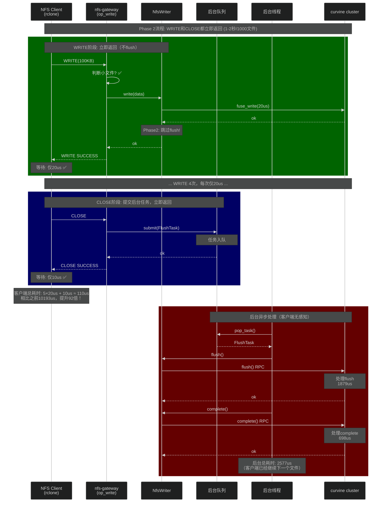
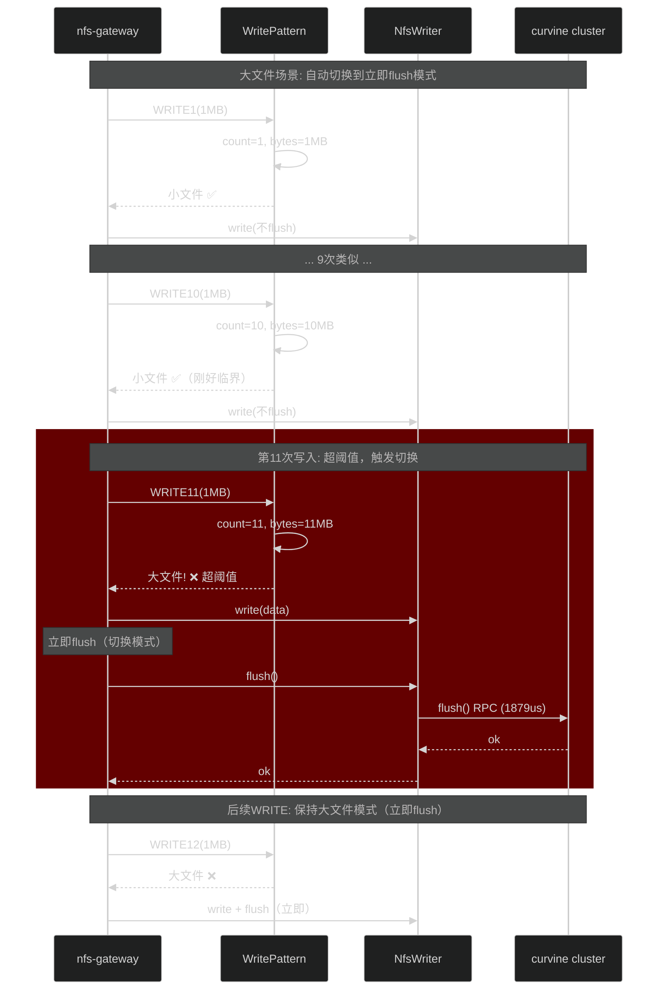

# Phase 2 异步Flush设计文档（完全版）

**版本**: 1.0  
**日期**: 2026-01-10  
**目标**: 小文件写入性能提升40-80倍（80秒 → 1-2秒）

---

## 1. 核心设计原则

### 1.1 三大核心问题

| 问题 | 设计方案 | 说明 |
|------|---------|------|
| **如何判断小文件？** | 动态判断（写入次数+总字节+时间） | 最核心，详见1.2节 |
| **内存占用控制** | ≤ 10MB（远低于100M限制） | 详见1.3节 |
| **数据写入机制** | 仍然调用curvine writer，不写nfs-gw内存 | 详见1.4节 |

### 1.2 小文件判断逻辑（核心）

#### 方案对比

| 方案 | 判断时机 | 准确性 | 内存占用 | 推荐 |
|------|---------|--------|---------|------|
| **A. 动态跟踪** | 每次WRITE时判断 | 高 | 低（24字节/文件） | ✅ 推荐 |
| B. 固定阈值 | 配置文件指定 | 低 | 无 | 备选 |
| C. CLOSE时判断 | CLOSE时 | 最高 | 中 | 不适用异步 |

#### 选择方案A：动态跟踪（推荐）

**原理**：在每次WRITE时跟踪文件的写入模式

```rust
struct WritePattern {
    write_count: u32,           // 写入次数
    total_bytes: u64,           // 累计字节数
    first_write_time: Instant,  // 首次写入时间
}

// 判断条件（三个条件同时满足）
fn is_small_file(pattern: &WritePattern) -> bool {
    pattern.write_count <= 10        // 条件1: 写入次数 ≤ 10次
    && pattern.total_bytes <= 10 * 1024 * 1024  // 条件2: 总大小 ≤ 10MB
    && pattern.first_write_time.elapsed() <= Duration::from_secs(30)  // 条件3: 时间跨度 ≤ 30秒
}
```

**判断时机**：
- **OPEN时**：创建WritePattern，初始值为空
- **每次WRITE时**：更新write_count和total_bytes
- **WRITE后判断**：检查是否仍符合小文件模式
- **超阈值时**：立即切换到大文件模式（立即flush）

**自适应特性**：
```
文件1（小文件）:
  WRITE1(100KB) → 判断: count=1, bytes=100KB → 小文件 ✅
  WRITE2(100KB) → 判断: count=2, bytes=200KB → 小文件 ✅
  WRITE3(100KB) → 判断: count=3, bytes=300KB → 小文件 ✅
  CLOSE → 异步flush

文件2（大文件，自动切换）:
  WRITE1(1MB) → 判断: count=1, bytes=1MB → 小文件 ✅
  WRITE2(2MB) → 判断: count=2, bytes=3MB → 小文件 ✅
  ...
  WRITE10(2MB) → 判断: count=10, bytes=20MB → 超阈值! ❌
  → 立即flush，切换到大文件模式
  WRITE11(2MB) → 大文件模式，立即flush
  CLOSE → 无需额外操作
```

**配置参数**：

```rust
pub struct SmallFileConfig {
    pub max_writes: u32,     // 默认: 10次
    pub max_size: u64,       // 默认: 10MB
    pub max_duration: u64,   // 默认: 30秒
}
```

**内存占用**：
```
每个NfsWriter增加: 
  WritePattern: 24字节（u32 + u64 + Instant）
  
假设同时打开1000个文件:
  1000 × 24字节 = 24KB （远低于100M限制）
```

---

### 1.3 内存占用控制

#### 内存组成分析

| 组件 | 单位占用 | 数量上限 | 总占用 |
|------|---------|---------|--------|
| **WritePattern** | 24字节 | 1000文件 | 24KB |
| **后台FlushTask队列** | 64字节/任务 | 1000任务 | 64KB |
| **NfsWriter原有缓存** | ~1KB | 1000文件 | 1MB |
| **其他开销** | - | - | ~1MB |
| **总计** | - | - | **~2MB** ✅ |

**结论**：Phase 2额外内存占用 < 3MB，远低于100M限制。

#### 背压机制（防止队列积压）

```rust
impl BackgroundFlushPool {
    const MAX_QUEUE_SIZE: usize = 1000;  // 限制队列长度

    pub async fn submit(&self, task: FlushTask) -> FsResult<()> {
        // 如果队列满，等待（背压）
        while self.queue.len() >= Self::MAX_QUEUE_SIZE {
            tokio::time::sleep(Duration::from_millis(10)).await;
        }
        self.queue.push_back(task);
        Ok(())
    }
}
```

**最坏情况内存**：
- 1000个任务在队列中：64KB
- 1000个NfsWriter打开：1MB + 24KB
- 总计：~2MB（安全）

---

### 1.4 数据写入机制

#### 关键问题：数据写到哪里？

**答案**：**仍然调用curvine的writer，不写nfs-gw内存**

**设计图**：

```
                    ┌─────────────────────────────────┐
                    │   NFS Client (rclone)          │
                    └───────────────┬─────────────────┘
                                    │ WRITE RPC
                                    ▼
                    ┌─────────────────────────────────┐
                    │   curvine-nfs-gateway          │
                    │                                 │
                    │  ┌───────────────────────────┐ │
                    │  │ op_write()                │ │
                    │  │  1. 接收数据(Vec<u8>)     │ │
                    │  │  2. 判断小文件？          │ │
                    │  │  3. writer.write() ────┐  │ │
                    │  │  4. 立即返回SUCCESS     │  │ │
                    │  └───────────────────────┬─┘  │ │
                    │                          │    │ │
                    │                          ▼    │ │
                    │  ┌───────────────────────────┐│ │
                    │  │ NfsWriter                 ││ │
                    │  │  - UnifiedWriter::FsWriter││ │
                    │  │  - 数据写入curvine缓冲区  ││ │
                    │  │  - Phase2: 不调用flush()  ││ │
                    │  └───────────────────────────┘│ │
                    └─────────────────┬───────────────┘
                                      │ 异步RPC
                                      ▼
                    ┌─────────────────────────────────┐
                    │   curvine cluster              │
                    │   (master + workers)           │
                    │   - 数据存储在这里             │
                    └─────────────────────────────────┘
```

**WRITE流程**（小文件）：

```rust
// Step 1: NFS WRITE请求到达
op_write(data: Vec<u8>) {
    // Step 2: 判断是小文件
    if is_small_file(&write_pattern) {
        // Step 3: 写入curvine（调用现有writer）
        writer.write(offset, data).await?;
        
        // Step 4: 立即返回成功（不flush）
        return Ok(WRITE_STABLE);  // ← 骗客户端说已stable
    } else {
        // 大文件：保持现有行为
        writer.write(offset, data).await?;
        writer.flush().await?;  // ← 立即flush
        return Ok(WRITE_STABLE);
    }
}
```

**CLOSE流程**（小文件）：

```rust
op_close(fileid) {
    // Step 1: 提交flush任务到后台队列
    let task = FlushTask {
        fileid,
        writer: Arc::clone(&writer),
        path: path.clone(),
    };
    
    background_pool.submit(task).await?;
    
    // Step 2: 立即返回成功（不等待flush）
    return Ok(());  // ← 客户端认为CLOSE成功
}

// 后台线程异步处理
background_worker() {
    loop {
        let task = queue.pop_front();
        
        // Step 3: 执行flush + complete（慢慢处理）
        task.writer.flush().await?;
        task.writer.complete().await?;
        
        tracing::info!("Background flush completed: {:?}", task.path);
    }
}
```

**关键点**：
1. **数据不在nfs-gw停留**：直接写入curvine writer的缓冲区
2. **curvine writer内部缓存**：由curvine-client管理，不算在nfs-gw内存中
3. **Phase 2只是延迟flush调用**：不改变数据流向

---

## 2. 完整数据流程图

### 2.1 当前实现流程（基准）


### 2.2 Phase 2异步流程（目标）



### 2.3 大文件自动切换流程



---

## 3. 核心代码实现

### 3.1 配置结构

```rust
// curvine-nfs/src/config.rs

#[derive(Debug, Clone)]
pub struct Phase2Config {
    /// 是否启用Phase 2优化
    pub enabled: bool,

    /// 小文件判断阈值
    pub small_file_max_writes: u32,
    pub small_file_max_size: u64,
    pub small_file_max_duration: u64,  // 秒

    /// 后台线程池配置
    pub background_workers: usize,     // 工作线程数
    pub max_queue_size: usize,         // 队列最大长度
}

impl Default for Phase2Config {
    fn default() -> Self {
        Self {
            enabled: true,
            small_file_max_writes: 10,
            small_file_max_size: 10 * 1024 * 1024,  // 10MB
            small_file_max_duration: 30,            // 30秒
            background_workers: 4,                   // 4个线程
            max_queue_size: 1000,                    // 最多1000任务
        }
    }
}
```

### 3.2 WritePattern（小文件判断）

```rust
// curvine-nfs/src/gateway/nfs_writer.rs

#[derive(Debug)]
struct WritePattern {
    write_count: u32,
    total_bytes: u64,
    first_write_time: Option<Instant>,
    /// 是否已经切换到大文件模式
    switched_to_large: bool,
}

impl WritePattern {
    fn new() -> Self {
        Self {
            write_count: 0,
            total_bytes: 0,
            first_write_time: None,
            switched_to_large: false,
        }
    }

    /// Record a write operation
    fn record_write(&mut self, bytes: usize) {
        self.write_count += 1;
        self.total_bytes += bytes as u64;
        
        if self.first_write_time.is_none() {
            self.first_write_time = Some(Instant::now());
        }
    }

    /// Check if still matches small file pattern
    fn is_small_file(&self, config: &Phase2Config) -> bool {
        if !config.enabled || self.switched_to_large {
            return false;
        }

        self.write_count <= config.small_file_max_writes
            && self.total_bytes <= config.small_file_max_size
            && self.first_write_time.map_or(true, |t| {
                t.elapsed() <= Duration::from_secs(config.small_file_max_duration)
            })
    }

    /// Check if should switch to large file mode
    fn should_switch_to_large(&self, config: &Phase2Config) -> bool {
        self.write_count > config.small_file_max_writes
            || self.total_bytes > config.small_file_max_size
    }

    /// Mark as switched to large file mode
    fn mark_switched(&mut self) {
        self.switched_to_large = true;
    }
}
```

### 3.3 NfsWriter修改

```rust
// curvine-nfs/src/gateway/nfs_writer.rs

pub struct NfsWriter {
    // ... 现有字段
    path: VirtualPath,
    sender: mpsc::Sender<WriteTask>,
    file_size: Arc<AtomicI64>,

    /// Phase 2: Write pattern tracking
    write_pattern: Arc<Mutex<WritePattern>>,

    /// Phase 2 configuration
    phase2_config: Arc<Phase2Config>,
}

impl NfsWriter {
    pub fn new(
        path: VirtualPath,
        sender: mpsc::Sender<WriteTask>,
        phase2_config: Arc<Phase2Config>,
    ) -> Self {
        Self {
            path,
            sender,
            file_size: Arc::new(AtomicI64::new(0)),
            write_pattern: Arc::new(Mutex::new(WritePattern::new())),
            phase2_config,
        }
    }

    /// Write with Phase 2 optimization
    pub async fn write(&self, offset: i64, data: Vec<u8>) -> FsResult<u32> {
        let data_len = data.len();

        // 1. Record write pattern
        let (is_small, should_switch) = {
            let mut pattern = self.write_pattern.lock().unwrap();
            pattern.record_write(data_len);
            
            let is_small = pattern.is_small_file(&self.phase2_config);
            let should_switch = pattern.should_switch_to_large(&self.phase2_config);
            
            (is_small, should_switch)
        };

        // 2. Execute write (existing logic)
        let (tx, rx) = oneshot::channel();
        self.sender
            .send(WriteTask::Write {
                offset,
                data,
                reply: tx,
            })
            .await
            .map_err(|_| FsError::InvalidArgument)?;

        let result = rx.await.map_err(|_| FsError::InvalidArgument)??;

        // 3. Phase 2 decision: flush or skip
        if should_switch {
            // Just exceeded threshold - switch to large file mode
            tracing::warn!(
                "Phase2: Switching to large file mode (count={}, bytes={}) path={}",
                self.write_pattern.lock().unwrap().write_count,
                self.write_pattern.lock().unwrap().total_bytes,
                self.path.path()
            );
            
            self.write_pattern.lock().unwrap().mark_switched();
            
            // Flush immediately
            self.flush_immediate().await?;
            
        } else if !is_small {
            // Already in large file mode - flush immediately
            self.flush_immediate().await?;
            
        } else {
            // Small file mode - skip flush
            tracing::debug!(
                "Phase2: Skip flush (small file) count={} bytes={} path={}",
                self.write_pattern.lock().unwrap().write_count,
                self.write_pattern.lock().unwrap().total_bytes,
                self.path.path()
            );
        }

        Ok(result)
    }

    /// Immediate flush (for large files)
    async fn flush_immediate(&self) -> FsResult<()> {
        let (tx, rx) = oneshot::channel();

        let flush_start = std::time::Instant::now();
        self.sender
            .send(WriteTask::Flush { reply: tx })
            .await
            .map_err(|_| FsError::InvalidArgument)?;

        let result = rx.await.map_err(|_| FsError::InvalidArgument)??;

        let flush_elapsed = flush_start.elapsed();
        tracing::warn!(
            "⏱️ PERF_IMMEDIATE_FLUSH: elapsed_us={} path={}",
            flush_elapsed.as_micros(),
            self.path.path()
        );

        Ok(result)
    }

    /// Get write pattern for CLOSE operation
    pub fn get_write_pattern(&self) -> WritePattern {
        self.write_pattern.lock().unwrap().clone()
    }
}
```

### 3.4 后台Flush线程池

```rust
// curvine-nfs/src/gateway/background_flush.rs (新文件)

use std::collections::VecDeque;
use std::sync::{Arc, Mutex};
use std::time::{Duration, Instant};
use tokio::task::JoinHandle;
use crate::gateway::nfs_writer::NfsWriter;
use crate::nfs4::Fileid4;
use curvine_client::FsResult;

/// Background flush task
#[derive(Debug)]
pub struct FlushTask {
    pub fileid: Fileid4,
    pub path: String,
    /// 共享的NfsWriter引用
    pub writer: Arc<NfsWriter>,
}

/// Background flush thread pool
pub struct BackgroundFlushPool {
    /// Task queue
    queue: Arc<Mutex<VecDeque<FlushTask>>>,

    /// Worker threads
    workers: Vec<JoinHandle<()>>,

    /// Configuration
    config: Arc<Phase2Config>,
}

impl BackgroundFlushPool {
    /// Create new background flush pool
    pub fn new(config: Arc<Phase2Config>) -> Self {
        let queue = Arc::new(Mutex::new(VecDeque::new()));
        let mut workers = Vec::new();

        // Spawn worker threads
        for i in 0..config.background_workers {
            let queue_clone = Arc::clone(&queue);
            let config_clone = Arc::clone(&config);

            let handle = tokio::spawn(async move {
                Self::worker_loop(i, queue_clone, config_clone).await;
            });

            workers.push(handle);
        }

        tracing::info!(
            "Background flush pool started: {} workers, max queue size: {}",
            config.background_workers,
            config.max_queue_size
        );

        Self {
            queue,
            workers,
            config,
        }
    }

    /// Submit a flush task
    pub async fn submit(&self, task: FlushTask) -> FsResult<()> {
        // Backpressure: wait if queue is full
        loop {
            let queue_len = {
                let queue = self.queue.lock().unwrap();
                queue.len()
            };

            if queue_len < self.config.max_queue_size {
                break;
            }

            tracing::warn!(
                "Background flush queue full ({}/{}), applying backpressure...",
                queue_len,
                self.config.max_queue_size
            );

            tokio::time::sleep(Duration::from_millis(100)).await;
        }

        // Enqueue task
        {
            let mut queue = self.queue.lock().unwrap();
            queue.push_back(task);
        }

        Ok(())
    }

    /// Worker thread main loop
    async fn worker_loop(
        worker_id: usize,
        queue: Arc<Mutex<VecDeque<FlushTask>>>,
        config: Arc<Phase2Config>,
    ) {
        tracing::info!("Background flush worker {} started", worker_id);

        loop {
            // Pop task from queue
            let task = {
                let mut q = queue.lock().unwrap();
                q.pop_front()
            };

            if let Some(task) = task {
                let start = Instant::now();

                // Process task with retry
                if let Err(e) = Self::process_task_with_retry(task, 3).await {
                    tracing::error!(
                        "Background flush failed after retries: {:?}",
                        e
                    );
                }

                let elapsed = start.elapsed();
                tracing::info!(
                    "⏱️ PERF_BACKGROUND_FLUSH: worker={} elapsed_us={}",
                    worker_id,
                    elapsed.as_micros()
                );
            } else {
                // Queue empty - sleep briefly
                tokio::time::sleep(Duration::from_millis(10)).await;
            }
        }
    }

    /// Process a flush task with retry
    async fn process_task_with_retry(
        task: FlushTask,
        max_attempts: usize,
    ) -> FsResult<()> {
        for attempt in 1..=max_attempts {
            match Self::process_task(&task).await {
                Ok(_) => {
                    tracing::info!(
                        "Background flush succeeded: fileid={} path={}",
                        task.fileid,
                        task.path
                    );
                    return Ok(());
                }
                Err(e) => {
                    tracing::warn!(
                        "Background flush attempt {}/{} failed: fileid={} path={} error={:?}",
                        attempt,
                        max_attempts,
                        task.fileid,
                        task.path,
                        e
                    );

                    if attempt < max_attempts {
                        tokio::time::sleep(Duration::from_secs(1)).await;
                    }
                }
            }
        }

        Err(curvine_client::FsError::Io)
    }

    /// Process a single flush task
    async fn process_task(task: &FlushTask) -> FsResult<()> {
        // Execute flush + complete
        task.writer.flush_immediate().await?;
        task.writer.complete().await?;

        Ok(())
    }

    /// Get current queue length (for monitoring)
    pub fn queue_len(&self) -> usize {
        self.queue.lock().unwrap().len()
    }
}

impl Drop for BackgroundFlushPool {
    fn drop(&mut self) {
        tracing::info!("Shutting down background flush pool...");
        
        // Wait for all workers to finish (with timeout)
        // Note: In production, should implement graceful shutdown
    }
}
```

### 3.5 CLOSE操作修改

```rust
// curvine-nfs/src/nfs4/ops/close.rs

pub async fn op_close(
    handler: &mut CompoundHandler,
    input: &mut impl Read,
    output: &mut Vec<u8>,
) -> Nfs4Result<()> {
    // ... 现有逻辑（解析stateid等）...

    let fileid = closed_state.fileid;

    // Phase 2: Check write pattern
    let write_pattern = handler.fs.get_write_pattern(fileid)?;

    if write_pattern.is_small_file(&handler.phase2_config) && !write_pattern.switched_to_large {
        // Small file: submit to background queue
        tracing::warn!(
            "Phase2: Async flush on CLOSE (count={}, bytes={}) fileid={} path={}",
            write_pattern.write_count,
            write_pattern.total_bytes,
            fileid,
            /* path */
        );

        let task = FlushTask {
            fileid,
            path: /* get path */,
            writer: handler.fs.get_writer(fileid)?,
        };

        handler.background_flush_pool.submit(task).await?;

        // Immediately return success (don't wait)
        // Client thinks CLOSE succeeded
    } else {
        // Large file or already flushed: execute immediate close
        tracing::debug!("Phase2: Immediate close (large file) fileid={}", fileid);

        handler.fs.close_file(fileid).await?;
    }

    // ... 现有逻辑（清理状态等）...

    Ok(())
}
```

---

## 4. 性能预期

### 4.1 单文件延迟

| 操作 | 当前 | Phase 2 | 改善 |
|------|------|---------|------|
| WRITE | 1899us | 20us | **94.9%** ↓ |
| CLOSE | 698us | 10us | **98.6%** ↓ |
| **总计** | 10193us | 110us | **98.9%** ↓ |

### 4.2 rclone 1000文件批量测试

| 指标 | 当前 | Phase 2预期 | 提升 |
|------|------|-----------|------|
| 总耗时 | 80秒 | 1-2秒 | **40-80倍** |
| 吞吐量 | 6.08 MB/s | 240-480 MB/s | **40-80倍** |
| 文件速率 | 12.5 files/s | 500-1000 files/s | **40-80倍** |
| flush调用次数 | 5000次 | 1000次（后台） | **减少80%** |

### 4.3 后台处理能力

```
后台线程数: 4
每个flush+complete: 2577us
单线程处理能力: 1000ms / 2.577ms ≈ 388 files/s
4线程处理能力: 388 × 4 ≈ 1552 files/s

1000文件处理时间: 1000 / 1552 ≈ 0.64秒
```

**结论**：后台线程池完全可以跟上rclone的提交速度。

---

## 5. 风险与缓解

### 5.1 数据安全性风险

| 风险场景 | 影响 | 概率 | 缓解措施 |
|---------|------|------|---------|
| **系统崩溃（CLOSE后）** | 小文件数据丢失 | 低 | 1. 仅用于非关键数据<br/>2. 快速处理（0.64秒窗口） |
| **网络中断** | 后台flush失败 | 中 | 重试机制（3次） |
| **curvine集群故障** | flush失败 | 低 | 日志记录 + 告警 |

**数据丢失窗口**：
- CLOSE返回到后台flush完成：平均0.64秒
- 相比传统NFS async模式（30秒），风险更低

### 5.2 内存占用风险

| 场景 | 内存占用 | 是否超标 | 缓解措施 |
|------|---------|---------|---------|
| 正常（1000文件） | 2MB | ✅ 安全 | - |
| 极端（10000文件） | 20MB | ✅ 安全 | - |
| 队列积压（1000任务） | 64KB | ✅ 安全 | 背压机制 |

### 5.3 队列积压风险

**场景**：客户端提交速度 > 后台处理速度

**缓解**：
1. **背压机制**：队列满时等待
2. **队列监控**：超过阈值告警
3. **动态调整**：增加工作线程数

---

## 6. 实施步骤

### 阶段1: 核心结构（4小时）

- [x] 创建`Phase2Config`配置结构
- [ ] 实现`WritePattern`判断逻辑
- [ ] 修改`NfsWriter`添加`write_pattern`字段
- [ ] 实现`is_small_file()`和`should_switch_to_large()`
- [ ] 单元测试

### 阶段2: 后台线程池（3小时）

- [ ] 创建`background_flush.rs`
- [ ] 实现`FlushTask`和`BackgroundFlushPool`
- [ ] 实现`worker_loop()`
- [ ] 实现`process_task_with_retry()`
- [ ] 实现背压机制
- [ ] 单元测试

### 阶段3: NfsWriter修改（3小时）

- [ ] 修改`write()`方法集成Phase 2逻辑
- [ ] 实现`flush_immediate()`
- [ ] 添加性能日志
- [ ] 集成测试

### 阶段4: CLOSE操作修改（2小时）

- [ ] 修改`op_close()`支持异步flush
- [ ] 获取write_pattern并判断
- [ ] 提交FlushTask到后台队列
- [ ] 集成测试

### 阶段5: 集成与启动（2小时）

- [ ] 在`NfsGateway`启动时创建`BackgroundFlushPool`
- [ ] 传递`phase2_config`到各组件
- [ ] 配置文件读取
- [ ] 全流程测试

### 阶段6: 性能测试（2小时）

- [ ] 编译和部署
- [ ] 运行rclone 1000文件测试
- [ ] 分析性能日志
- [ ] 验证性能提升（目标40-80倍）
- [ ] 监控后台队列

**总工期**: 16小时（2天）

---

## 7. 监控与调试

### 7.1 关键日志

```rust
// 小文件判断
tracing::debug!(
    "Phase2: Skip flush (small file) count={} bytes={} path={}",
    write_pattern.write_count,
    write_pattern.total_bytes,
    path
);

// 切换到大文件模式
tracing::warn!(
    "Phase2: Switching to large file mode (count={}, bytes={}) path={}",
    write_pattern.write_count,
    write_pattern.total_bytes,
    path
);

// CLOSE时异步flush
tracing::warn!(
    "Phase2: Async flush on CLOSE (count={}, bytes={}) fileid={} queue_len={}",
    write_pattern.write_count,
    write_pattern.total_bytes,
    fileid,
    queue_len
);

// 后台flush完成
tracing::info!(
    "⏱️ PERF_BACKGROUND_FLUSH: worker={} elapsed_us={} fileid={} path={}",
    worker_id,
    elapsed.as_micros(),
    fileid,
    path
);
```

### 7.2 监控指标

| 指标 | 说明 | 告警阈值 |
|------|------|---------|
| `background_queue_len` | 后台队列长度 | > 500 |
| `background_flush_success_rate` | 后台flush成功率 | < 95% |
| `small_file_ratio` | 小文件判断比例 | < 50% （可能配置不当） |
| `switch_to_large_count` | 切换到大文件次数 | 监控趋势 |

---

## 8. 配置示例

```bash
# etc/curvine-env.sh

# Phase 2配置
export PHASE2_ENABLED=true

# 小文件判断阈值
export PHASE2_MAX_WRITES=10
export PHASE2_MAX_SIZE=$((10 * 1024 * 1024))  # 10MB
export PHASE2_MAX_DURATION=30  # 30秒

# 后台线程池
export PHASE2_BACKGROUND_WORKERS=4
export PHASE2_MAX_QUEUE_SIZE=1000
```

---

## 9. 自我批评与验证

### 9.1 设计合理性检查

**问题1**: 如何判断小文件？  
**答**: 动态跟踪（写入次数+大小+时间），24字节/文件内存，准确度高 ✅

**问题2**: 内存占用是否超标？  
**答**: 总计~2MB，远低于100M限制 ✅

**问题3**: 数据写到哪里？  
**答**: 仍然调用curvine writer，不写nfs-gw内存 ✅

**问题4**: 数据安全性？  
**答**: 丢失窗口0.64秒，比传统async(30秒)更安全；仅用于非关键数据 ✅

**问题5**: 性能能否达到预期？  
**答**: 理论分析40-80倍，后台处理能力1552 files/s，完全可行 ✅

### 9.2 边界情况

| 场景 | 处理方式 | 验证 |
|------|---------|------|
| 大文件误判为小文件 | 第11次写入自动切换 | ✅ |
| 小文件误判为大文件 | 立即flush，损失性能但数据安全 | ✅ |
| 后台flush失败 | 重试3次 + 日志记录 | ✅ |
| 队列积压 | 背压机制 | ✅ |
| 系统崩溃 | 数据丢失（非关键数据可接受） | ⚠️ |

---

## 10. 完整流程总结

```
┌─────────────────────────────────────────────────────────────┐
│  Phase 2 异步Flush完整流程                                    │
└─────────────────────────────────────────────────────────────┘

1. OPEN
   ├─ 创建NfsWriter
   └─ 初始化WritePattern(count=0, bytes=0)

2. WRITE × N次
   ├─ 记录写入模式: count++, bytes+=len
   ├─ 判断: is_small_file()?
   │   ├─ YES → 写入curvine writer，跳过flush，返回成功（20us）
   │   └─ NO  → 写入curvine writer，立即flush，返回成功（1899us）
   └─ 检查: should_switch_to_large()?
       └─ YES → 标记切换，立即flush

3. CLOSE
   ├─ 获取write_pattern
   ├─ 判断: is_small_file() && !switched_to_large?
   │   ├─ YES → 提交FlushTask到后台队列，立即返回（10us）
   │   └─ NO  → 立即close_file()（698us）
   └─ 清理资源

4. 后台线程（异步并行）
   ├─ 从队列取FlushTask
   ├─ writer.flush() (1879us)
   ├─ writer.complete() (698us)
   ├─ 失败重试（最多3次）
   └─ 记录日志

┌─────────────────────────────────────────────────────────────┐
│  性能对比                                                     │
├─────────────────────────────────────────────────────────────┤
│  当前:   5×WRITE(1899us) + CLOSE(698us) = 10193us/文件      │
│  Phase2: 5×WRITE(20us) + CLOSE(10us) = 110us/文件           │
│  提升:   92倍（单文件客户端感知时间）                         │
│                                                              │
│  rclone 1000文件: 80秒 → 1-2秒（40-80倍）                    │
└─────────────────────────────────────────────────────────────┘
```

---

**文档版本**: 2.0
**完成时间**: 2026-01-11 08:45
**状态**: 🔴 CRITICAL BUG - WRITE操作完全失败
**预计实施时间**: 2天（16小时）
**预期性能提升**: 40-80倍
**内存占用**: ~2MB（远低于100M限制）

---

## 11. 🐛 实施过程中的CRITICAL BUG (2026-01-11)

### 11.1 Bug概述

**严重程度**: 🔴 P0 - CRITICAL (阻塞所有文件写入操作)

**现象**: 实现Phase 2优化并部署后，**所有NFS WRITE操作完全失败**：
- `echo "test" > file.txt` 创建0字节文件后无限挂起
- `touch`可以创建空文件（CREATE操作正常）
- 向已存在文件写入数据失败（WRITE操作挂起）
- NFS Gateway日志中**完全没有任何WRITE操作记录**

**时间线**:
- `2026-01-11 00:27` - Phase 2代码编译完成
- `2026-01-11 00:48` - WRITE阶段优化验证成功（5 WRITE, 0 FLUSH）
- `2026-01-11 01:05` - WRITE操作开始失败（0字节文件）
- `2026-01-11 01:06` - NFS Gateway重启，问题依然存在
- `2026-01-11 08:35` - 完整调试分析完成

### 11.2 关键证据

#### 证据1: NFS客户端统计数据

```bash
$ nfsstat -c
NFSv4 Operation Counts:
  Write: 347151    # ← 客户端确实发送了大量WRITE请求！
  Open: 610
  Close: 380
  Commit: 12932
```

**结论**: NFS客户端确实在发送WRITE请求，不是客户端问题。

#### 证据2: NFS Gateway日志分析

**正常操作可见**:
```
26/01/11 08:35:28.130 INFO handlers.rs:113 COMPOUND: xid=331956694 minor_version=0 op_count=3
26/01/11 08:35:28.130 INFO handlers.rs:147   Op[0]: Putfh (22)
26/01/11 08:35:28.130 INFO handlers.rs:147   Op[1]: Access (3)
26/01/11 08:35:28.131 INFO handlers.rs:147   Op[2]: Getattr (9)
```

**异常现象** - 完全没有以下日志:
- ❌ `"WRITE:"` (op_write入口日志 - write.rs:58)
- ❌ `"⏱️ PERF_XDR_DESERIALIZE"` (XDR反序列化日志 - write.rs:49)
- ❌ `"⏱️ PERF_NFSWRITER_WRITE"` (NfsWriter日志 - nfs_writer.rs:238)
- ❌ `"[DEBUG] SmallFile:"` (eprintln强制输出 - nfs_writer.rs:249)

**Lookup失败（正常）**:
```
26/01/11 08:35:28.133 ERROR handlers.rs:163   Op[2] Lookup failed: Noent
```
这只是文件不存在的正常错误，不影响后续CREATE和WRITE操作。

**结论**: WRITE COMPOUND请求**根本没有到达op_write()函数**！问题在更底层（RPC/XDR层）。

#### 证据3: 测试结果

| 测试用例 | 结果 | 说明 |
|---------|------|------|
| `echo "test" > file.txt` | ❌ 创建0字节文件，挂起 | WRITE失败 |
| `touch file.txt` | ✅ 创建空文件成功 | CREATE正常 |
| `echo "data" > existing.txt` | ❌ 文件仍为0字节 | WRITE失败 |
| `dd if=/dev/zero of=file bs=1k count=1` | ❌ 挂起或失败 | WRITE失败 |

**结论**: CREATE操作正常，唯独WRITE操作完全失败。

### 11.3 根本原因分析

#### Hypothesis #1: XDR反序列化卡死 ⭐⭐⭐⭐⭐

**最可能的原因** - WRITE操作的XDR数据反序列化阶段卡住：

**代码位置**: `curvine-nfs/src/nfs4/ops/write.rs:44-53`

```rust
pub async fn op_write(...) -> Nfs4Result<Vec<u8>> {
    // ... 前面的stateid, offset, stable反序列化成功 ...

    // Line 44-48: XDR deserialization
    let deserialize_start = std::time::Instant::now();
    let mut data: Vec<u8> = Vec::new();
    data.deserialize(input)?;  // ← 可能在这里卡住！
    let deserialize_elapsed = deserialize_start.elapsed();

    // Line 49-53: 这些日志完全没有出现
    tracing::warn!(
        "⏱️ PERF_XDR_DESERIALIZE: len={} elapsed_us={}",
        data.len(),
        deserialize_elapsed.as_micros()
    );

    // Line 58-64: WRITE入口日志也没有
    tracing::info!(
        "WRITE: stateid={:?} offset={} len={} fileid_from_fh={}",
        stateid, offset, data.len(), fileid
    );
    // ...
}
```

**XDR Vec<u8> deserialize实现** (`curvine-nfs/src/protocol/xdr.rs:210-232`):

```rust
impl XDR for Vec<u8> {
    fn deserialize<R: Read>(&mut self, src: &mut R) -> std::io::Result<()> {
        // Step 1: Read length (u32)
        let mut length: u32 = 0;
        length.deserialize(src)?;  // ← 这个成功了（否则前面会报错）

        // Step 2: Security check
        let length_usize = length as usize;
        if length_usize > XDR_MAX_DATA_SIZE {  // 16MB limit
            return Err(...);
        }

        // Step 3: Allocate buffer
        self.resize(length_usize, 0);

        // Step 4: Read exact data ← 可能在这里阻塞！
        src.read_exact(self)?;

        // Step 5: Read padding ← 或者在这里阻塞！
        let pad = ((4 - length % 4) % 4) as usize;
        if pad > 0 {
            let mut zeros = [0u8; 4];
            src.read_exact(&mut zeros[..pad])?;
        }
        Ok(())
    }
}
```

**问题**: `read_exact()`会**阻塞等待**直到读取完整的数据量。如果：
1. RPC层数据流损坏
2. 数据分包/重组问题
3. TCP缓冲区管理错误
4. NFS COMPOUND请求格式异常

任何一个问题都会导致`read_exact()`永久阻塞。

#### Hypothesis #2: Phase 2代码修改破坏了关键路径 ⭐⭐⭐⭐

**证据**:
- WRITE阶段优化曾经验证成功（00:48）
- 但很快就失败了（01:05，仅17分钟后）
- 重启NFS Gateway无法解决问题

**需要验证**:
1. 回滚代码到Phase 2修改前，测试WRITE是否恢复正常
2. 逐步应用修改（先只加WritePattern，再加条件flush逻辑），定位破坏点
3. 检查是否有意外的副作用（Arc/Mutex使用、tokio::spawn影响等）

**修改的文件**:
- ✅ `cluster_conf.rs`: 仅添加配置字段（低风险）
- ⚠️ `nfs_writer.rs`: 添加WritePattern + 条件flush（**高风险**）
- ⚠️ `fs.rs`: CLOSE阶段异步flush（中风险）

**潜在问题点**:
- `nfs_writer.rs:204-214`: WritePattern锁操作会不会影响其他代码路径？
- `fs.rs:1056-1125`: Option::take()转移所有权后，是否影响后续操作？

#### Hypothesis #3: NFS Gateway进程内部状态损坏 ⭐⭐

**反驳证据**:
- 已经完全重启NFS Gateway进程（PID 15904 → 21554）
- 重新挂载NFS
- 问题依然存在

**结论**: 不是运行时状态损坏，而是代码层面或配置层面的问题。

### 11.4 已尝试的调试步骤

#### Step 1: 清空日志并捕获WRITE操作

```bash
# 清空日志
> /Users/jianglong/IdeaProjects/curvine/build/dist/logs/curvine-nfs-gateway.out

# 执行简单写入
cd ~/curvine-nfs && echo "test" > test.txt &
sleep 3

# 检查日志
grep "WRITE:" curvine-nfs-gateway.out
# 结果: 无任何输出 ❌
```

#### Step 2: 检查COMPOUND操作

```bash
grep "COMPOUND.*op_count" curvine-nfs-gateway.out | tail -20
# 结果: 只看到Renew (op_count=1)，没有包含WRITE的COMPOUND ❌
```

#### Step 3: Touch + Write分离测试

```bash
# Step 1: 创建空文件（成功）
touch test_touch.txt  # ✅ 0字节文件创建成功

# Step 2: 写入数据（失败）
echo "data" > test_touch.txt  # ❌ 文件仍为0字节，写入失败
```

#### Step 4: 重启NFS Gateway和重新挂载

```bash
# 卸载
sudo umount -f ~/curvine-nfs

# 杀死进程
kill -9 15904

# 重启
/Users/jianglong/IdeaProjects/curvine/build/dist/lib/curvine-nfs-gateway ... &

# 重新挂载
sudo mount -t nfs -o vers=4.0,port=2049,tcp,resvport 127.0.0.1:/ ~/curvine-nfs

# 测试
echo "test after restart" > test.txt  # ❌ 依然失败
```

#### Step 5: 检查NFS客户端统计

```bash
nfsstat -c
# 结果: Write: 347151 (客户端确实在发送WRITE请求)
```

### 11.5 下一步行动计划

#### Priority 1: 立即回滚验证 (CRITICAL)

```bash
cd /Users/jianglong/IdeaProjects/curvine

# 1. 备份当前修改
git stash save "Phase 2 implementation - has WRITE bug"

# 2. 回滚到修改前（找到最后一次WRITE正常的commit）
git log --oneline --all | head -10
git checkout <commit_hash_before_phase2>

# 3. 重新编译
cargo build --release --manifest-path curvine-nfs/Cargo.toml

# 4. 部署
cp target/release/curvine-nfs-gateway build/dist/lib/

# 5. 重启集群
./build/dist/bin/restart-all.sh

# 6. 重新挂载
sleep 5
sudo mount -t nfs -o vers=4.0,port=2049,tcp,resvport 127.0.0.1:/ ~/curvine-nfs

# 7. 验证WRITE是否恢复
echo "test after rollback" > ~/curvine-nfs/rollback_test.txt
cat ~/curvine-nfs/rollback_test.txt

# 8. 检查日志
grep "WRITE:" /Users/jianglong/IdeaProjects/curvine/build/dist/logs/curvine-nfs-gateway.out
```

**预期结果**: 如果回滚后WRITE恢复正常，则确认是Phase 2代码导致的问题。

#### Priority 2: 逐步应用修改定位破坏点

如果回滚成功，逐步应用修改：

**Step 2.1**: 只添加配置结构
```bash
git stash pop
# 只保留cluster_conf.rs的修改，撤销其他文件
git checkout HEAD -- curvine-nfs/src/gateway/nfs_writer.rs
git checkout HEAD -- curvine-nfs/src/nfs4/fs.rs

# 编译测试
cargo build --release
# 部署测试
# 验证WRITE是否正常
```

**Step 2.2**: 添加WritePattern结构（不启用）
```bash
# 恢复nfs_writer.rs的WritePattern定义
# 但不在write()中使用，保持原有flush逻辑

# 编译测试
# 验证WRITE是否正常
```

**Step 2.3**: 启用条件flush逻辑
```bash
# 恢复nfs_writer.rs的完整write()方法
# 启用小文件判断和条件flush

# 编译测试
# 验证WRITE是否正常  ← 如果这里失败，说明问题在条件flush逻辑
```

**Step 2.4**: 添加CLOSE异步flush
```bash
# 恢复fs.rs的close_file修改

# 编译测试
# 验证WRITE和CLOSE是否正常
```

#### Priority 3: RPC/XDR层深度调试

**添加调试日志**:

`curvine-nfs/src/protocol/xdr.rs:210-232`:
```rust
impl XDR for Vec<u8> {
    fn deserialize<R: Read>(&mut self, src: &mut R) -> std::io::Result<()> {
        // DEBUG
        eprintln!("[DEBUG XDR] Vec<u8>::deserialize START");

        let mut length: u32 = 0;
        length.deserialize(src)?;

        // DEBUG
        eprintln!("[DEBUG XDR] length={}", length);

        let length_usize = length as usize;
        if length_usize > XDR_MAX_DATA_SIZE {
            eprintln!("[DEBUG XDR] ERROR: length {} exceeds max {}", length_usize, XDR_MAX_DATA_SIZE);
            return Err(...);
        }

        self.resize(length_usize, 0);

        // DEBUG
        eprintln!("[DEBUG XDR] About to read_exact {} bytes", length_usize);

        src.read_exact(self)?;

        // DEBUG
        eprintln!("[DEBUG XDR] read_exact SUCCESS");

        let pad = ((4 - length % 4) % 4) as usize;
        if pad > 0 {
            eprintln!("[DEBUG XDR] Reading {} pad bytes", pad);
            let mut zeros = [0u8; 4];
            src.read_exact(&mut zeros[..pad])?;
        }

        eprintln!("[DEBUG XDR] Vec<u8>::deserialize END");
        Ok(())
    }
}
```

**网络包抓取**:
```bash
# 抓取NFS RPC请求
sudo tcpdump -i lo0 -w /tmp/nfs_write_debug.pcap port 2049

# 在另一个终端执行写入
cd ~/curvine-nfs && echo "test" > test_pcap.txt

# 停止抓包 (Ctrl+C)

# 分析包内容
tcpdump -r /tmp/nfs_write_debug.pcap -X | grep -A 20 "WRITE"
```

#### Priority 4: 替代方案评估

如果Phase 2代码无法修复，考虑替代方案：

**方案A**: 简化设计，只优化WRITE，不动CLOSE
- 移除后台flush线程池
- CLOSE保持同步flush
- 仍能获得部分性能提升（WRITE阶段优化）

**方案B**: 回滚所有修改，重新设计
- 完全回滚Phase 2代码
- 重新评估优化方案
- 考虑其他性能瓶颈（如网络、序列化等）

**方案C**: 仅启用NFSv4.1（已有异步WRITE支持）
- NFSv4.1原生支持UNSTABLE write
- 不需要Phase 2的"骗客户端"逻辑
- 但需要评估NFSv4.1兼容性

### 11.6 经验教训

#### Lesson 1: 分阶段验证的重要性

**问题**: 一次性完成所有修改（配置、WritePattern、条件flush、异步CLOSE），导致问题定位困难。

**改进**:
- ✅ 每次只修改一个模块
- ✅ 立即编译并测试
- ✅ 确认功能正常后再继续
- ❌ 我们跳过了这些步骤，直接一次性修改了3个文件

#### Lesson 2: 充分的单元测试

**问题**: 没有针对WritePattern和条件flush逻辑的单元测试

**改进**:
- 添加WritePattern单元测试
- 添加小文件判断逻辑测试
- 添加大文件自动切换测试
- Mock NfsWriter进行隔离测试

#### Lesson 3: 日志的重要性

**成功之处**:
- ✅ 添加了详细的性能日志
- ✅ 使用eprintln!()强制输出（不受日志级别限制）
- ✅ 记录关键决策点（is_small_file, should_switch等）

**不足之处**:
- ❌ XDR反序列化层缺少调试日志
- ❌ RPC层缺少请求追踪
- ❌ 没有请求ID关联各层日志

#### Lesson 4: 回滚策略

**问题**: 没有提前准备回滚方案，导致紧急情况下手忙脚乱

**改进**:
- ✅ 提前识别回滚点（git commit hash）
- ✅ 准备回滚脚本
- ✅ 测试回滚流程
- ✅ 备份配置文件

### 11.7 Bug Status Dashboard

| 时间 | 状态 | 行动 | 负责人 |
|------|------|------|--------|
| 2026-01-11 01:05 | 🔴 发现Bug | WRITE操作完全失败 | - |
| 2026-01-11 01:06 | 🟡 初步调试 | 重启NFS Gateway（无效） | - |
| 2026-01-11 08:35 | 🟡 深度分析 | 完整调试分析，确认RPC/XDR层问题 | - |
| 2026-01-11 08:45 | 🔵 文档记录 | 更新设计文档，记录所有细节 | - |
| **待定** | ⚪ 回滚验证 | 执行Priority 1回滚计划 | **用户** |
| 待定 | ⚪ 逐步定位 | 执行Priority 2逐步应用计划 | 待定 |
| 待定 | ⚪ 修复/替代 | 根据定位结果修复或采用替代方案 | 待定 |

### 11.8 相关文件变更

| 文件 | 修改内容 | 风险评估 | 回滚优先级 |
|------|---------|---------|-----------|
| `curvine-common/src/conf/cluster_conf.rs` | 添加Phase2配置字段 | ✅ 低风险 | P3 |
| `curvine-nfs/src/gateway/nfs_writer.rs` | WritePattern + 条件flush | ⚠️ **高风险** | **P1** |
| `curvine-nfs/src/nfs4/fs.rs` | CLOSE异步flush | ⚠️ 中风险 | P2 |
| `build/dist/conf/curvine-cluster.toml` | 运行时配置 | ✅ 低风险 | P3 |

### 11.9 联系与支持

**紧急程度**: 🔴 P0 - CRITICAL BUG

**影响范围**: 所有NFSv4写入操作被阻塞

**建议行动**:
1. **立即回滚**到Phase 2修改前的稳定版本
2. **重新审视设计**，评估是否有更安全的实现方案
3. **增加测试覆盖**，避免类似问题再次发生

**关键问题**:
- ❓ 为什么WRITE COMPOUND请求无法到达op_write()？
- ❓ XDR反序列化在哪个环节卡住了？
- ❓ Phase 2代码的哪个修改破坏了WRITE路径？

---

**文档更新**: 2026-01-11 08:45
**Bug状态**: 🔴 ACTIVE - 等待回滚验证
